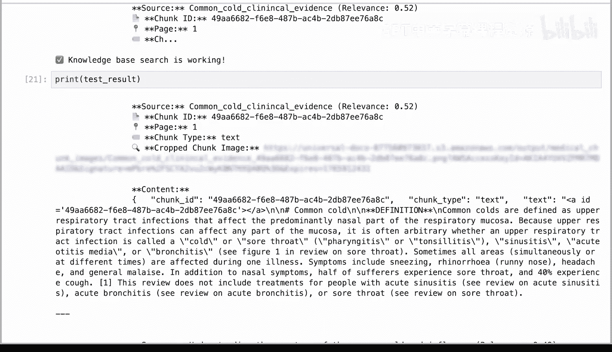
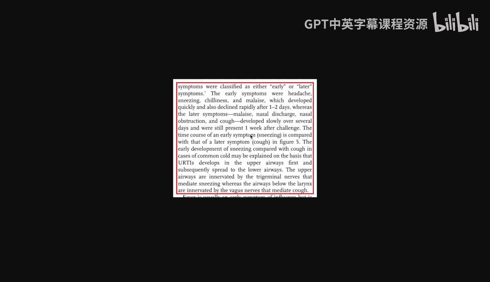
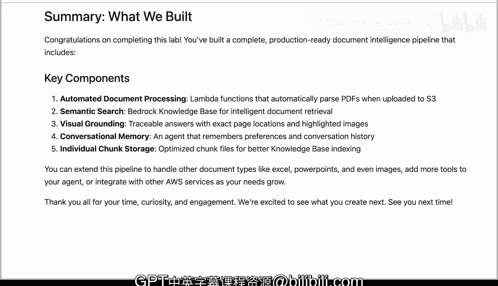

# 014：使用Strands Agents构建研究论文聊天机器人

## 概述

在本实验中，我们将构建一个完整的文档智能处理流水线。该流水线部署在AWS上，结合了Landing AI的自动化文档解析功能与对话式AI智能体。我们将学习如何设置Lambda函数、配置S3触发器、将文档索引到知识库，并最终创建一个具备记忆和视觉溯源能力的智能聊天机器人。

---

## 实验架构与数据流回顾

在上一节中，我们介绍了系统的整体架构。本节中，我们来详细看看数据在系统中的流动过程。

1.  用户将PDF文件上传到S3存储桶的`input`文件夹。
2.  当新文件到达时，S3会自动触发一个Lambda函数。
3.  Lambda函数使用Landing AI API将PDF解析为结构化的Markdown文本。
4.  解析后的Markdown、视觉溯源数据以及独立的文本块（chunk）被保存到S3的`output`文件夹。
5.  Bedrock知识库为文档建立索引，以支持语义搜索。
6.  用户向具备记忆功能的Strands Agent提问，以维持对话上下文。

## 实验前提条件

本实验假设您已具备一个包含`input`和`output`文件夹的S3存储桶，以及一个连接到S3`output/medical_chunks`文件夹的Bedrock知识库。如果您希望亲自尝试本实验，我们将提供相关链接，指导您如何创建AWS账户、设置这些资源并学习AWS基础知识。

---

## 第一步：安装所需软件包

以下是本实验将用到的核心Python包及其作用：

*   **`boto3`**：官方的AWS Python SDK，用于以编程方式与AWS服务交互。
*   **`python-dotenv`**：从`.env`文件加载敏感配置信息。
*   **`pymupdf`**：用于为PDF页面添加高亮注释，实现视觉溯源。
*   **`Pillow`**：将PDF页面渲染为图像。
*   **`bedrock-agent-core`**：为智能体提供记忆管理功能。
*   **`strands-agent`**：一个用于构建AI智能体的框架。

安装命令如下：
```bash
pip install boto3 python-dotenv pymupdf Pillow bedrock-agent-core strands-agent
```

## 第二步：配置环境变量与AWS客户端

为了安全地管理凭证，我们将从`.env`文件加载环境变量，而不是将其硬编码在笔记本中。

以下是一个`.env`文件的示例模板：
```env
AWS_ACCESS_KEY_ID=your_access_key
AWS_SECRET_ACCESS_KEY=your_secret_key
AWS_REGION=us-east-1
LANDINGAI_API_KEY=your_landingai_key
```

环境配置完成后，我们需要建立与所需AWS服务的连接。`boto3`库通过创建“客户端”来实现这一点。

我们将为以下服务创建客户端：
*   **S3客户端**：用于上传PDF、下载输出文件和管理存储桶。
*   **Lambda客户端**：用于部署Lambda函数、更新代码和配置触发器。
*   **IAM客户端**：用于为Lambda函数创建具有适当权限的角色。
*   **Logs客户端**：用于通过CloudWatch日志监控Lambda执行和调试错误。
*   **Bedrock Agent Runtime客户端**：用于查询知识库以进行文档搜索。
*   **Bedrock Runtime客户端**：用于直接调用云端模型。

## 第三步：构建完整流水线路线图

我们的AWS客户端已准备就绪，现在可以开始构建完整的流水线。以下是我们的实现路线图：

**第一部分：设置Lambda函数（步骤3-5）**
我们将分三步设置Lambda函数：
1.  打包代码：将Python文件及其依赖项捆绑到一个zip文件夹中。
2.  创建角色：定义允许Lambda访问S3以下载和上传文件的权限。
3.  部署函数：将打包好的代码上传到AWS Lambda。

**第二部分：设置触发器（步骤6）**
接下来，我们将配置S3，使其在上传新文件到`input`文件夹时自动调用我们的Lambda函数。

**第三部分：构建智能体（步骤7-12）**
最后，我们将上传医学研究论文PDF，将解析后的文档索引到Bedrock知识库，并使用Strands Agent构建一个智能体。

为了保持本教程专注于核心概念，我们已在`lambda_helpers.py`中创建了辅助函数来处理底层的AWS操作。我们将在实验过程中解释每个辅助函数的逻辑。

---

## 第四步：创建部署包（步骤3）

什么是Lambda部署包？要创建AWS Lambda函数，您需要将源代码及其所有依赖项捆绑到一个zip文件中。这个包包含了Lambda运行代码所需的一切。

部署包包含：
*   **您的源代码**：`ade_s3_handler.py`，其中包含Lambda函数被调用时执行的ADE解析逻辑。
*   **安装的依赖项**：您的源代码导入的所有pip包。

以下是部署包的结构示例：
```
deployment_package.zip
├── ade_s3_handler.py
├── landingai/
├── boto3/
└── ...其他依赖项
```

我们将使用`create_deployment_package`辅助函数来构建此包。该函数在后台执行以下操作：创建一个临时目录，使用pip将包安装到该目录，将您的源代码文件复制到临时目录，从该目录中的所有内容创建zip文件，并清理临时目录。

在进入下一步之前，让我们了解一下在Lambda内部运行的代码逻辑。下图展示了完整的流程：



以下是逐步发生的情况：
1.  **接收事件**：当PDF文件上传到S3的`input`文件夹时，S3事件会触发Lambda函数。
2.  **ADE处理函数**：从事件中提取文件键（key）。
3.  **检查与验证**：处理函数检查是否为PDF文件、跳过文件夹，并验证输出是否已存在。
4.  **下载PDF**：将PDF下载到Lambda的临时目录。
5.  **调用ADE API**：将PDF发送到ADE API进行解析，返回Markdown文本和文本块。
6.  **上传结果**：将结果以三种格式上传到S3的`output`文件夹：
    *   一个Markdown文件，用于存储解析后的内容。
    *   一个包含所有文本块信息（用于视觉溯源）的JSON文件。
    *   独立的文本块JSON文件，用于优化知识库索引。

为了帮助您理解每个输出文件的内容，假设您上传了`input/medical_research_paper.pdf`，在ADE处理完成后，S3的`output`文件夹中将包含：
*   **`markdown/`**：包含完整文档的可读格式，其中包含链接文本到块ID的锚点标签。
*   **`grounding_json/`**：一个包含所有文本块及其边界框坐标等元数据的单一文件。
*   **`medical_chunks/`**：每个文本块一个文件，针对向量数据库索引进行了优化。每个文件都自包含文本、位置和源元数据。

由于我们正在实现一个RAG（检索增强生成）流水线，我们将专注于仅使用`output/medical_chunks`文件夹进行Bedrock知识库索引和生成注释图像。其他文件夹可用于不同的实验和下游用例。

## 第五步：创建IAM角色（步骤4）

什么是IAM角色？Lambda函数在默认没有任何权限的隔离容器中运行。IAM角色授予函数使用临时凭证访问特定AWS服务的权限。

我们将使用`create_or_update_lambda_role`辅助函数来创建一个具有Lambda函数所需权限的角色。该角色包括以下权限：
*   **S3权限**：`GetObject`（从输入文件夹读取PDF）、`PutObject`（将Markdown文件写入输出文件夹）、`HeadObject`（检查输出文件夹是否已存在）。
*   **日志权限**：`CreateLogGroup`（为此函数创建CloudWatch日志组）、`CreateLogStream`（为每次执行创建日志流）、`PutLogEvents`（写入日志条目以进行调试）。

## 第六步：部署Lambda函数（步骤5）

现在我们已经拥有了所需的两部分：部署包（我们的代码）和IAM角色（我们的权限）。让我们使用`deploy_lambda_function`辅助函数来部署Lambda函数。

部署还包括一些重要的配置选项：
*   **环境变量**：我们的代码在运行时可以访问的配置值。
*   **超时**：最大执行时间设置为900秒（15分钟），用于处理较大的PDF。
*   **内存大小**：分配的RAM量，我们将设置为1024 MB。

## 第七步：设置S3触发器（步骤6）

我们的Lambda函数已部署，但还不会自动运行。我们需要告诉S3在文件上传时触发Lambda函数。S3可以在对象被创建、修改或删除时向Lambda发送事件。我们将配置为当文件上传到`input`文件夹时调用我们的函数。`setup_s3_trigger`辅助函数处理此配置。

## 第八步：上传文档进行处理（步骤7）

基础设施现已准备就绪。现在，让我们上传我们的医学PDF文档，并观察流水线的运行。下图展示了PDF文件如何从您本地的`medical`文件夹流向S3输入存储桶，被自动触发的Lambda函数使用ADE处理，并产生三种类型的输出文件。



我们将使用`upload_folder_to_s3`辅助函数上传本地文档。当Lambda函数处理我们的文档时，我们可以实时监控其进度。此辅助函数监视CloudWatch日志以显示处理状态。Lambda会自动写入日志，我们只需要读取它们。要停止监控，请按`Esc`键，然后双击`I`。您可以选择显示所有输出文件，但在本视频中，我们直接按`Note`。

## 第九步：连接到Bedrock知识库（步骤8）

我们的文档现已解析并存储在S3中。下一步是通过将它们摄取到Bedrock知识库中使其可搜索。知识库是一个支持语义搜索的向量数据库。

首先，让我们验证我们的知识库是否可用且配置正确。我们使用Bedrock Agent客户端列出所有知识库及其数据源。请注意，知识库已在AWS控制台中预先配置，指向我们的S3 `output/medical_chunks`文件夹作为数据源，使用Amazon Titan创建向量嵌入，并将向量存储在OpenSearch Serverless中以进行快速相似性搜索。此信息未在此处打印，但我想让您了解我们在本实验中使用的配置。

## 第十步：将文档摄取到知识库（步骤9）

现在，让我们将解析后的文档从S3同步到知识库中。这个过程称为“摄取”。

摄取过程中会发生什么？
1.  知识库读取S3 `output/medical_chunks`文件夹中所有新的或修改过的JSON文件。
2.  它为每个文本块创建向量嵌入。
3.  这些向量被存储在数据库中，以便进行快速相似性搜索。

摄取完成后，我们可以用自然语言问题查询知识库，并找到最相关的文档部分。`start_ingestion_job` API启动异步处理，它立即返回作业ID，实际工作在后台进行。

## 第十一步：创建具备视觉溯源的搜索工具（步骤10）

我们的文档已在知识库中建立索引，现在可以为我们的智能体创建一个搜索工具。但我们要添加一些特别的东西：Landing AI的视觉溯源功能。

下图展示了我们搜索工具的代码逻辑：




让我带您了解这个逻辑。该工具遵循以下模式：
当用户提交一个查询（例如“什么有助于缓解感冒症状？”）时：
1.  **检索**：通过查询知识库（使用混合搜索，结合关键词匹配和语义相似性）来检索相关结果。
2.  **检查**：对于每个结果，检查它是否来自`medical_chunks`文件夹的块JSON文件。
3.  **解析**：解析块JSON以获取元数据，如块ID、块类型、页码和边界框。
4.  **生成图像**：动态生成裁剪后的块图像，并将其上传到S3，返回一个预签名URL。
5.  **格式化响应**：智能体将格式化响应，为您提供来源、块ID、页码、块类型、裁剪图像URL和内容。

在创建智能体之前，让我们验证一下我们的搜索工具是否正常工作。一个简单的测试查询知识库并显示第一个结果。让我们搜索“common cold symptoms”。您可以看到知识库搜索工作正常。我们现在可以打印这些测试结果。当您点击预签名URL时，您可以看到为可追溯性和可审计性动态创建的块图像。对于受严格监管的组织和高风险操作，这可以整合到您的RAG系统或任何下游应用程序中。


## 第十二步：为智能体创建记忆（步骤11）

我们的搜索工具正在工作。现在，让我们为智能体创建记忆，以便它能记住对话并随着时间学习用户偏好。AWS Bedrock Agent Core提供了三种记忆策略，每种服务于不同的目的：
*   **会话摘要**：总结过去的会话。
*   **用户偏好**：随着时间学习用户偏好。
*   **语义记忆**：提取和存储事实。

我们将配置所有三种策略，为智能体提供全面的记忆能力。我们将首先检查是否已为智能体创建了记忆，否则将创建一个新的记忆。创建记忆后，我们需要设置一个会话管理器，为每次对话组织信息。每次对话需要两个标识符：
*   **参与者ID**：谁在使用智能体，这支持跨会话的个性化。
*   **会话ID**：此特定对话的唯一标识符。

## 第十三步：创建Strands智能体（步骤12）

我们现在已准备好所有组件：一个具备视觉溯源的搜索工具，以及用于在对话间维护上下文的记忆。让我们将所有内容整合到一个Strands智能体中。

智能体配置如下：
*   **模型**：使用Claude via Bedrock作为底层的LLM。
*   **系统提示**：定义智能体个性和行为的指令。
*   **会话管理器**：用于记住偏好、历史摘要和事实的记忆。
*   **工具**：我们之前创建的搜索知识库函数。

请注意，系统提示明确指示智能体在其响应中包含视觉溯源信息，如页码、位置坐标和注释图像。

## 第十四步：交互式聊天（步骤13）

您的医学文档智能体现在已准备就绪。让我们启动一个交互式聊天会话。让我们从“维生素C治疗感冒的效果如何？”开始。这里显示它使用了`search_knowledge_base`工具，并返回了一个症状列表。以及信息源，我们可以在其中找到注释图像。

我现在告诉它我更喜欢简短的回答，然后退出。让我们再次运行它并问同样的问题。您可以看到，它根据我之前的偏好返回了更简洁的答案。要退出，请输入`exit`、`quit`或`bye`。

---

## 总结

恭喜您完成本实验！您已经构建了一个完整的、可用于生产的文档智能处理流水线，其中包含以下关键组件：
*   **自动化文档处理**：当PDF上传到S3时自动解析的Lambda函数。
*   **语义搜索**：用于智能文档检索的Bedrock知识库。
*   **视觉溯源**：提供精确页码位置和高亮图像的可追溯答案。
*   **对话记忆**：能记住偏好和对话历史的智能体。
*   **独立文本块存储**：为更好的知识库索引而优化的块文件。

您现在可以扩展此流水线以处理其他文档类型（如Excel、PowerPoint甚至图像），为智能体添加更多工具，或随着需求增长与其他AWS服务集成。


感谢您付出的时间、展现的好奇心和参与的热情。我们非常期待看到您接下来将创造什么。下次见！😊