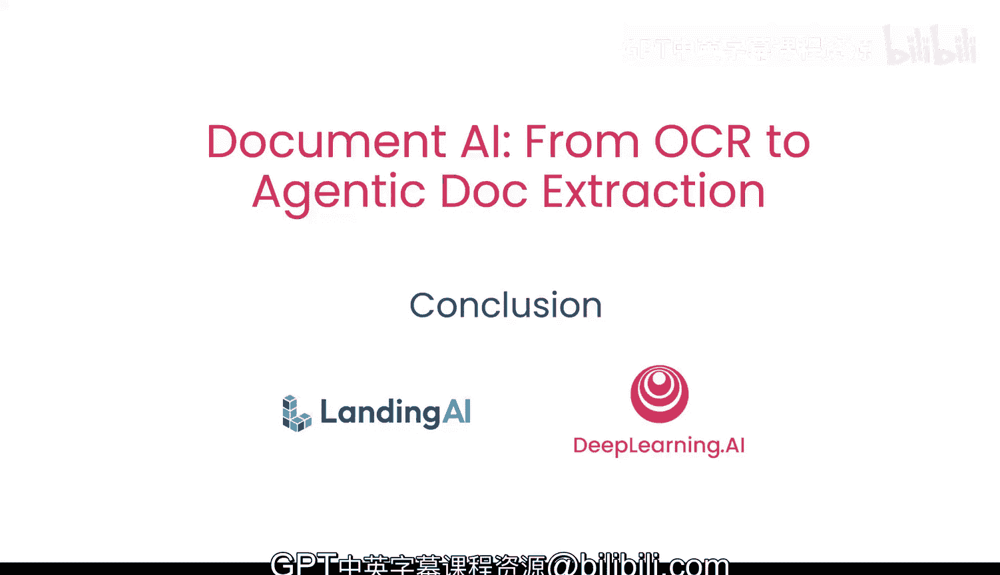

# 015：总结 🎯

在本课程中，我们学习了如何构建一个智能体化的文档处理系统，使你能够解析和提取PDF等文件中的信息。



## 课程内容回顾 📚

上一节我们探讨了如何将应用迁移到云端并使其事件驱动。现在，让我们对整个课程的核心内容进行总结。

以下是我们在本课程中学习的关键步骤与技术：

1.  **从图像到文本的转换**：你学习了如何通过**OCR（光学字符识别）**技术将图像文件转换为可处理的文本。
    ```python
    # 示例：使用OCR库提取文本
    text = ocr_engine.extract_text(image_file)
    ```

2.  **布局分析与逻辑排序**：你探索了如何使用**边界框（Bounding Boxes）**分析文档的物理布局，并将识别出的文本块按逻辑顺序进行重组。

3.  **视觉语言模型的应用**：你使用了**视觉语言模型（VLMs）**来理解文本及其在文档中的上下文关系。

4.  **智能体化文档理解**：你采用了**ADE（一种“视觉优先”的智能体生成方法）**来处理复杂文档，该方法优先考虑视觉结构。

5.  **构建检索增强生成应用**：你基于以上技术，构建了一个**RAG（检索增强生成）**应用程序，用于回答关于非结构化文档的问题。

6.  **云端部署与事件驱动**：最后，你探索了如何将应用程序迁移到云端，并将其改造为事件驱动的架构，以提高可扩展性和响应能力。

## 总结与展望 🌟

本节课中，我们一起学习了从基础的OCR文本提取，到利用智能体进行高级文档理解和构建问答应用的完整流程。你掌握了处理非结构化文档并将其转化为可查询知识的核心技能。

我期待看到你运用这些知识，构建出属于自己的创新应用。🚀