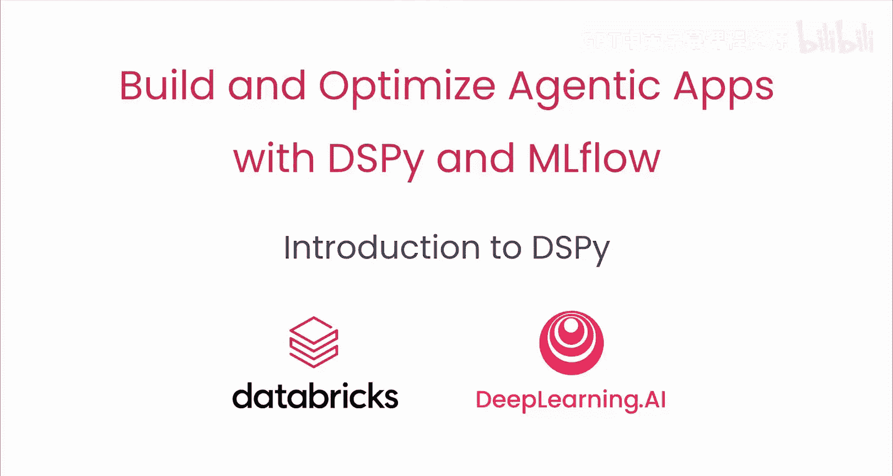
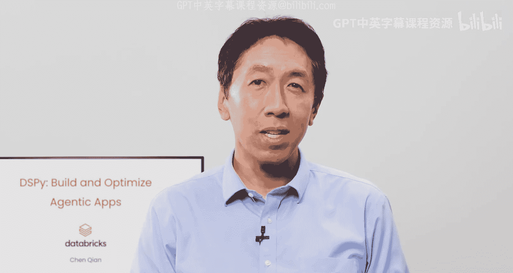

# 001：引言 🚀

在本课程中，我们将学习如何使用DSPy框架来构建和优化基于大型语言模型的智能应用。DSPy旨在简化提示工程流程，通过自动化优化来提升应用性能，减少手动调试的工作量。

---

构建复杂的AI应用时，面临的主要挑战之一是为语言模型编写高质量的提示。开发者通常需要尝试数十个提示，反复调整措辞和格式，以期获得更好的结果。这个过程非常耗时，并且当底层模型更新时，精心设计的提示也常常会失效。

DSPy简化并自动化了这一传统流程。你只需定义模型所需的输入和期望的输出，并提供一个包含输入和理想输出的数据集。DSPy随后可以自动优化你的AI程序，以更少的手动工作获得更佳的性能。

我们很高兴地介绍本课程的讲师Zn Tian，他是Databricks的软件工程师，也是DSPy的核心开发者之一。

---

## 核心构建模块：签名与模块

在DSPy中构建应用组件主要涉及两个核心概念：**签名**和**模块**。

当你尝试构建应用的一个组件时，指定一个**签名**可以告诉系统该组件期望的输入和输出是什么。例如，一个情感分析程序的签名可以定义为：输入一个字符串，输出一个代表情感倾向的整数。

**模块**则利用这些签名来实际调用语言模型并获取结果。有时应用可能无法正常工作，但我们不确定原因。在本课程中，你还将学习使用流程追踪功能，它能帮助你清晰地看到应用每一步的执行情况：使用了什么数据、调用了哪些工具、模型返回了什么结果，以及问题出在哪里。只需添加一层代码，你就可以为你的应用启用这些追踪功能。

---

## 优化智能代理工作流

DSPy的一个强大应用是优化智能代理的工作流。如果你有一个复杂的工作流，它接收一个输入，经过多步处理（可能涉及多次调用模型或多个工具）来生成输出，那么DSPy的优化器可以派上用场。

优化器会接收你的代理程序、一个评估数据集和一个评估指标，并基于这些信息，自动为所有步骤搜索更好的提示。有时，它能根据你的数据生成非常高质量的提示，其效果远超人类手动调整所能达到的水平。

在本课程中，你将使用DSPy的优化器来优化一个基于维基百科问答的RAG应用中的提示。

---

## 课程致谢与展望

许多人为本课程的筹备做出了贡献。在此，我们要感谢Omar、Kat、Kahi、Yin、Trister、Obsalon、Tobo、Hirata、Ash、Gagari和Brendan Brown。

关于DSPy，一个令人惊讶的特点是它所需的代码量非常少，并且它本质上自动化了提示工程的过程。请继续观看下一个视频，了解这是如何实现的。

---

**总结**：本节课我们一起学习了DSPy课程的目标与核心价值。我们了解到DSPy通过引入**签名**和**模块**这两个核心构建块，以及强大的自动优化与流程追踪功能，旨在解决传统提示工程耗时、脆弱的问题，让开发者能更高效地构建和优化复杂的AI应用。