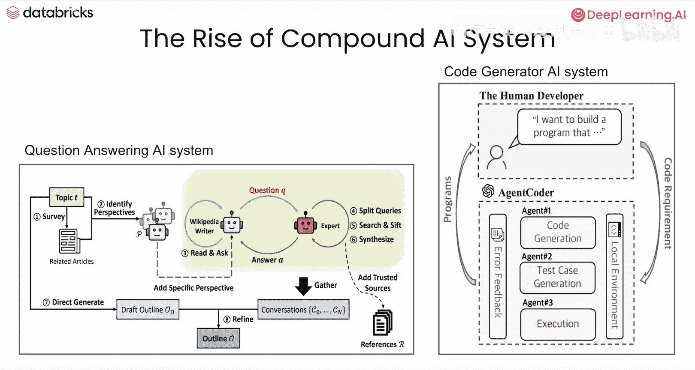
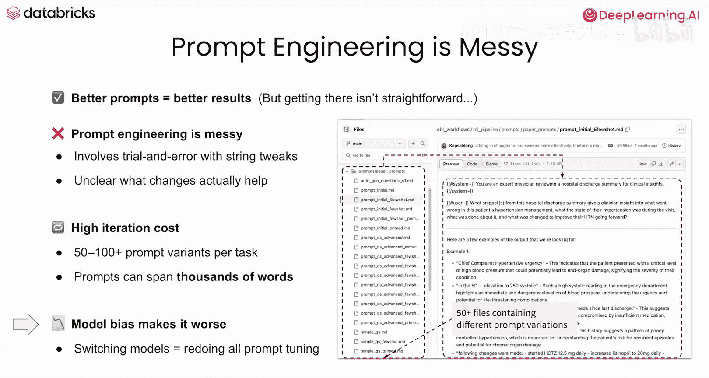
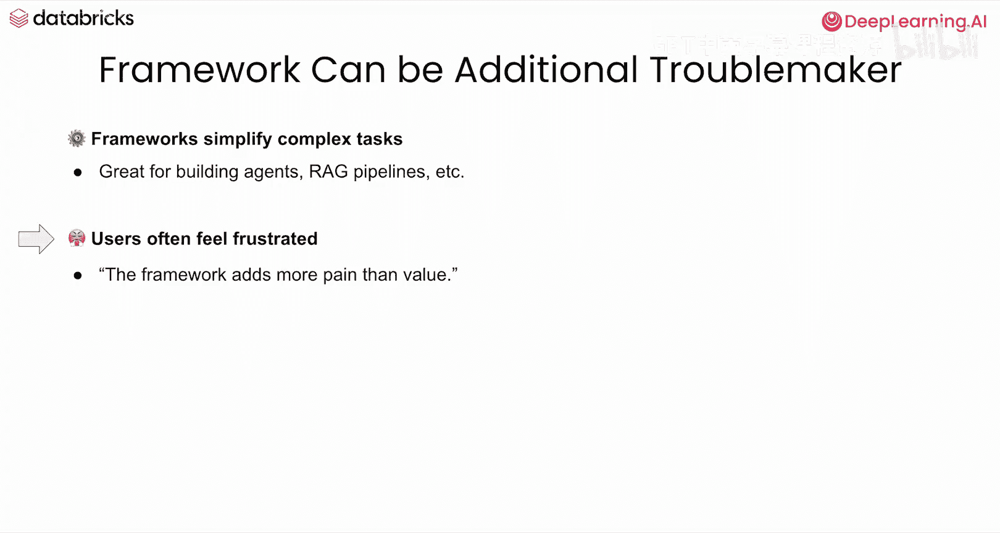
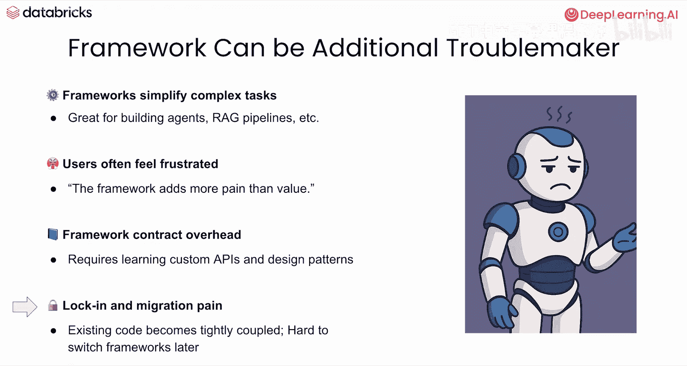
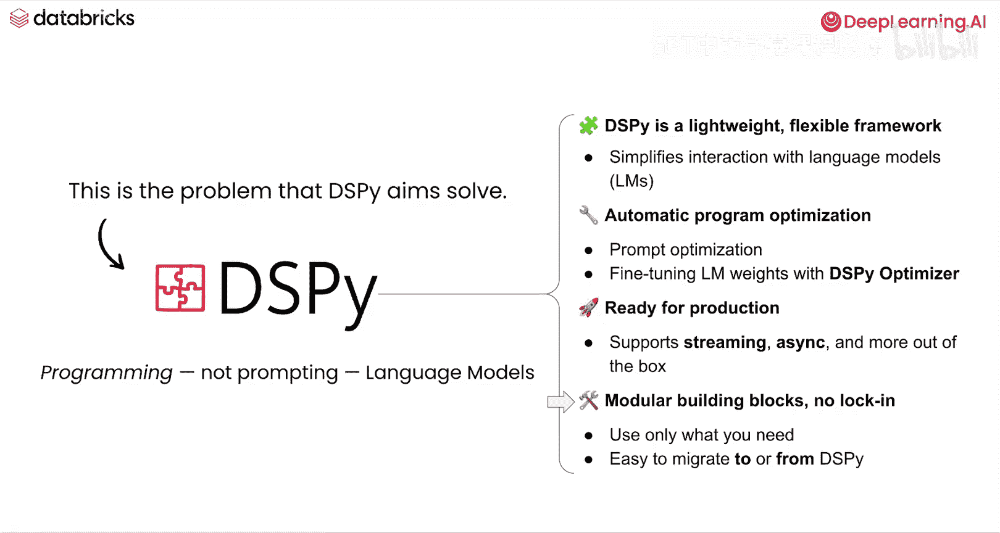
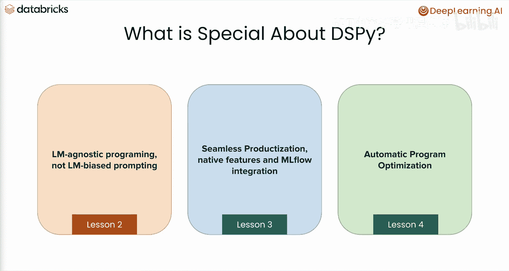
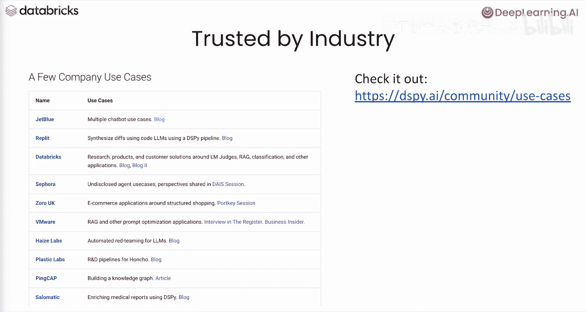

# 002：DSPy框架介绍 🚀

在本节课中，我们将学习什么是DSPy，更重要的是，了解DSPy的特殊之处以及为何众多开发者选择使用它来构建智能应用。

## 概述

DSPy是一个用于构建和优化智能代理应用的框架。本节将介绍DSPy的核心概念、它旨在解决的问题，以及其区别于其他框架的关键特性。

## 什么是DSPy？

从高层次看，DSPy是一个**智能应用创作框架**，它简化了基于语言模型的应用程序开发。你可以用它来构建检索增强生成系统或智能代理。

一个很自然的问题是：我们是否在重复造轮子？市场上已有许多类似选项。答案是否定的。接下来，我们将一起探讨DSPy的独特之处。

## 当前面临的挑战

在深入了解DSPy之前，我们先看看当前开发者面临的问题。自2022年底以来，随着生成式模型的成功，**复合AI系统**开始兴起。

复合AI系统是由多个模块组成的系统。每个模块处理一个子任务，这些子任务可能涉及调用语言模型，也可能只是常规的函数调用。将这些模块组合起来，就形成了一个能够处理复杂任务（如图中所示的检索增强生成或智能体）的强大AI系统。

在构建复合AI系统时，我们普遍面临来自**提示工程**的挑战。

我们进行提示工程是因为我们知道，更好的提示能从语言模型中获得更好的结果。但提示工程可能非常混乱，因为我们是在调整字符串，并且并不真正知道哪些改变在实践中能产生实际效果。这通常意味着我们需要迭代50、100甚至更多个提示，而每个提示可能非常长，达到数万字。

更糟糕的是，如果我们更换模型，就需要重新开始，因为提示工程严重依赖于特定的语言模型。总而言之，提示工程既脆弱又耗时。

另一个问题来自框架本身。框架非常强大，因为它们简化和标准化了构建智能体或RAG等应用的经验。

但越来越多的抱怨指出，用户不喜欢某些框架，因为它们带来的麻烦多于价值。

一个非常实际的担忧是，用户被迫学习框架的特定约定，这有时意味着不必要的开销，而不是让用户专注于业务逻辑。此外，如果决定切换到另一个框架，将现有代码迁移出来也非常困难。

## DSPy的解决方案

为了解决上述两个问题，DSPy应运而生。现在，让我们更详细地回答这个问题：什么是DSPy？

DSPy是一个**灵活、轻量级的框架**，它简化了与语言模型的交互，并通过DSPy优化器提供**自动程序优化**，包括提示优化和语言模型权重优化。

DSPy还提供**无缝的产品化支持**，例如流式处理、异步操作等。DSPy为你提供构建AI应用的**基础模块**，但不会限制你构建应用的方式。无论是迁移到DSPy还是从DSPy迁移出去，都同样容易。

DSPy内部有三个特别之处。以下是详细介绍：

### 1. 模型无关编程 vs. 模型偏向提示

本质上，DSPy不是进行提示工程，而是通过定义DSPy上下文中的**输入字段**和**输出字段**来与语言模型交互。你可以将语言模型和提示视为一个精心设计的REST API，但与传统API不同的是，输入和输出是在客户端定义的。如果现在还不完全清楚，请不要担心，我们将在下一课中详细讲解。

### 2. 通过原生功能与MLflow实现无缝产品化

DSPy通过其原生功能（如缓存）以及与**MLflow**的紧密集成，实现无缝产品化。MLflow是一个ML和AI运维工具，可简化AI应用程序的端到端开发。例如，它通过MLflow Tracing帮助调试AI程序，通过MLflow Experiments跟踪开发，并通过MLflow Deployments部署应用。我们将在第3课中了解更多关于它的内容。

### 3. 自动程序优化

在第4课中，你将学习自动程序优化。当你使用DSPy构建好AI应用程序后，可以创建一个DSPy优化器并将其应用于你的程序，从而自动获得质量提升。

## 行业信任

DSPy受到行业的信任。我们与许多企业用户成功集成。请在DSPy.ai社区查看更多使用案例。

## 总结

本节课我们一起学习了DSPy框架的基本介绍。我们了解了当前AI应用开发中提示工程和框架锁定带来的挑战，并探讨了DSPy如何通过其模型无关编程、无缝产品化支持和自动优化功能来解决这些问题。

在下一课中，你将学习如何在DSPy中构建一个AI应用程序。我们下节课见。

