# 003：签名与模块 🧩

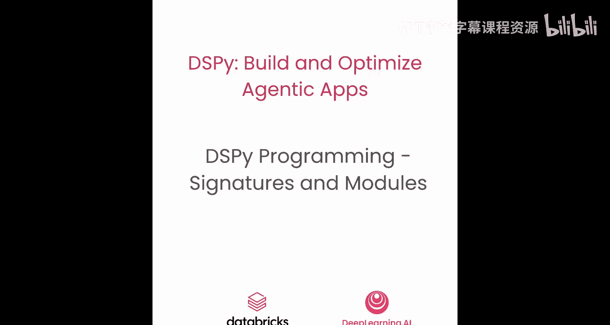

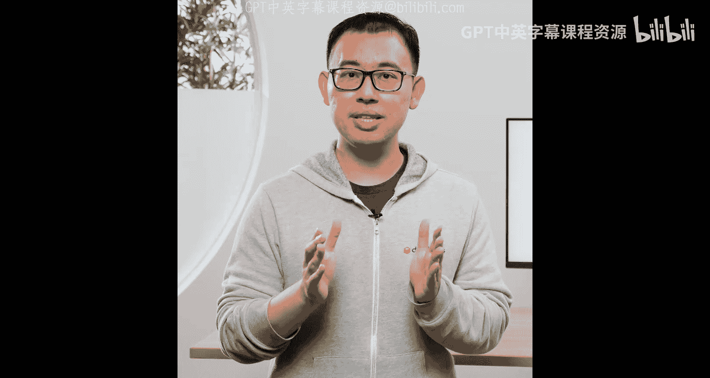

在本节课中，你将学习如何使用DSPy构建AI应用。我们将深入代码，通过一个实验来掌握DSPy的两个核心抽象：**签名**和**模块**。签名定义了AI任务的输入输出格式，而模块则是利用签名与语言模型交互的执行单元。

## 签名：定义输入输出合约 📝

在DSPy中，与语言模型的交互类似于调用一个具有明确定义输入输出格式的RESTful API，但这个格式定义发生在客户端。这个定义就是通过**DSPy签名**来完成的。

签名定义了输入和输出字段，以及它们的类型和注释。定义签名主要有两种方式。

### 基于类的签名

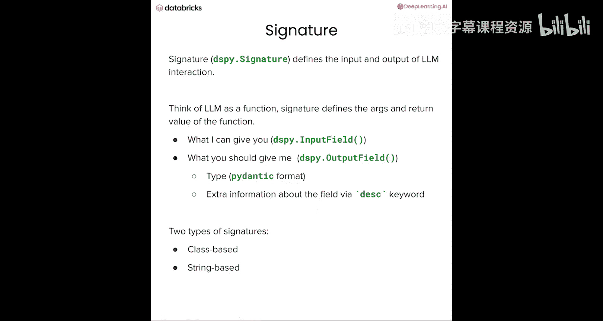

这是推荐的方式。你需要从`dspy.Signature`类继承，并使用`dspy.InputField`和`spy.OutputField`来标记输入输出字段。

```python
import dspy

class SentimentSignature(dspy.Signature):
    """分析给定文本的情感倾向。"""
    text: str = dspy.InputField(desc="待分析的文本")
    sentiment: int = dspy.OutputField(desc="情感分数，范围0-10", gt=0, lt=10)
```

一个基于类的签名包含五个重要部分：
1.  **文档字符串**：签名指令，用几句话概述任务目的。
2.  **字段名**：用于传递输入数据和访问输出数据。
3.  **字段类型**：标记是输入字段还是输出字段。
4.  **描述**：当字段名不能自解释时，提供关于字段的实际信息。
5.  **类型信息**：可以是基本类型或任何自定义类，对于输出字段尤其有用，可以确保返回值的类型。

### 基于字符串的签名

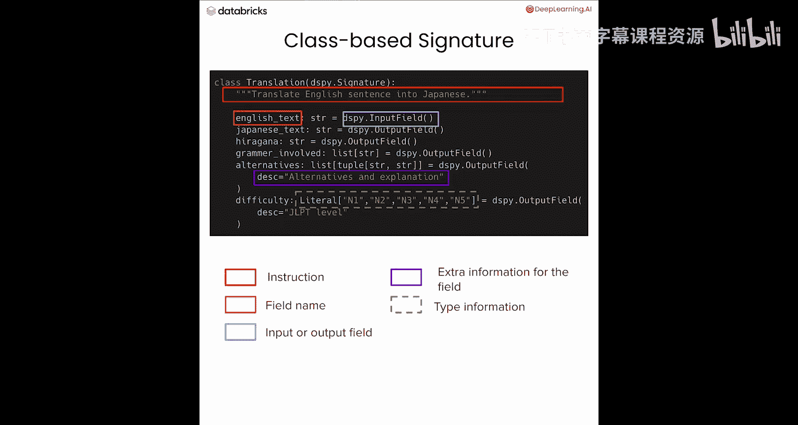

这是一种更轻量的方式，适合快速原型设计。

```python
signature = "text -> sentiment"
```

你只需在箭头前写输入字段，在箭头后写输出字段，用逗号分隔。虽然简洁，但为了获得更好的灵活性和功能支持，我们通常推荐使用基于类的签名。

## 模块：与语言模型交互的执行单元 ⚙️

上一节我们介绍了如何静态地定义任务格式，本节我们来看看如何利用签名来与语言模型对话，这就是**DSPy模块**的用途。

模块是DSP程序的最小构建块，通常都附带着一个签名。最简单的模块是`dspy.Predict`，它根据附带的签名将用户查询格式化为提示词，并解析语言模型的响应。

模块除了签名外，还有可配置的属性，例如`demos`属性用于携带示例。DSPy模块可以自定义以实现复杂逻辑，并且一个模块可以由多个子模块组成。

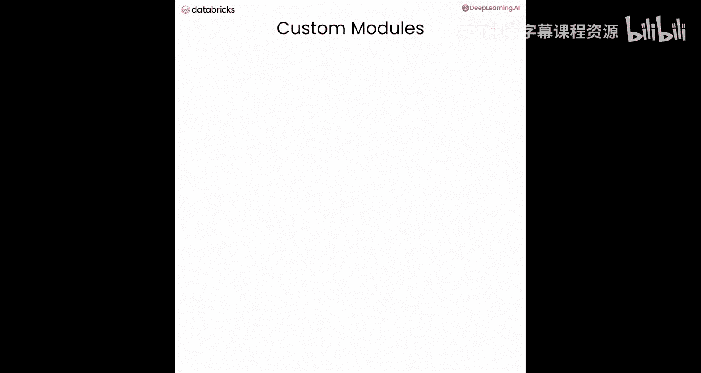

DSPy提供了一系列构建模块，让用户能轻松上手。以下是几个重要的内置模块：
*   **`dspy.Predict`**：最基本的模块，执行语言模型交互，是所有复杂模块的构建基础。
*   **`dspy.ChainOfThought`**：要求模型在给出答案前进行推理。
*   **`dspy.ReAct`**：代表“推理与行动”，是构建AI智能体的常用范式，我们将在下一课详细介绍。
*   **`dspy.ProgramOfThought`**：类似于ReAct，但工具调用是通过代码完成的。
*   **`dspy.Retry`**：用户可以设置奖励函数和阈值，如果未达到阈值则重试。

### 使用内置模块

要使用内置模块，只需将签名传递给模块构造函数，然后通过设置关键字参数来调用它。

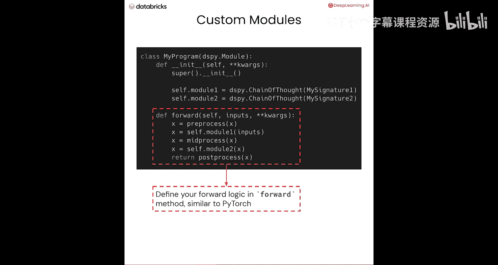

```python
# 创建一个带有签名的问题生成器模块
qa_module = dspy.ChainOfThought("question -> answer")
# 调用模块
result = qa_module(question="天空是什么颜色的？")
print(result.answer) # 访问输出字段
```

你可以在DSPy文档站点找到完整的构建模块列表。

### 创建自定义模块

更常见的情况是，你需要的复杂逻辑无法完全由预构建模块覆盖。这时，你需要编写自定义模块。

这类似于PyTorch，你需要从`dspy.Module`类继承，并在`forward`方法中实现你的自定义逻辑。

```python
class CustomGameModule(dspy.Module):
    def __init__(self):
        super().__init__()
        self.question_gen = dspy.ChainOfThought("past_questions, past_answers -> new_question, guess_made")

    def forward(self, celebrity_name):
        # 在这里实现你的游戏逻辑
        # 可以调用子模块、其他Python函数、任何框架或工具
        questions = []
        answers = []
        for _ in range(20):
            result = self.question_gen(past_questions=questions, past_answers=answers)
            # ... 处理结果，询问用户，更新列表 ...
        return final_result
```

这种方式非常灵活。你可以在`forward`方法中调用任何Python函数、框架（如LangChain、LlamaIndex）或工具（如搜索引擎、文件系统处理器）。

## 实战：构建情感分析器与猜名人游戏 🎮

现在，让我们通过编码来更好地理解签名和模块系统是如何工作的。我们将构建一个简单的情感分析器，然后是一个更复杂的“猜名人”游戏。

### 第一步：设置语言模型

DSPy编程的第一步是选择你的语言模型。在本实验中，我们使用`gpt-4o-mini`。

```python
import dspy
# 配置语言模型
lm = dspy.OpenAI(model='gpt-4o-mini')
dspy.configure(lm=lm)
```

### 第二步：构建情感分类器

我们使用之前定义的`SentimentSignature`，并创建一个`dspy.Predict`模块。

```python
# 定义签名
class SentimentSignature(dspy.Signature):
    """分析给定文本的情感倾向。"""
    text: str = dspy.InputField(desc="待分析的文本")
    sentiment: int = dspy.OutputField(desc="情感分数，范围0-10", gt=0, lt=10)

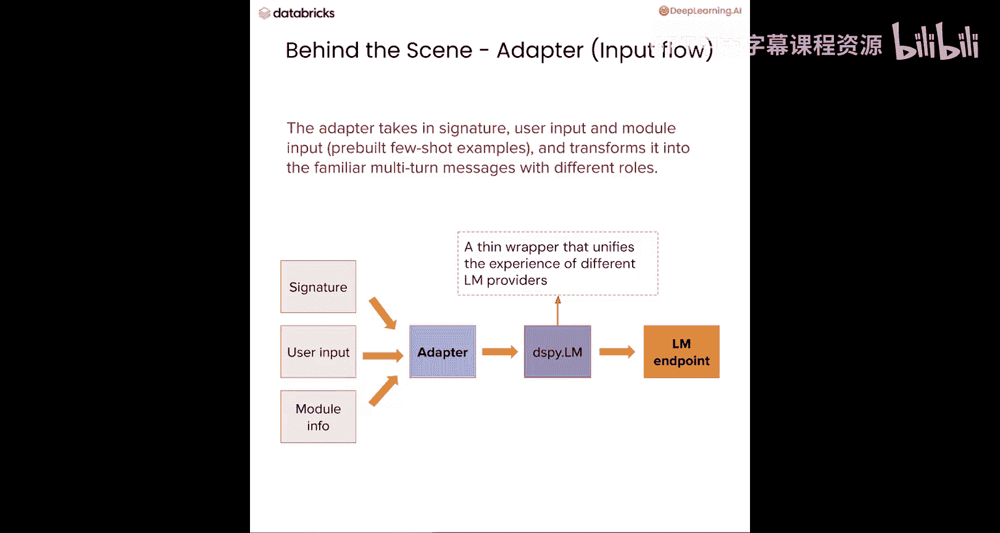

# 创建模块
classifier = dspy.Predict(SentimentSignature)

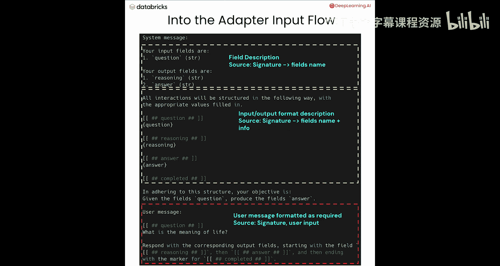

# 调用模块
result = classifier(text="这部电影真是太精彩了！")
print(result.sentiment) # 输出情感分数
```

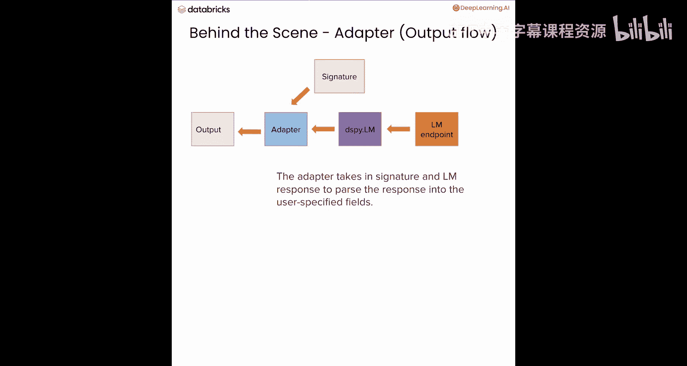

`result`是一个`dspy.Prediction`对象，类似于字典，但支持关键字和点号两种访问方式。

我们可以查看语言模型的交互历史来理解幕后发生了什么：

```python
print(lm.inspect_history(n=1))
```

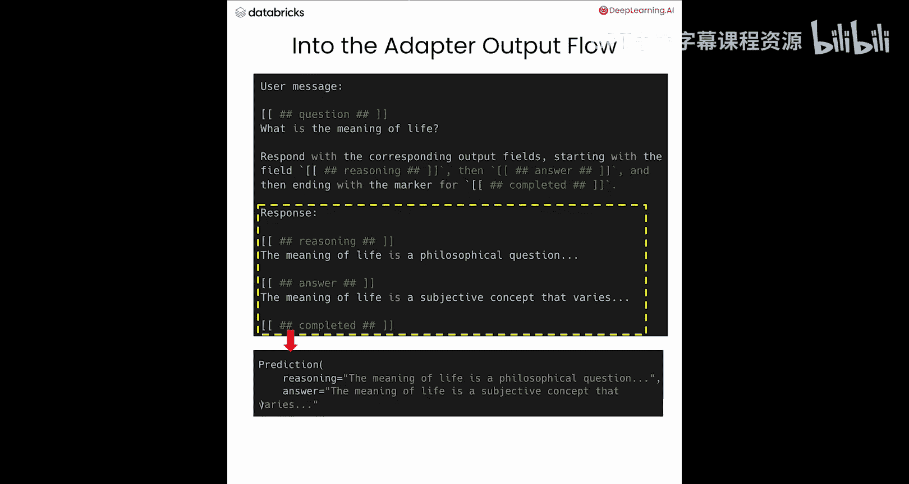

输出会展示系统消息（包含签名、字段格式）、用户消息（格式化后的输入）和助手的响应（格式化后的输出）。DSPy将签名、模块信息和实际输入组合成一个多轮对话提示词，并根据签名解析语言模型的响应，使得语言模型就像一个具有明确定义输入输出的API。

### 第三步：构建“猜名人”游戏

现在，让我们构建一个更复杂的自定义模块来实现“猜名人”游戏。游戏规则是：玩家一想一个名人名字，玩家二（语言模型）开始问是/否问题，直到猜出名字或用完所有问题机会（设为20次）。

```python
class CelebrityGame(dspy.Module):
    def __init__(self):
        super().__init__()
        # 子模块1：问题生成器
        self.question_gen = dspy.ChainOfThought("past_questions, past_answers -> new_question, guess_made")
        # 子模块2：游戏后反思
        self.reflector = dspy.Predict("correct_name, final_guess, qa_log -> reflection")

    def forward(self):
        celebrity_name = input("请想一个名人名字并输入: ")
        questions = []
        answers = []
        
        for i in range(20):
            # 生成新问题
            gen_result = self.question_gen(past_questions=questions, past_answers=answers)
            new_q = gen_result.new_question
            guess_flag = gen_result.guess_made
            
            print(f"问题 {i+1}: {new_q}")
            answer = input("你的回答 (是/否): ").strip().lower()
            answers.append(answer)
            questions.append(new_q)
            
            # 检查是否直接猜出了名字
            if "yes" in guess_flag.lower():
                print(f"模型猜测是: {guess_flag}")
                if input("猜对了吗? (是/否): ").strip().lower() == '是':
                    print("游戏结束！模型猜对了。")
                    break
        
        # 游戏结束后进行反思
        final_guess = guess_flag if i < 19 else "未猜出"
        reflection = self.reflector(correct_name=celebrity_name, final_guess=final_guess, qa_log=list(zip(questions, answers)))
        print("\n=== 游戏反思 ===")
        print(reflection.reflection)
        
        return {"correct_name": celebrity_name, "guessed": final_guess}

# 运行游戏
game = CelebrityGame()
game()
```

这个例子展示了DSPy模块的灵活性。你可以在`forward`方法中编写任何Python逻辑，并且签名系统使得与语言模型的交互变得简单可靠，无需手动解析输出字段。

## 模块的保存与加载 💾

DSPy提供了两种保存和加载模块的方式。

**1. 仅保存状态**
只保存模块的内部状态（如参数、演示示例）。

```python
# 保存
game.save("game_state.json", save_program=False)
# 加载（需要先重新创建实例）
loaded_game = CelebrityGame()
loaded_game.load("game_state.json")
```

**2. 保存整个程序**
保存整个程序，包括其结构和依赖。

```python
# 保存
game.save("my_game_program")
# 加载
loaded_program = dspy.load("my_game_program")
# 可以直接调用
loaded_program()
```

## 总结 📚

在本节课中，我们一起学习了DSPy编程的核心概念。我们首先了解了**签名**，它像一份合约，明确定义了AI任务的输入和输出格式。接着，我们探索了**模块**，它是利用签名与语言模型交互、并可以包含自定义逻辑的执行单元。我们通过构建情感分析器和“猜名人”游戏，实践了如何使用内置模块和创建自定义模块。最后，我们还了解了如何保存和加载DSPy模块。

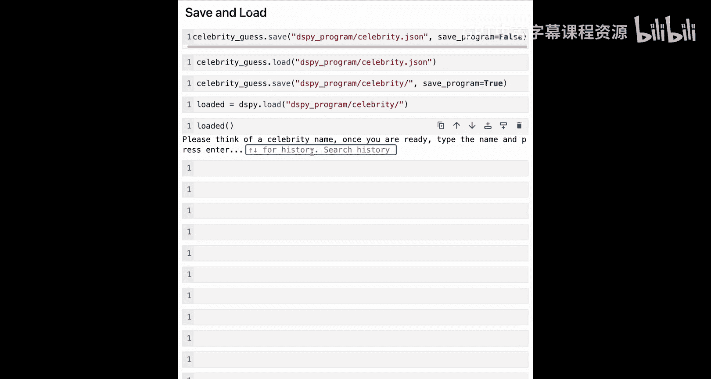

DSPy通过将提示词工程抽象为可组合、可优化的模块，让构建复杂的AI应用变得更加简单和可靠。在下一节课中，你将学习如何使用Ammoflow追踪来调试你的DSPy程序。