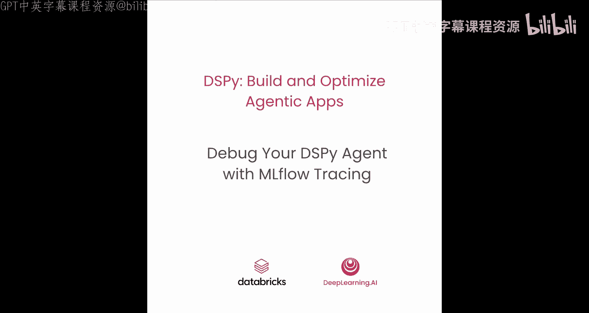
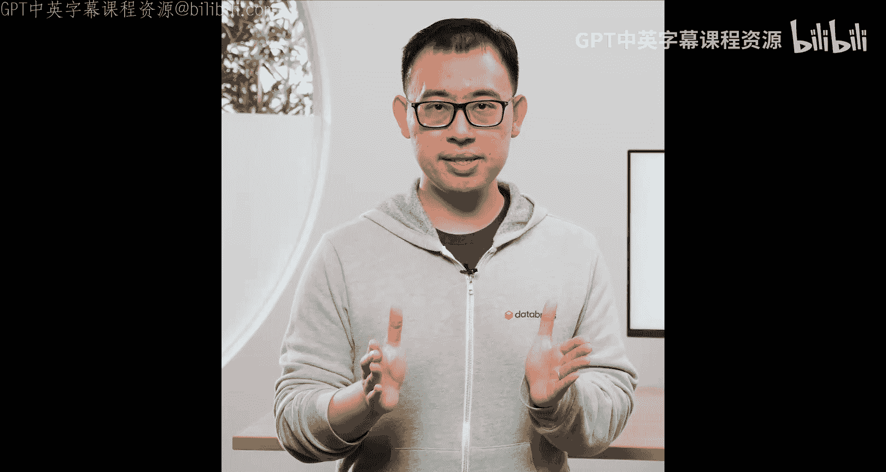
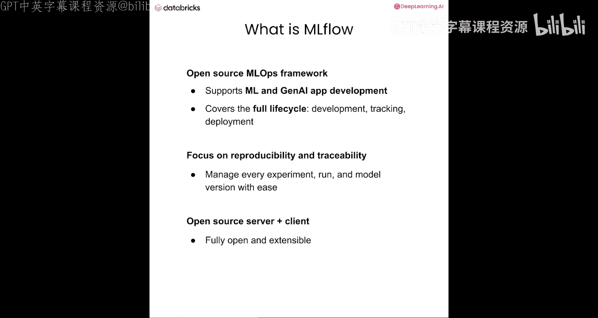
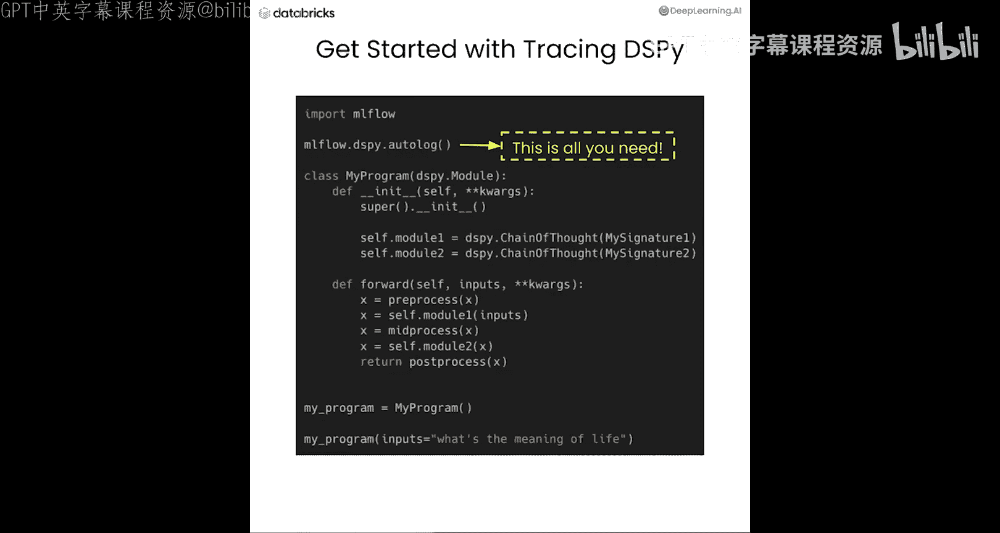
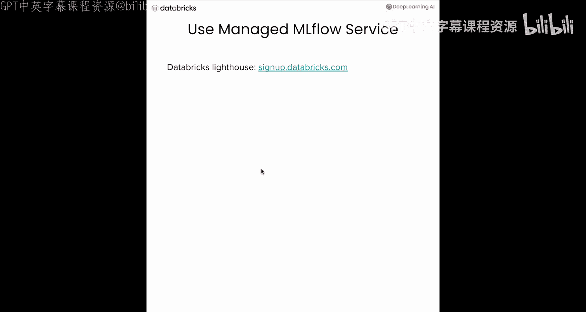

# 004：使用MLflow追踪调试你的DSPy智能代理 🐛





在本节课中，我们将学习如何使用MLflow追踪功能来帮助调试DSPy程序。我们将构建一个航空客户服务代理，并通过MLflow清晰地观察其内部复杂的多步推理过程。

## 概述：什么是追踪及其必要性

上一节我们介绍了DSPy的基础模块。本节中，我们来看看如何调试这些模块。

追踪意味着记录AI程序中内部函数的输入和输出，并捕获一个层次化的调用栈，例如模块A调用模块B。

AI应用内部可能非常复杂，但通常只暴露最终输出。因此，当出现问题时，很难追溯到根本原因。例如，如果你构建了一个由五个子模块组成的DSPy程序，其中一个语言模型调用因无法理解提示词而失败，即使DSPy提供了检查历史记录的API，追溯问题根源仍然困难。

追踪为可解释性和调试提供了一种简便的方法。

## 什么是MLflow

MLflow是一个开源的AI运维包，可以简化你的AI应用开发流程。MLflow有助于构建AI应用的全生命周期管理，确保每个阶段都是可追踪和可复现的。





MLflow服务器和客户端都是完全开源的，你可以轻松设置以开始追踪DSPy程序。使用MLflow追踪DSPy程序，你只需要在程序中添加一行代码：`mlflow.dspy.autolog()` 或简写为 `mlflow.autolog()`。之后，你的程序将被自动追踪，并且追踪记录将保存在MLflow服务器中，你可以在生成后随时访问。

## MLflow追踪的内容

以下是MLflow在DSPy程序中追踪的四个核心部分：

1.  **追踪每个模块调用**：无论是顶层模块还是内部模块。
2.  **追踪所有对适配器的调用**：你可以看到适配器如何格式化用户查询并解析语言模型的响应。
3.  **追踪对语言模型的调用**：你可以检查实际的提示词和语言模型的响应。
4.  **追踪DSPy工具调用**：这是对DSPy工具调用的封装，同样会被MLflow追踪。

我们不仅可以解释DSPy程序每个子模块的输入和输出，还可以看到这些模块的层次结构以及其他重要信息，如耗时。当出现问题时，会有一个“X”标记指出有问题的模块。

幻灯片中的截图是一个真实ReAct模块的追踪记录。让我们将其映射到我们追踪的组件：
*   `react` 是我们的顶层模块，它调用了一些表示为 `predict` 的子模块。我们可以看到 `react` 和 `predict` 都被追踪了。
*   在 `predict` 内部，`chat_adapter.format_and_parse` 承载了适配器的追踪。
*   中间的 `LM traces` 包含了来自语言模型的实际提示词和响应。
*   在底部，我们还可以看到工具调用的追踪，在本例中是调用文件。

在上一课中，我们看到了如何使用 `dspy.inspect_history` API 来查看实际提示词。现在有了MLflow追踪，这变得更加容易。只需点击LM追踪记录，你就可以看到实际的提示词和LM响应。

## 开始编码：构建航空客户服务代理

让我们开始编码。与之前的实验类似，我们需要设置API密钥，此外还需要设置MLflow环境。

```python
import mlflow
# 设置MLflow跟踪UI。在本实验中，我们已经为你设置了MLflow跟踪服务器。
# 现在，让我们给实验一个唯一的标识符。
mlflow.set_experiment("DSPy_Lesson_4")
# 正如幻灯片中提到的，我们可以用一行代码开启追踪功能。
mlflow.dspy.autolog()
# 然后，我们可以像之前的实验一样选择我们的语言模型。
```

现在，让我们开始使用DSPy的ReAct构建一个航空客户服务代理，并使用MLflow追踪来辅助这个过程。

这个代理将能够接收用户请求并为用户预订航班，也可以为用户修改行程。

我们首先需要定义数据。在实际生产中，会有一个数据库模式。这里我们有用户档案、航班信息、行程信息和客户支持工单。现在我们有了领域数据和数据格式。

让我们定义几个工具（模块）：
*   `fetch_flight_information`：根据日期、出发地、目的地获取航班信息。
*   `fetch_itinerary`：获取行程。
*   `pick_flight`：从几个候选航班中挑选一个航班。
*   `book_itinerary`：代表用户预订行程。
*   `cancel_itinerary`：取消行程。
*   `get_user_info`：获取用户信息。
*   `file_customer_ticket`：如果我们无法自动解决问题，则提交客户工单。

要使用DSPy上下文定义工具或函数，你需要指定一个描述来说明此函数的功能，并为输入参数提供类型提示，以便语言模型可以帮助设置参数。

现在我们有了工具和数据，让我们定义一个签名，以便我们知道这个程序的输入和输出是什么。

输入将是一个字符串，代表用户请求。输出是一个 `ProcessResult`，它是一个给用户的消息。如果预订成功，它将包含确认号；如果我们无法解决问题，我们将链接到一个工单号。

现在我们有了签名和工具。我们可以将它们组合成一个DSPy的ReAct模块。那么什么是ReAct？ReAct代表推理和行动。基本上，我们给语言模型一个签名（这是程序的目标）以及一个工具列表，语言模型可以决定是否要调用工具来获取实际信息以回答用户问题。如果它不需要实际信息，可以直接回答问题。

现在我们已经构建了一个ReAct实例。让我们调用它。

```python
# 我们可以简单地将用户请求放入。
user_request = "Book a flight from SFO to JFK on 2024-01-01 for John Doe."
# 运行代理
result = react_agent(user_request)
```

现在我们将得到结果以及MLflow追踪记录。这是MLflow追踪UI。我们可以看到被追踪的内容以及追踪的属性。

让我们看一下追踪的属性。我们捕获了输入和输出以及属性（这些是函数调用时的参数，如温度、最大令牌数和其他可配置属性）。如果存在任何错误，事件选项卡将保存错误消息。

我们可以看到顶层模块 `react` 被追踪，其输入输出就是我们的最终输入和最终输出。可以看到输入是我们的用户查询，最终输出（表示为输出字段 `process_result`）显示“已成功预订航班，这是确认号”。

我们可以深入查看某个子模块，了解过程中发生了什么。当我们与语言模型对话时，我们给它一个用户请求并询问下一步行动。下一个行动可能是工具调用，也可能是流程结束。最初，它只会说“我想获取航班信息，因为我现在没有任何信息”，并且它还决定了函数调用的参数，以提供我们想要获取航班的日期。

收到这个后，我们继续调用工具 `fetch_flight_information`，其输入参数由语言模型决定：日期、出发地、目的地。然后我们获取匹配请求的航班列表，得到两个候选航班。

然后我们收集所有信息（如两个候选航班以及工具调用信息），将它们发送回语言模型以决定下一个工具调用，或者我们可以结束流程。

我们在轨迹字段中表示所有内容：我们有上次工具调用的参数和结果。语言模型说：“好的，我有一堆航班，我想挑选最好的航班。”参数是航班候选列表。我们调用 `pick_flight` 工具。

我们为这个 `pick_flight` 工具编写了相当精细的逻辑：我们总是选择最短的航班；如果时长相同，我们选择最便宜的。

这里我们获取航班信息作为输入，然后从中挑选一个航班。我们收集所有信息再次调用语言模型。这次语言模型看到：“好的，我们有航班了，我可以获取用户信息，以便代表用户预订航班。”我们获取用户信息，并将所有信息再次传递给语言模型。

下一个想法是：“我拥有所有信息，我可以直接预订航班了。”然后我们调用 `book_flight` 工具，将其写入数据库并记录。这次语言模型说：“好的，这似乎完成了，所以我们可以调用 `finish`（一个标记ReAct工具调用结束的虚拟工具）。”

在所有过程之后，我们仍然需要找到一种方法来生成 `process_result`（输出字段）。所以我们只需调用一个链式模块，给它所有的工具调用历史记录和用户请求，以形成最终输出。然后，之后我们结束流程。

通过MLflow追踪，我们可以清晰地解释ReAct模块内部发生的非常复杂的多跳调用过程。如果出现任何问题，我们可以点击特定的模块，查找其输入输出来决定如何调试。

## 总结与扩展

顺便说一下，MLflow也与LangChain、LlamaIndex和其他框架集成。你也可以在其他框架中获得自动追踪功能。

在实验中，我们为你设置了一个MLflow服务器。在实际开发中，你需要自己完成。如果你没有时间设置自己的MLflow服务器，或者想探索更多功能，Databricks提供了托管的MLflow服务，你可以直接连接它来开始使用。你可以通过Databricks Lighthouse尝试，它提供免费试用。试试看，在 `databricks.com` 注册。



在本节课中，你使用了MLflow追踪来构建一个复杂的航空客户服务ReAct模块。在下一课中，你将学习如何使用DSPy优化器自动优化程序质量。我们下节课见。