# 005：使用DSPy优化器优化代理

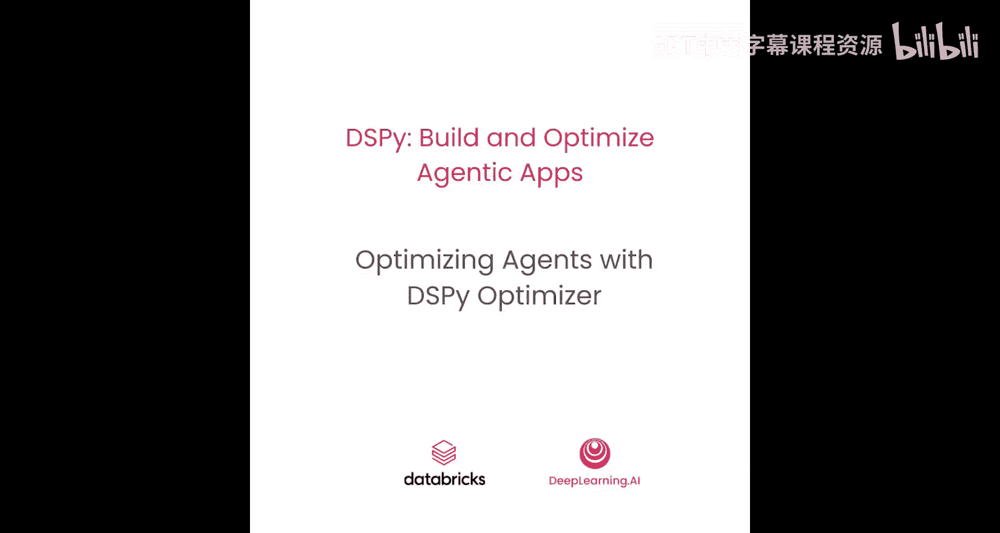

在本节课中，你将学习如何使用DSPy优化器自动提升你的DSP程序质量。

本节课附带一个实验。在实验中，你将亲身体验使用DSPy优化器自动提升一个基于维基百科数据源的问答代理的质量。

优化后，你将看到你的代理质量得到显著提升。

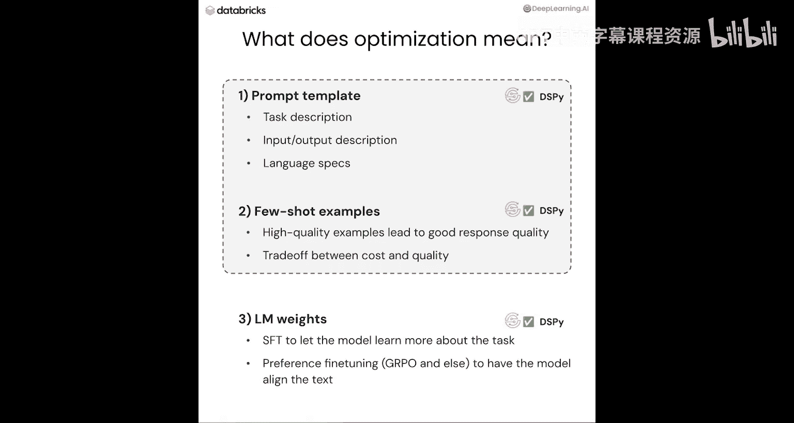

## 什么是优化？

在讨论DSPy优化器之前，我们先思考一下，当我们谈论语言模型应用时，“优化”意味着什么。

优化通常可以指三件事：
1.  优化提示模板。
2.  构建高质量的少样本示例。
3.  微调语言模型的权重。

前两部分都属于提示优化或提示工程的范畴。在DSPy中，我们支持以上所有三种优化方式。

## DSPy优化器概览

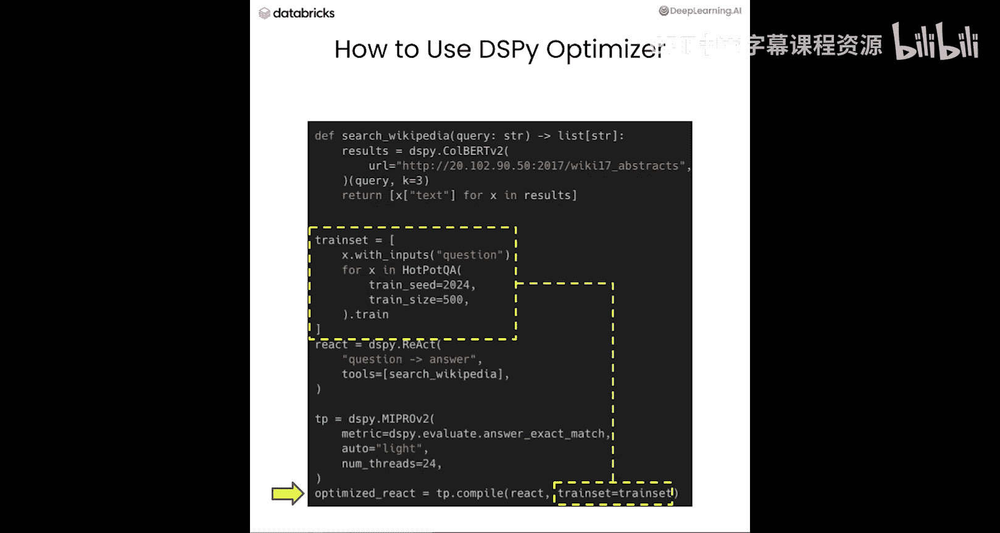

现在，让我们概览一下如何使用DSPy优化器。

首先，你需要选择一个优化器。关于如何选择优化器，请参考我们的官方文档网站 `dspy.ai`。

在本节课和实验中，我们将使用 **MIPROVE** 优化器。这是一个适用于提示模板优化和构建少样本示例的优秀优化器。

选择优化器后，你需要告诉优化器评估指标函数，以及训练和验证数据集。其核心思想是让优化器知道什么是好的程序，什么是不好的程序。

与常规的机器学习任务不同，这个数据集可以小到只有20条记录。如果你没有验证数据集，优化器会自动划分一部分数据作为验证集。

## 优化器如何工作？

本节课我们专注于提示工程，并以MIPROVE优化器为例进行演示。关于如何使用DSPy优化器进行微调以及其他优化器的工作原理，请阅读 `dspy.ai` 上的教程文档。

从高层次来看，优化过程如下：
1.  首先，构建多组少样本示例。
2.  基于这些少样本示例和你的程序信息，我们让语言模型生成多个提示模板候选。这些模板对应签名中的指令。
3.  我们从少样本示例集和指令集中采样，组合成候选程序。
4.  在验证数据集上运行候选程序并进行评估。评估基于用户定义的指标函数，将程序输出与标准答案进行比较。
5.  候选程序的最终得分是所有验证数据得分的平均值。
6.  在整个过程中，我们会持续选择得分最高的候选组合。

重要的是，在优化器中，我们既不进行穷举搜索，也不尝试所有组合。相反，我们使用一种称为**贝叶斯采样**的统计方法，智能地向最优组合方向采样。

## 生成少样本示例和指令候选

上一节我们介绍了优化流程，本节我们来看看如何生成少样本示例和指令候选。

少样本示例是通过一个称为 **自举** 的过程生成的。这个过程很简单：
1.  我们从训练数据集中获取数据，并将其输入到一个DSP程序中。
2.  如果根据指标函数，该程序在用户设定的阈值之上获得了分数，我们就捕获每个模块的输入和输出轨迹。
3.  这些轨迹将成为该模块的少样本示例候选。

请注意，一条数据可能生成多个候选，因为我们通过设置非零的 `temperature` 参数为每次调用添加了随机性。

现在，我们来谈谈如何构建指令候选：
1.  我们获取程序代码和描述，连同少样本示例以及一些通用提示（如“要全面”或“要简洁”）。
2.  通过一个称为 **DSPy提议** 的机制，将所有内容发送给语言模型，生成一批指令候选。

现在我们有了指令（即提示模板）和少样本示例的候选，就可以通过选取一个少样本示例候选和一个指令候选来组合生成候选程序。然后我们可以评估候选程序，并根据用户指定的试验次数持续采样。

## 优化效果与过程追踪

我们已经对MIPROVE优化器的性能进行了全面的实验。我们看到，在多项任务中，MIPROVE的表现都大幅超越了原始提示。更多细节请查阅论文《Optimizing Instructions and Demonstrations for Multi-Stage Language Model Programs》。

我们还可以利用 **MLflow** 来解读优化过程。只需设置几个标志来开启 `mlflow.dspy.autolog`，优化过程就会被追踪。当我们尝试候选程序时，会对其进行评估，所有这些评估结果以及候选程序的信息（如指令是什么、少样本示例是什么）都将保存到MLflow中，从而完整记录整个过程中尝试过的所有内容。

## 动手实践：优化问答代理

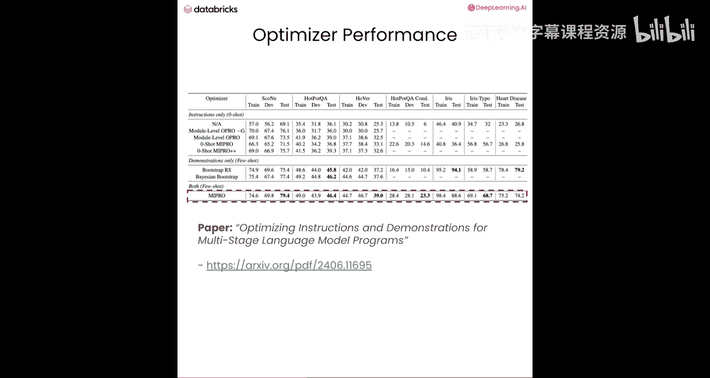

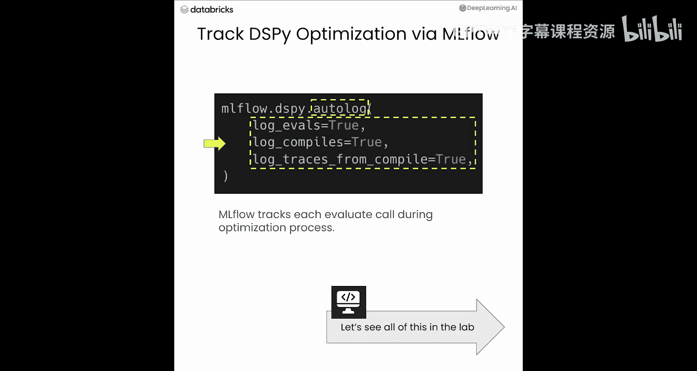

现在，让我们通过编码来看看优化器如何工作。

和之前的实验一样，我们首先设置语言模型API。我们还需要设置一个MLflow追踪服务器，并给它一个唯一的标识符，我们称之为 `dspy-course-2`。

我们可以设置自动日志记录，并开启比之前更多的标志，以便追踪优化过程。我们继续使用 `gpt-4` 作为语言模型。

这个问答代理将基于维基百科数据。我们使用 `ReAct` 模块，但不固定检索调用次数，而是使用 `ReAct` 的生成模式，让语言模型决定在得到最终答案前是否需要从数据源获取更多数据。

首先定义我们的工具，即维基百科搜索。我们使用公开可用的 `ColBERTv2` 接口来获取维基百科数据，返回值将是维基百科数据源的文本块。

我们仍然使用 `dspy.ReAct` 作为我们的程序。这次输入输出非常简单，只有问题和答案。所以我们使用一个基于字符串的签名，并且只有一个工具：搜索维基百科。

现在，回顾一下我们需要为优化器准备什么：数据和评估指标。我们需要训练数据集和验证数据集。我们为你准备了一个数据集，它是 `HotpotQA` 数据集的一个子集，这是一个基于维基百科的问答数据集。

加载数据后，让我们看看数据是什么样子。它非常简单，一个问题对应一个答案。一个输入案例就是问题。

是时候创建我们的优化器了。我们将使用MIPROVE优化器。如前所述，我们需要准备一个指标函数，以便优化器知道如何评估我们的候选程序。对于这个任务，我们只使用答案完全匹配作为指标。

配置优化器时，我们建议你使用自动模式，它有 `light`、`medium` 和 `heavy` 三种模式，这些模式经过精心调校以获得良好性能。但如果你想自定义MIPROVE优化器，可以在文档网站的搜索框中搜索 `DSPy` 或 `MIPROVE` 来找到所有可用的配置选项。

优化过程可能需要相当长的时间。为了加速这个过程，我们为你记录了缓存，因此优化将命中缓存而变得快得多。在实际生产中，你不需要记录任何缓存，只需进行语言模型调用。

现在，让我们启动优化过程。我们使用优化器的 `compile` 函数，将程序、训练集和验证集传递给它。

优化完成后，我们可以查看日志。基本上，我们持续获取候选程序并对其进行评估，最终从整个过程中选出最佳程序。

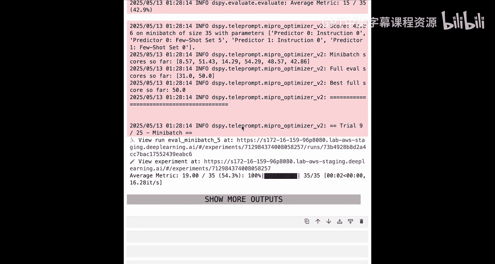

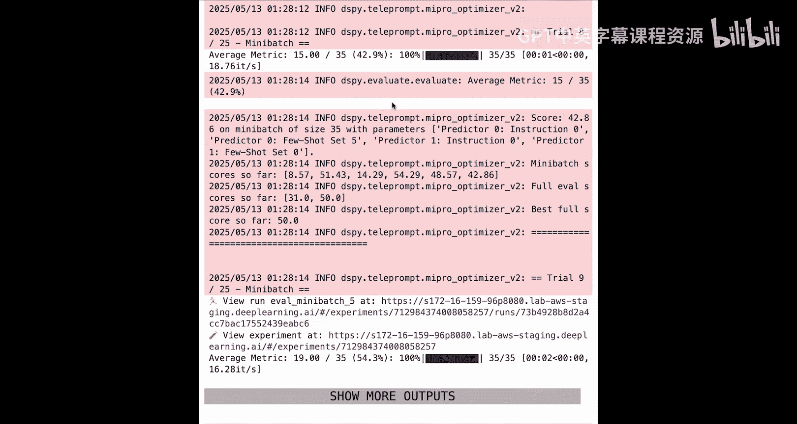

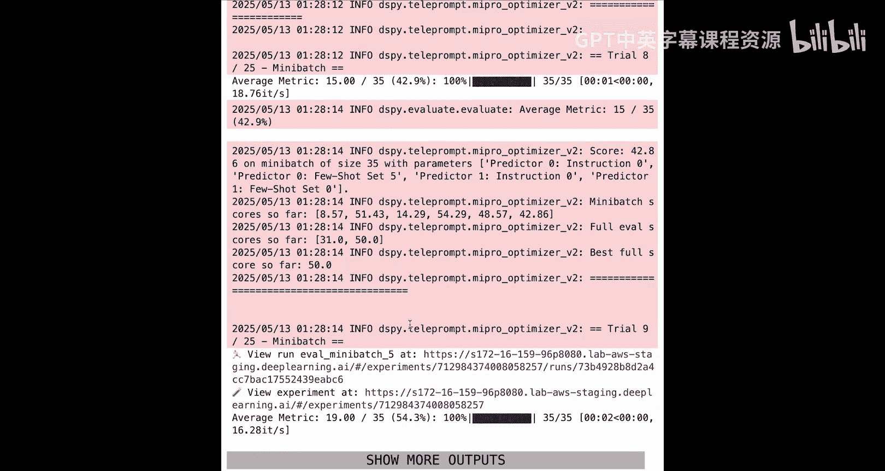

让我们看看在这个过程中发生了什么变化。如果你还记得，原始的签名只是一个非常简单的从问题到答案的映射，`ReAct` 模块没有任何指令。但在优化过程之后，`ReAct` 子模块将填充一个非常全面的指令，并且还内置了一些少样本示例。

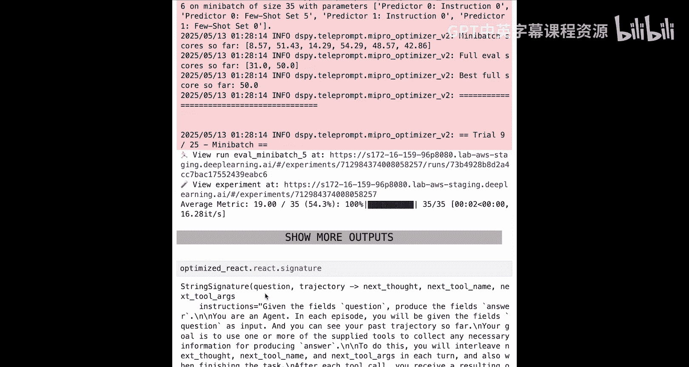

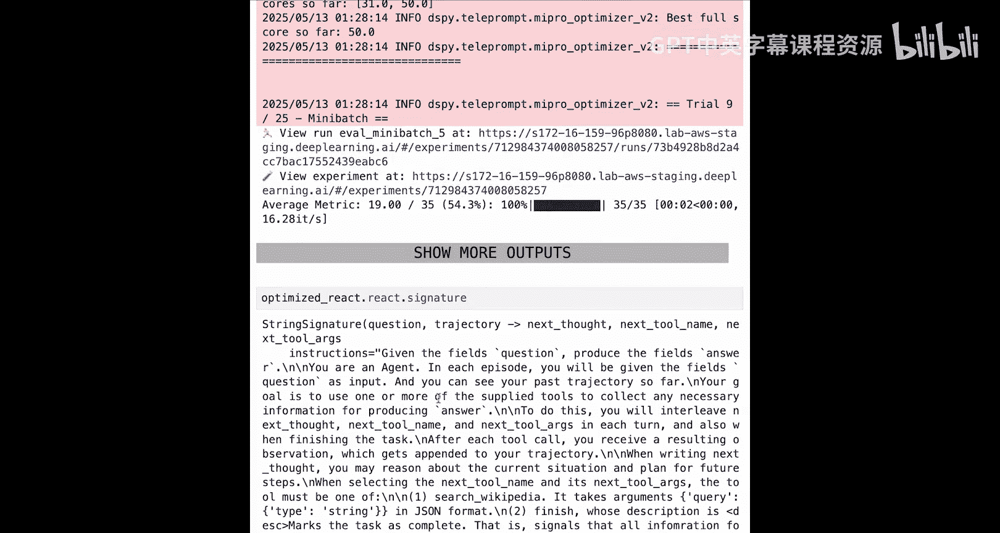

这些示例以列表的形式表示在 `demos` 属性中。

让我们进一步评估未经优化的 `ReAct` 问答应用。我们得到了31分，可以在表格中看到一些输入输出示例。

现在，让我们评估优化后的 `ReAct` 并获取分数。我们得到了54分。可以看到，无需任何人工干预，仅仅通过使用优化器，我们的分数就从31分提升到了54分。这就是DSPy优化器的威力。

正如幻灯片中提到的，我们使用MLflow追踪了优化过程，你可以在MLflow UI中查看。在UI中，优化运行显示为一行，每个子项对应一个候选程序的评估。点击进入运行，你可以看到候选程序的属性，如少样本示例、指令以及其他属性，以及候选程序的评估分数。这样你就完整记录了优化过程的全部记录。

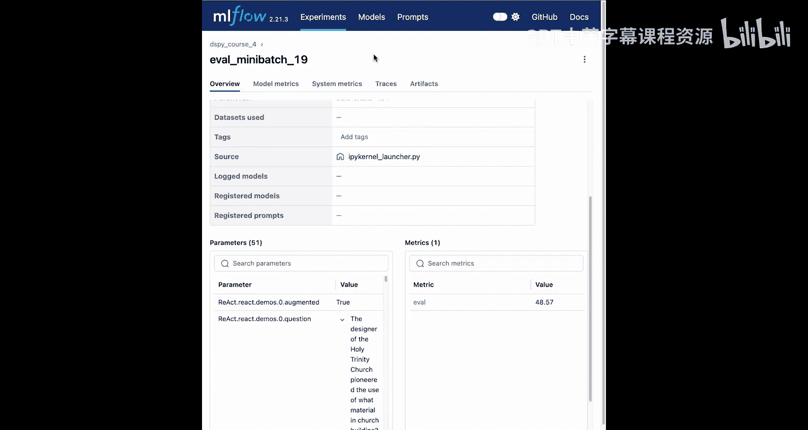

## 总结

在本节课中，你学习了如何使用DSPy优化器来优化你的DSP程序。我们通过优化基于维基百科数据的问答代理，看到了DSPy优化器的强大能力。