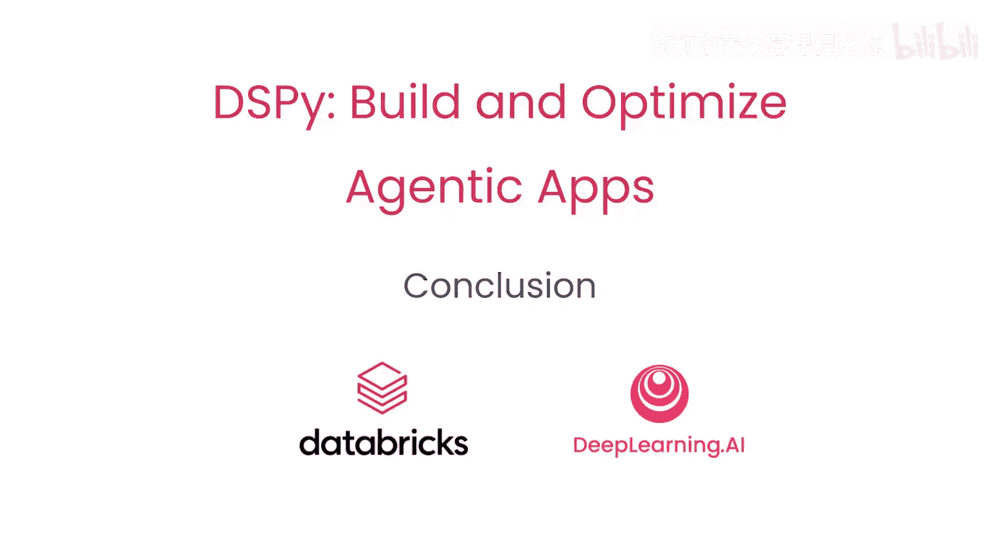

# 006：总结 🎯



在本课程中，我们学习了DSPy框架的核心概念与应用方法。DSPy是一个轻量级、灵活的框架，旨在简化与大型语言模型的交互以及智能代理应用的开发。它通过自动程序优化和原生MLflow追踪集成，极大地提升了开发效率。

## 框架概述 🧩

DSPy是一个轻量级且灵活的框架，用于简化与大型语言模型的交互和智能代理应用的开发。它提供了通过DSP优化器实现的自动程序优化功能，并集成了原生的MLflow追踪功能，便于开发过程中的调试与监控。

## 核心工作流程 🔄

上一节我们介绍了框架的整体概念，本节中我们来看看构建和优化一个DSPy程序的具体步骤。

以下是构建一个DSPy应用的基本步骤：

1.  **定义签名**：使用`dspy.Signature`来明确指定程序的输入和输出。
    ```python
    class QA(dspy.Signature):
        """回答基于上下文的问题。"""
        context = dspy.InputField(desc="相关背景信息")
        question = dspy.InputField(desc="用户提出的问题")
        answer = dspy.OutputField(desc="基于上下文的答案")
    ```

2.  **创建模块**：使用`dspy.Module`来封装自定义的逻辑链。
    ```python
    class RAG(dspy.Module):
        def __init__(self):
            super().__init__()
            self.generate_answer = dspy.ChainOfThought(QA)
        
        def forward(self, question, context):
            return self.generate_answer(context=context, question=question)
    ```

3.  **准备数据与评估**：构建一个小型数据集并定义一个匹配函数，用于评估程序输出。
    ```python
    trainset = [ ... ] # 你的训练数据示例
    def match_func(example, pred):
        # 定义如何将预测结果与标准答案比较
        return example.answer.lower() == pred.answer.lower()
    ```

4.  **优化程序**：使用DSPy优化器（如`BootstrapFewShot`）来提升AI程序的质量。
    ```python
    from dspy.teleprompt import BootstrapFewShot
    teleprompter = BootstrapFewShot(metric=match_func)
    optimized_program = teleprompter.compile(RAG(), trainset=trainset)
    ```

5.  **集成追踪**：通过添加`mlflow.autolog()`或`dspy.MLflowLogger`，轻松集成MLflow进行实验追踪。
    ```python
    import mlflow
    mlflow.autolog()
    # 或使用 dspy.configure(..., logger=MLflowLogger())
    ```

## 课程总结 📝

本节课中，我们一起学习了DSPy框架的核心价值与使用方法。你了解到DSPy如何通过签名定义接口、通过模块组织逻辑、并利用优化器自动提升程序性能。最后，我们还探讨了如何集成MLflow来追踪实验过程。掌握这些步骤后，你就可以开始构建和优化自己的智能代理应用了。期待看到你运用DSPy构建出的成果。