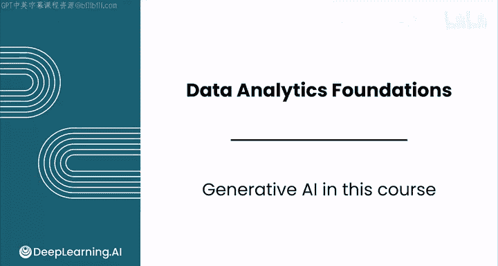
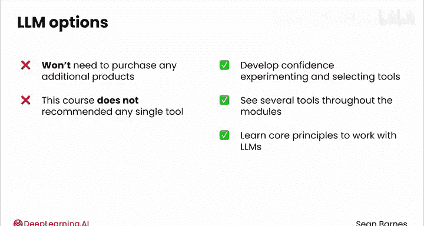

# 002：生成式AI在数据分析中的应用 🚀

在本节课中，我们将学习生成式AI（特别是大型语言模型，LLMs）如何融入数据分析师的工作流程。我们将探讨其核心能力、关键限制以及未来发展趋势，并建立使用这一新兴技术的基本原则。

---

## 生成式AI的核心作用

本课程的一个关键要素是学习使用生成式AI，特别是像ChatGPT、Claude、Gemini等大型语言模型（LLMs）。

我迫不及待地想与大家分享这些工具如何融入你作为数据分析师的工作。有时它们的感觉就像魔法一样。

上一节我们提到了生成式AI的重要性，本节中我们来看看它的具体应用场景。你将学习如何使用LLMs来完成以下任务：

以下是LLMs在数据分析中的主要应用方向：
*   综合来自利益相关者的信息。
*   探索数据集及其元数据。
*   通过为你编写代码来自动运行数据分析。
*   解释数据可视化的图像。
*   创建数据可视化图表。

---

## 认识LLMs的关键限制

然而，你同样需要了解LLMs的关键局限性，包括它们无法为你完成的任务。

LLMs是一种极其有用的工具，但它们不能替代你的技能和判断力。它们无法在复杂情况下复制你的决策能力，尤其是在需要经验、直觉和适应性思维的场景中。

---

## 课程的教学理念与挑战

教授如此新兴的技术有其挑战。我想花点时间分享我们团队关于在本课程中使用生成式AI的理念。

首先，本课程展示了截至2025年的最新技术能力，我们预计在未来数月和数年内还会发生变化。

我们的团队设计本课程是为了传授**长青的原则**：即如何思考并在你的工作中使用生成式AI，无论你最终使用哪种具体产品。

最重要的是，你将培养一种**迭代和实验的心态**。自2022年底推出以来，LLM产品的进展令人震惊。它们的能力迅速提升，新功能不断发布。

---

## 未来的发展趋势

了解其核心原则后，我们有必要展望一下未来。以下是你近期可以预期的一些变化：

以下是生成式AI工具可能的发展方向：
*   出现具有更先进和专业化功能的Gen AI工具，例如为你使用应用程序的能力。
*   工具变得更便宜、更快速，输出质量更高。

在这个快速发展的领域，要跟上所有变化可能很困难。但别担心，在本课程中，你将培养必要的元认知技能，以便在自己的工作中驾驭这些进步。

---

## 关于工具使用的说明

本课程也展示了一些LLMs的付费功能，但你无需购买任何额外的产品即可完成作业。

让你了解可用的选项（包括付费选项）非常重要，这样你才能有信心在自己的数据分析工作中进行实验并选择最佳工具。

本课程不推荐任何单一工具，你将在各个模块中看到多种工具。请记住，你将学到的**核心原则**将使你准备好使用现在和未来的LLMs，无论是免费还是付费版本。

---

## 实践与总结

你将在本模块的第4课首次体验使用生成式AI进行数据分析，其中包括一个动手实验。

现在，请和我一起进入下一个视频，了解本模块所有令人兴奋的主题。我们那里见。

---

本节课中我们一起学习了生成式AI在数据分析中的潜力与局限，建立了使用它的核心原则与迭代心态，并展望了其未来发展趋势。记住，LLMs是强大的辅助工具，但数据分析师的专业判断与决策能力始终不可替代。