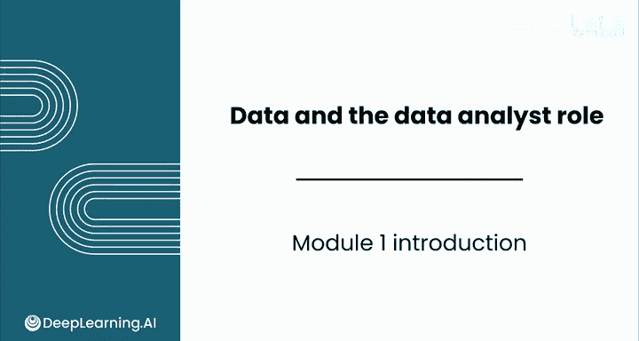

# 003：数据分析基础 - 模块1 简介 🧭

在本节课中，我们将要学习数据分析的基本概念、其历史渊源、核心组成部分以及现代工具的应用。我们将了解数据分析如何融合数学、技术与商业思维，并初步认识数据生态系统中的不同角色。

---

想象一个每个决策都有坚实证据支持的世界，一个企业能够利用数据的力量来驱动效率、成功与创新的世界。欢迎来到数据分析的世界。

你将看到这个多学科领域如何结合数学的解题能力、技术的计算能力以及商业的战略思维，从而创造出一门极具价值的学科。

从古代文明追踪农业周期，到现代企业优化其决策制定，数据分析的原则已经塑造我们的世界数千年。

在上一节我们介绍了数据分析的愿景，本节中我们来看看本模块的具体学习内容。

在本模块中，你将全面了解不同类型的数据以及它们如何在组织中流动。你将认识构成数据生态系统的多样化角色，每个角色都拥有其独特的技能组合。

最后，你将学习利用一个强大的工具——像 ChatGPT 这样的大型语言模型。这些人工智能工具可以作为思考伙伴，帮助你进行头脑风暴、完善想法，甚至运行分析。

无论你是准备开启数据领域的职业生涯，还是希望在当前职位中利用分析技术，本模块都将为你提供一个坚实的基础。

以下是本模块涵盖的核心概念列表：
*   **数据类型与流动**：理解结构化与非结构化数据，以及数据在组织中的生命周期。
*   **数据生态系统角色**：认识如数据工程师、数据分析师、数据科学家等不同职位及其职责。
*   **AI 工具的应用**：学习如何将大型语言模型作为 **`分析助手`** 来提升工作效率。

接下来，我们将一窥数据分析师角色的日常。数据分析师的一天是怎样的？一年呢？整个职业生涯又如何？请跟随我到下一个视频去了解一下。

---

本节课中我们一起学习了数据分析的广泛定义及其悠久历史，明确了本模块的学习目标，包括理解数据分类、认识数据生态系统中的关键角色，以及掌握如何运用现代 AI 工具辅助分析。这些知识为我们后续深入具体技能打下了坚实的基础。