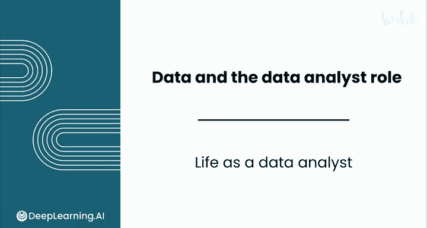
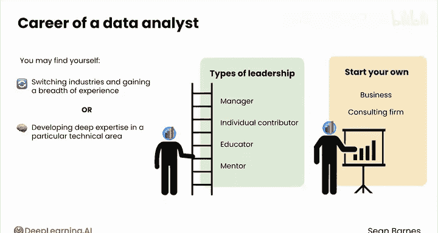

# 004：数据分析师的工作日常 📊

在本节课中，我们将深入了解数据分析师典型的工作日常、职业的长期发展路径以及这个领域带来的独特乐趣与满足感。通过一个模拟的日程安排和职业发展轨迹，你将清晰地看到数据分析师如何度过充实的一天，以及这个职业如何随着时间推移提供丰富的成长机会。

---

在我认识的所有数据分析师中，每一个人都对这份工作充满热情。只要你在一个公平对待你的公司，这份工作将成为你的乐趣之一。它充满趣味，节奏快，并且始终保持新鲜感。我想与你分享我在日常工作中、中期发展以及整个职业生涯中热爱数据分析的原因。

首先，我的同事们和我都热爱数据分析，因为你总是在发现新事物，这让工作保持新鲜感。它与众多不同领域紧密相连，几乎每个行业都需要数据分析师，从科技巨头和初创公司到政府机构和非营利组织。

市场对你技能的高需求转化为有竞争力的薪资和职业安全感。它吸引了来自各种背景的人才。你可能会与曾是物理学家、心理学家或商科专业的人并肩工作，他们都找到了进入数据领域的道路。

由于这个领域发展迅速，你将不断学习新的技术技能。如果你是那种热爱学习、解决问题和发现新事物的人，你会非常适合这里。

## 典型一日模拟日程 📅

以下是一个典型工作日的模拟日程安排，展示了数据分析师一天中可能进行的各种活动。

*   **上午9点**：开始一天的工作，探索需要解决的新问题。
*   **上午10点**：与数据团队开会。了解公司的新优先事项，并获取你所需的数据。
*   **上午11点**：专注工作时间。深入处理电子表格、数据库和代码，进行新的发现，甚至可能经历一两个“顿悟”时刻。
*   **下午2点**：创建仪表板。找出如何讲述数据中隐藏的故事，并以美观且实用的方式将这些故事可视化。
*   **下午3点**：展示你在仪表板上的进展。分享你的辛勤工作感觉很好，可以直接从队友那里获得关于这个仪表板将如何帮助他们创造价值的反馈。
*   **下午3点30分**：庆祝你的演示和仪表板进展。用一杯下午茶和短暂的休息来犒劳自己。我有时会去喝杯茶。
*   **下午4点**：学习一项新的技术技能。参加高级统计课程或学习一门新的编程语言。在工作中学习非常有收获。
*   **下午6点**：与数据团队的欢乐时光。与你的分析师和数据科学家同事社交，了解新趋势，并讨论即将开展的项目。

你的每一天都会安排得满满当当。我鼓励你花时间庆祝并记录你的成功。

## 中期发展与职业满足感 🚀

上一节我们看了一天的具体安排，本节中我们来看看在几年的时间跨度里，数据分析工作能带来哪些成长和成就感。

在几年的时间里，你可能会完成几个大型项目。看到你的工作在现实世界中产生影响是极其令人满足的。你将能够创建自己的工作作品集。作品集不仅能展示你的技能，还能帮助你为未来的成长机会做好准备。

你还将发展你的行业专业知识，从专业术语到不成文的规则。你的技术技能将显著提高，因为不同的项目要求你提升技能。通过领导成功的项目，你将赢得队友的信任。建立牢固的关系会带来处理引人入胜问题的机会。

数据分析的每一个方面本身都很有回报。这可能看起来还很遥远，但在你意识到之前，你就会庆祝巨大的成功并掌握全新的技能。

## 数据分析师的职业发展路径 🧭

日复一日，年复一年，构成了职业生涯。数据分析师的职业生涯是什么样的？你可能会发现自己转换行业，在不同领域（如科技、医疗保健、时尚、供应链等）获得广泛的经验。

或者，你可以在特定的技术领域发展深厚的专业知识，成为该领域的专家。随着你的进步，你将成为一个领导者。领导力有多种形式，可以是管理者、高技能的个人贡献者，也可以是教育者。

你还可以与年轻同事建立导师关系，帮助他们提升技能。随着你获得专业知识，你可能会决定创办自己的企业或咨询公司，利用这些专业知识帮助他人成功。

你在工作中每一天、每个项目、每次对话所付出的努力，都会为你在数据分析领域打开丰富多样的职业发展轨迹。

---

对我来说，数据分析不仅仅是一份工作。它是一种乐趣。我珍惜我获得的每一个学习机会，以及与我才华横溢的同事的每一次对话。我知道你也会像我一样享受这个领域。怀着这个目标，请加入下一节课，了解更多关于数据分析及其历史的知识。我很高兴你能迈出数据分析职业生涯中这重要的第一步。我们下节课见。