# 005：什么是数据分析 📊

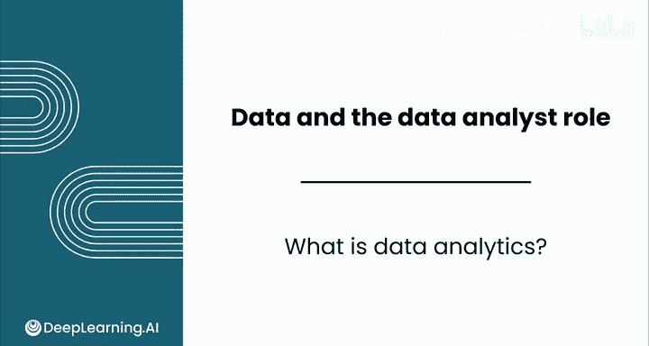

在本节课中，我们将要学习数据分析的核心概念，了解它是什么、如何运作，以及它与相关领域的区别。我们将从数据分析的普遍应用开始，逐步深入到其定义、特点、历史演变和职业应用。

---

数据分析几乎无处不在，它以通常不可见的方式对我们的生活产生有意义的影响。

我们观看此视频所使用的设备、你现在穿着的衣服，甚至你今天早上制作的早餐，都可能以某种方式受到数据分析的影响。

数据分析的核心是一套多样化的技能和工具，使企业能够做出更好的决策。它完全关乎利用数据来获取洞察并支持决策，而不是仅仅依赖运气或经验。

数据分析是一个多学科领域，它结合了数学、编程和商业直觉。你不仅仅是为了数学理解而做数学（例如推导几何证明），也不仅仅是为了编程本身而编程（例如开发排序数字列表的算法）。数据分析将数学和编程结合在一起，以实现特定的商业目标。

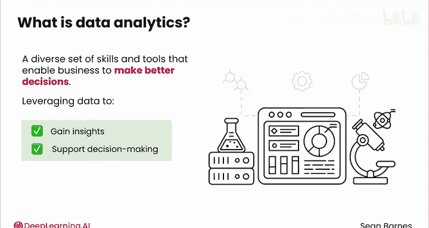

数据分析与科学家、侦探或记者等调查性角色有很多共同之处。

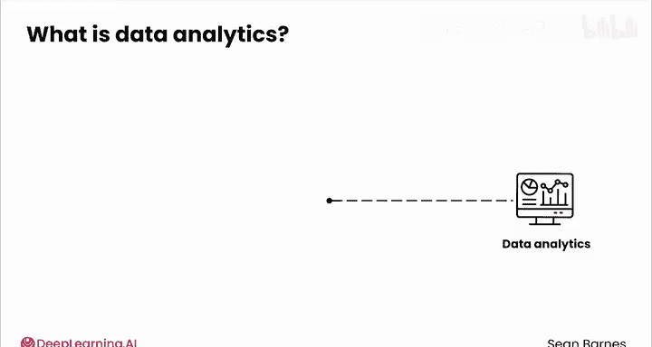

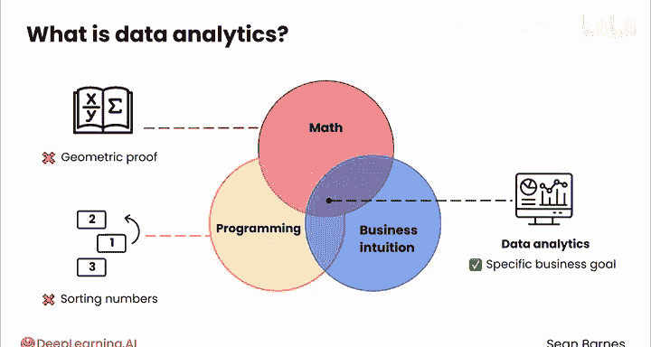

科学家从一个特定的假设开始，然后收集数据来评估这个假设。

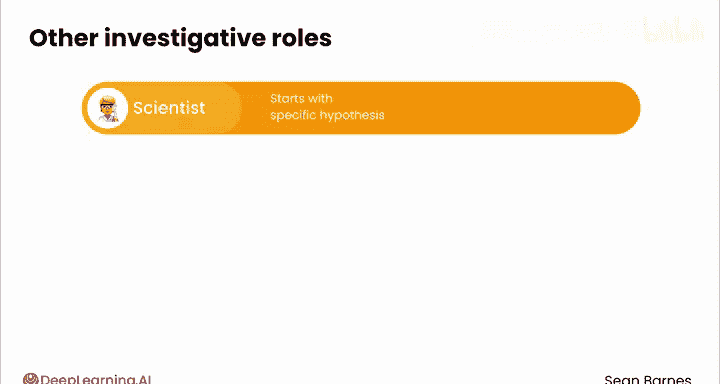

侦探收集证据并将其拼凑起来以理解犯罪。

记者综合信息并为特定主题创造引人入胜的叙述。

---

上一节我们探讨了数据分析的跨学科性质及其与调查工作的相似性。接下来，我们来区分两个容易混淆的概念：数据分析与数据分析。

数据分析听起来很像数据分析，但这两个概念在三个关键方面有所不同：**范围**、**技术**和**商业集成**。

以下是具体的区别：

*   **范围**：数据分析的范围更广，包括实时分析和预测建模，超越了回顾性分析。
*   **技术**：数据分析需要更复杂的技术，包括高级编程、可视化软件和大数据技术。此外，它通常涉及更复杂的迭代过程。
*   **商业集成**：数据分析通常深度集成到商业决策系统中，而不是用于回答一次性问题。它旨在预测趋势、指导决策，并解释过去的数据。

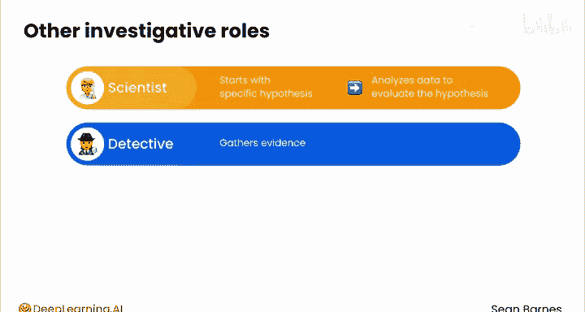

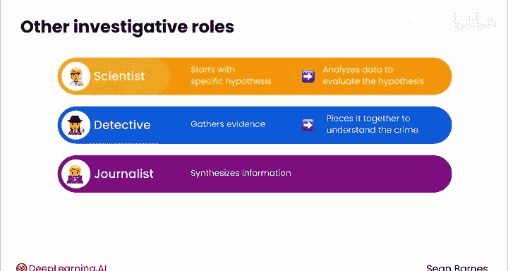

当一个公司在电子表格中跟踪其随时间变化的预算时，那是数据分析。

当他们使用复杂的统计建模技术来分析来自多个来源的大型数据集，创建可视化图表以识别最有前景的收入流，并将这些洞察集成到实时决策系统中时，那就是数据分析。

---

了解了数据分析的现代定义后，你可能会认为它是一个全新的领域，仅仅因为科技行业的近期加速发展而出现。这只是一部分原因。实际上，数据分析已经存在一段时间了。

以下是关于数据分析，哪些是新的，哪些不是新的：

*   **不是新的**：统计学家、科学家和工程师分析数据已有很长时间。数据可视化已经存在了数千年。有记载的第一个数据可视化可以追溯到公元前1150年，那是一张名为“都灵纸莎草地图”的古埃及金矿地图。古埃及人在数据方面相当精明。
*   **什么是新的**：数据分析的新颖之处在于数据本身的爆炸式增长。我们收集的数据比以往任何时候都更加详细。同时，计算技术也在同步发展，为我们提供了更强大的工具来分析这些数据。古埃及人肯定没有处理过9.6万名泰勒·斯威夫特粉丝挤在体育场里使用移动设备产生的数据，也没有分析过6.15亿月活跃的Spotify用户。我也怀疑他们是否用Python编程。

这些趋势催生了现代数据分析，使其具有更广的范围、更复杂的技术和更深度的商业集成。

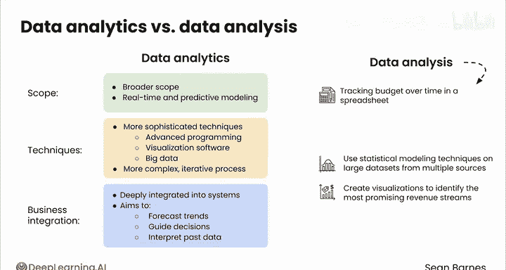

---

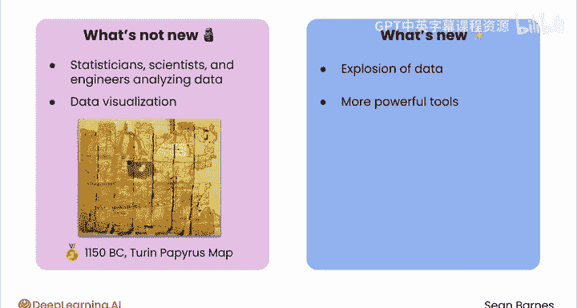

既然我们知道了数据分析是什么以及它是如何演变的，那么它可以在哪些地方发挥作用呢？

数据分析的应用范围几乎是无限的。

如果你查看一些招聘信息，你会发现数据分析师在科技公司、医院、运动队、制造工厂，甚至在学术机构进行研究（这也是我进入该领域的起点）都有需求。

在你寻找工作机会时，你会看到商业智能分析师、数据科学家等与数据分析师交替使用的类似职位发布。

诚然，这些职位有很多重叠之处，但我将分享一些细微差别：

*   **数据科学家**通常更侧重于复杂的建模技术。
*   **数据分析**则更广泛地包含基础统计技术和数据可视化。
*   **商业智能分析师**倾向于使用商业软件（如电子表格），对编程的重视程度较轻。

最终，这些区别有些随意。相同的头衔在不同公司可能对应不同的任务。作为一名数据分析师，你可能会发现自己更倾向于某些方法，因此你的工作可能属于其中一个或几个领域。

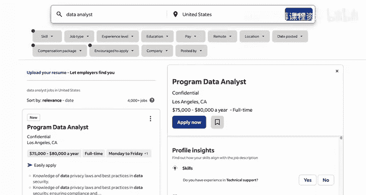

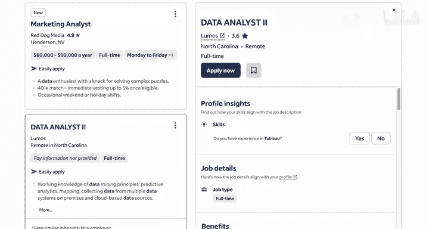

数据分析奖励好奇心、解决问题的能力和影响他人的能力。当然，在现实世界中看到你工作的影响是非常有回报的。

---

在本课程中，你将探索开始利用数据推动更好决策所需的工具和技术。

让我们直接进入一个基础概念：**基于证据的决策**。

---

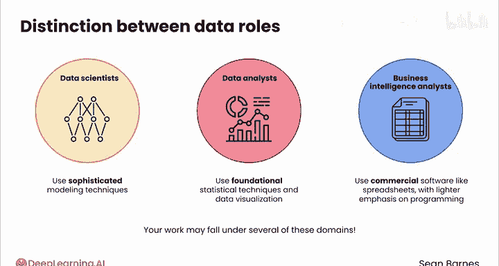

本节课中我们一起学习了数据分析的定义、其多学科性质、与数据分析的区别、历史演变以及广泛的职业应用场景。我们了解到，数据分析的核心是利用数据、数学和编程工具来获取商业洞察并支持决策，其价值在于将信息转化为实际行动。