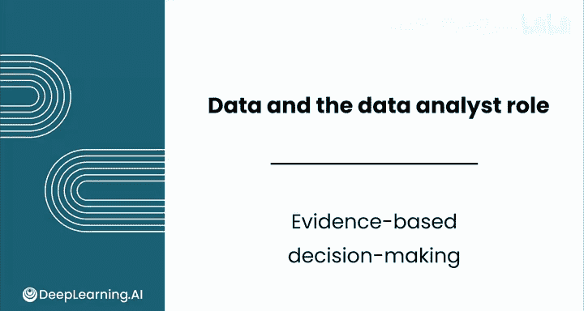
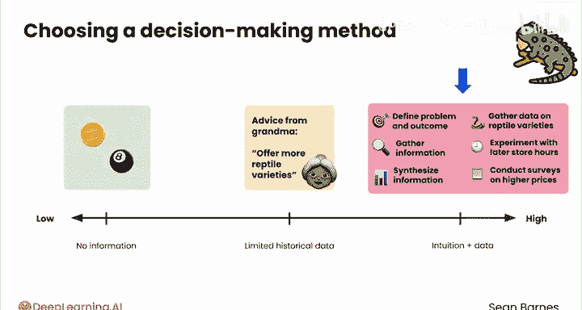

# 006：基于证据的决策 📊

在本节课中，我们将学习决策的不同方法，并重点探讨如何结合直觉与数据，进行基于证据的决策，以最大程度地提高决策成功的可能性。

---

当涉及做决策时，存在许多可能的方法。你可以即兴发挥。可以抛硬币。可以询问朋友。甚至可以摇晃魔法八号球。

与这种明显糟糕的方法相反，数据分析完全关乎证据和一致性。在本视频中，我们将讨论凭运气决策、凭直觉决策，以及最有可能结合直觉和数据取得持续成功的方法。

你可以通过三种基本方式做出决策：可以听天由命；可以凭直觉（这也称为直觉决策）；或者可以实践基于证据的决策，这正是数据分析的用武之地。

这些不同的方法位于信息利用程度的光谱上：凭运气决策完全不依赖任何信息；基于证据的决策位于高信息利用端；而直觉决策则处于中间位置。

直觉由你的个人经验所塑造，因此它是一项宝贵的资产。但还有其他重要的信息类别需要考虑，例如数据和他人提供的知情观点。

---

## 决策为何需要信息

虽然做出明智的决策对你可能很重要，但在日常生活中，你通常不会正式地定义问题并收集证据。

然而，你可能做过类似以下的决策：我应该选择哪所大学？搬到新城市还是留在原地，哪个选择更明智？我应该如何投资我的储蓄？

思考一下，为了回答上述每个问题，你可能会收集哪些类型的信息。我怀疑你不会为其中任何一个抛硬币。你可能会列出每所大学的优缺点，与住在新城市的朋友讨论，或者追踪不同投资的表现来决定哪个最佳。

收集证据所需的努力程度与决策的影响成正比。在刑事司法、医学或新闻等领域，决策可能产生严重后果，仅依赖意见或个人经验是不够的。

如果你因感冒症状去看医生，你不会希望她只是随机猜测你得了流感。风险越高，你就需要越多的证据来支持你的决策。

同时，如果你在决定是向顾客推荐连指手套而不是分指手套，你不需要那么多信息，因为做出错误决策的成本很低。没有人的健康受到威胁，只是手指的舒适度机会而已。

---

## 直觉与数据的结合

有时，凭直觉做决策是合理的。有时，看起来像流感的确实是流感。直觉并非无用。

事实上，一种思考方式是，你本质上是在依赖有限的历史数据点。但有些直觉比其他直觉更有价值。你更信任治疗过5名流感患者的医生的直觉，还是治疗过500名或5000名患者的医生的直觉？

最有效的方法是当直觉与数据相结合时。这就是为什么我们说基于证据的决策，因为数据和某种程度上的直觉都可以成为你证据的一部分。

直觉帮助你做出快速、低风险的决策，并避免在毫无头绪的情况下搜索海量数据。但你也不想一直依赖直觉。

---

## 案例分析：异宠店决策

让我们看一个例子。假设你想增加你的小型异宠店的收入。如果你能做到这一点，你可能就能在你的城市开一家新店，改善员工福利，或者提供更多种类的鱼。

你有几个正在考虑的选项来增加收入：增加更多爬行动物品种；每天延长营业时间两小时；或者提高动物饲料的价格。但你如何选择最佳方案？你可以使用什么信息来做选择？

这是一个高风险决策。一种选择是听天由命，抓起旧的魔法八号球摇一摇，或者抛一枚三面硬币。你基本上是在没有额外信息的情况下做决定。但这里有后果，我打赌你能做得比那更好。

基于直觉的决策会是什么样子？也许祖母从1987年就开始经营这家异宠店，她记得类似的情况，并且她绝对确信提供更多爬行动物品种是正确的方法。

这种直觉比魔法八号球使用了多一点的信息，因为它基于一些有限的历史背景。但你能做得比那更好吗？

---

## 基于证据的决策路径

让我们走基于证据的路线，这包括：明确定义问题和期望的结果；收集相关信息；综合这些信息以确定最佳决策。

这一切都是为了使用正确的信息做出正确的决策，并希望实现正确的结果。收集关于爬行动物品种的数据；尝试延长商店营业时间；进行调查，看看更高的价格是否会困扰你的顾客。

也许你可以首先基于祖母的直觉尝试爬行动物品种方案，如果那行不通，再调查其他两个选项。

有时你可能做出错误的决策却仍然得到正确的结果，反之亦然。每个决策中都有一点运气。基于证据的决策的目标是通过积累最佳证据，来最大化你获得正确结果的机会。

---

## 从直觉到证据的转变

想到祖母在87年经济衰退中凭直觉经营她的爬行动物生意很有趣，但很多企业都是这样决策的，基于诸如“感觉对了”、“我以前见过这样做”或“现在大型语言模型很流行，我们用一个大模型吧”之类的直觉。

这是做决策的最佳方式吗？绝对不是。

作为一名数据分析师，当你将这种思维方式转变为基于证据的决策时，你将为企业增加真正的价值，并且老实说，也会获得最大的乐趣。

---

## 总结

在本节课中，我们一起学习了决策的三种基本方法：凭运气、凭直觉和基于证据。我们探讨了信息在决策中的重要性，以及如何根据决策的风险高低来决定所需信息的多少。我们通过一个异宠店的案例，具体分析了如何结合直觉与数据，通过定义问题、收集信息和综合分析来进行基于证据的决策，从而最大化成功的可能性。记住，最有效的决策往往是直觉与数据证据的结合。