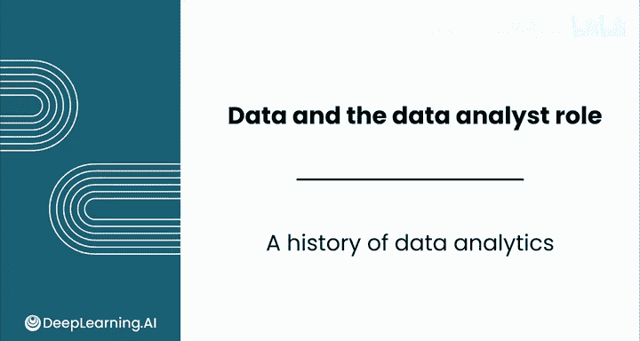
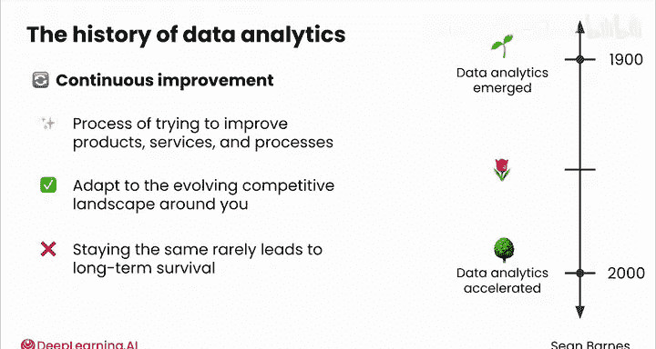
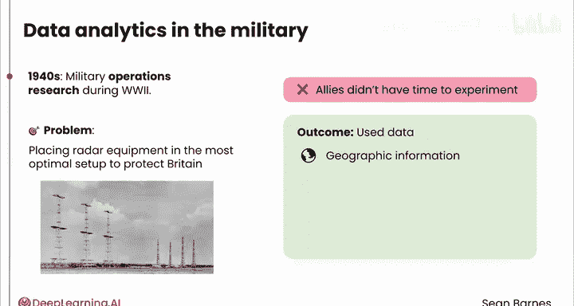
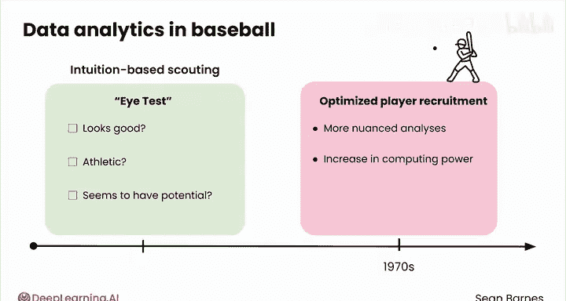
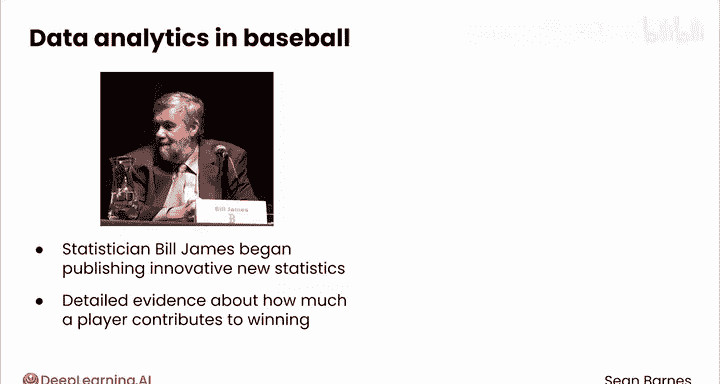
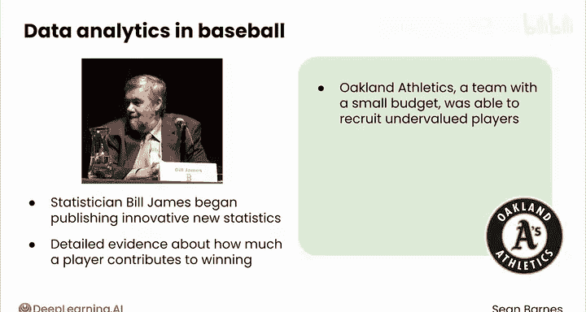
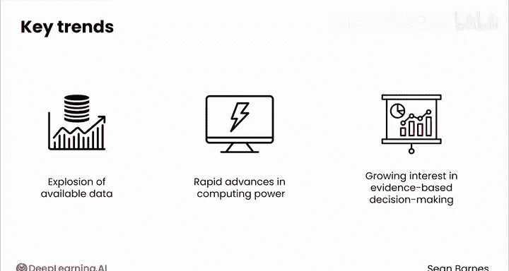
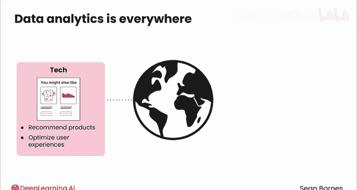
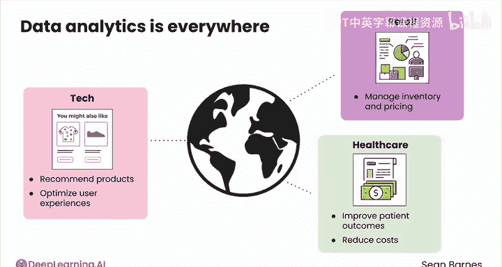

# 007：数据分析发展史 📊

在本节课中，我们将学习数据分析的现代发展历程。我们将从两次世界大战期间的军事应用开始，探讨数据分析如何演变，并最终成为当今商业和科技领域不可或缺的一部分。课程将重点介绍两个核心概念：**持续改进**和**数据驱动决策**。

---

现代数据分析的历史与古埃及人使用数据可视化的历史同样引人入胜。

从军事到棒球，再到科技行业，这段历史将帮助你理解为何数据分析师的需求如此旺盛。

我们将探讨转化为数据分析思维模式的两个关键趋势：**持续改进**和**数据驱动决策**。

---

## 现代数据分析的起源 🏛️

现代数据分析大约在100年前出现，并在世纪之交加速发展。

数据分析史的核心植根于**持续改进**的概念。这是一个持续的过程，旨在改进你的产品、服务和业务流程。作为一个公司，你必须适应周围不断变化的竞争环境，就像进化一样，保持不变很少能带来长期的生存。

现代数据分析的根源可以追溯到第一次世界大战期间的军事运筹学，大约在20世纪40年代初。

调动、补给和装备一整支军队是一项庞大的行动，每一个决策都可能产生重大后果。

最早有记录的运筹资源问题之一，涉及如何以最优配置部署雷达设备，以保护英国免受德国空袭。盟军本可以通过试错来放置设备，但他们没有时间进行实验，因为空袭已经发生。

通过使用诸如地理信息、敌机飞行模式、雷达范围和战略等数据，团队制定了一个部署雷达设备以探测敌机的最优策略。这种部署被认为是盟军在不列颠战役中获胜的一个主要因素。

虽然这可能看起来与当今的数据分析不完全一样——他们当时肯定没有处理大数据或强大的计算机——但这仍然是一种数据驱动决策的形式，对今天的数据分析领域产生了深远影响。

---

## 从战场到球场：棒球中的数据革命 ⚾

上一节我们介绍了数据分析在军事中的起源，本节中我们来看看数据分析如何进入体育领域。

美国棒球是历史上另一个数据驱动创新的温床。

在20世纪70年代之前，顶级球员的选拔通常严重依赖直觉。当时大多数寻找球员的球探都依赖所谓的“目测”。基本上，他们只是观看球员比赛。他们看起来好吗？他们有运动天赋吗？他们似乎有潜力吗？球探也使用一些基本统计数据，但他们的主观判断主导了决策过程。这种方法旨在打造获胜的队伍，同时保持这项运动的美感。

然后在20世纪70年代，三个因素逐渐优化了球员招募：更细致的分析、可用计算能力的增加以及对直觉依赖的减少。

统计学家比尔·詹姆斯开始发布创新的新统计数据。这些统计数据不再仅仅追踪得分（在棒球中称为“跑垒”），而是提供了更详细的证据，说明一个球员对整体胜利的贡献有多大。这可能意味着帮助队友得分，甚至阻止对方球队得分。

使用这些统计数据，预算有限的奥克兰运动家队能够招募到被低估的球员，即那些表现出色但价格较低的优秀球员。这一策略帮助他们获得了相对于一些最富有球队的竞争优势。他们的球员看起来不像典型的球员，但他们的球员更常获胜。这就是数据分析的力量。

---

## 关键趋势与行业普及 📈

棒球的故事与几个关键趋势同时发生：可用数据的爆炸式增长、计算能力的快速进步，以及各行各业对基于证据的决策日益增长的兴趣。

如果一个棒球队可以使用数据来与预算大得多的对手竞争，那么这对于其他行业的企业意味着什么？

以下是数据分析普及的关键驱动因素：

*   **数据爆炸**：可收集和分析的数据量呈指数级增长。
*   **计算能力**：硬件和软件的发展使得处理海量数据成为可能。
*   **决策文化**：企业越来越倾向于用证据而非直觉来支持决策。

今天，数据分析无处不在。

*   科技公司用它来推荐产品和优化用户体验。
*   零售商用它来管理库存和定价。
*   医疗保健提供者用它来改善患者治疗效果并降低成本。

这个列表还在继续。数据分析的普遍性推动了对该领域专家的全球需求。在美国，预计到2030年，数据分析相关工作岗位将增长25%。

每个企业都可以受益于使用数据驱动的证据来推动持续改进。

---

## 总结与展望 🎯

本节课中，我们一起学习了数据分析的现代发展史。

我们从**持续改进**和**数据驱动决策**这两个核心理念出发，追溯了数据分析从二战军事运筹学到美国职业棒球大联盟创新应用的历程。我们看到，数据的有效利用如何帮助组织在资源有限的情况下获得竞争优势。

历史表明，数据分析的本质在于利用信息做出更明智的决策。随着数据可用性和计算能力的提升，这一实践已渗透到各个行业，成为推动增长和效率的关键力量，也因此创造了全球范围内对数据分析人才的巨大需求。

请与我一起观看下一个视频，了解数据分析在现代的一些最令人兴奋的应用。