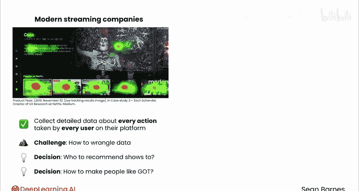
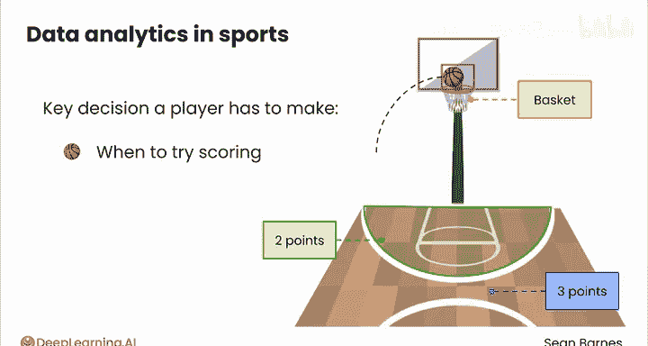
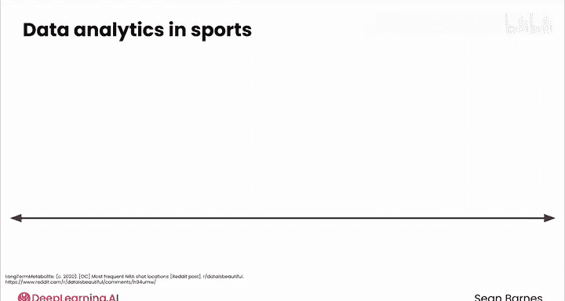
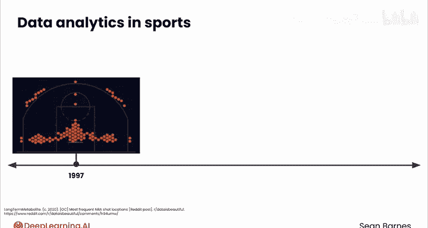
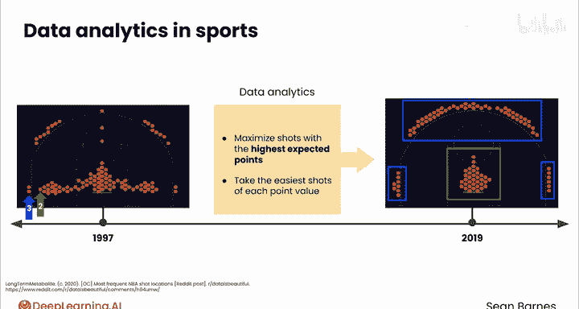
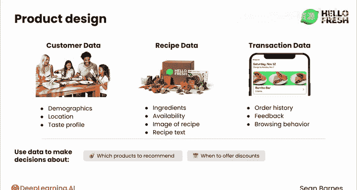
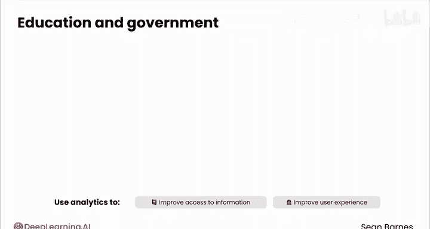
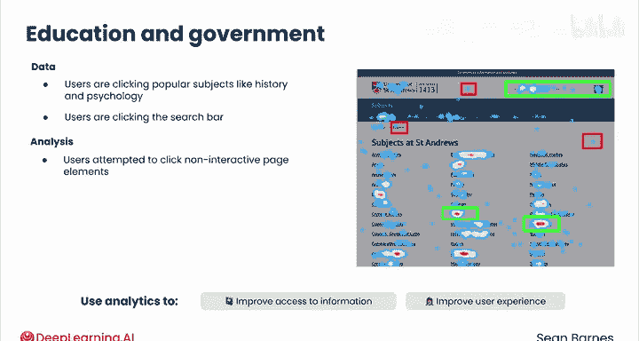
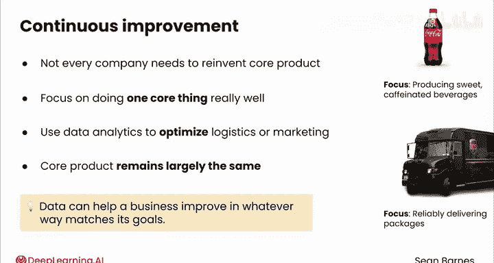

# 008：现代行业应用案例 🏀📊

在本节课中，我们将探索数据分析在不同行业中的实际应用案例。我们将看到，无论你对体育、娱乐、电商还是其他任何领域充满热情，数据分析师都能在其中找到用武之地，通过数据驱动决策，创造巨大价值。

## 流媒体娱乐行业

上一节我们介绍了数据分析的广泛应用前景，本节中我们来看看它在流媒体娱乐行业的具体应用。

像Netflix这样的现代流媒体公司会收集平台上每位用户的每一个行为的详细数据，包括点击、观看时长、搜索、暂停和回放操作。这些信息帮助他们推荐内容。

他们面临的挑战主要不在于获取信息，而在于如何处理如此海量的数据。所有关于“谁点击了什么”和“谁观看了什么”的数据，最终都需要转化为具体的决策，例如：应该向谁推荐真人秀节目？我们如何让人们喜欢《权力的游戏》第八季？这些决策影响深远。YouTube在2018年曾披露，用户观看的内容中有70%来自其推荐系统。

将这种方法与传统的电视收视率统计进行对比。电视网络过去依赖第三方公司（如尼尔森）收集的数据来了解观众。尼尔森通过在样本家庭中安装物理监测设备来记录他们的电视观看习惯，以此衡量人们的收视习惯。

这种方法虽然有用，但也带来了挑战，例如：记录到的收视习惯主要来自年长的电视观众，以及从拥有多台电视的家庭中收集到不准确的数据。

## 体育行业

娱乐只是数据分析的一个应用领域。在体育界，始于棒球的数据分析革命已经蔓延到篮球、美式足球（橄榄球）及其他运动。让我们以篮球为例来看看。

从俯视图看，篮球场是这样的。篮筐（也称为篮筐）位于这里。球员需要做出的一个关键决定是何时尝试得分，这在篮球中也被称为“投篮”。

如果球员在这条线内投篮并将球送入篮筐，则得两分；如果在线外投篮命中，则得三分。过去几十年，球员的投篮位置发生了巨大变化。

以下是1997年（左图）和2019年（右图）最常见的投篮位置分布图。随着球队拥抱数据分析，投篮模式完全改变了，旨在最大化每次投篮的预期得分。球员们学会了选择每种分值下最容易的投篮方式。

因此，出现了大量紧贴三分线的远投和尽可能靠近篮筐的两分球。例如，从这里投篮值两分，但向后退一步到这里投篮，难度基本相当，分值却高出50%。为什么不选择后者呢？

## 电商与产品设计

让我们看看产品设计领域。以HelloFresh为例，它收集多个类别的数据来为其推荐提供信息。

以下是HelloFresh收集的主要数据类型：
*   **客户数据**：如人口统计信息、地理位置和口味偏好。
*   **食谱数据**：如食材、可用性，甚至食谱图片和文本本身。
*   **交易数据**：如订单历史、用户反馈和浏览行为。

所有这些信息都可以用来决定推荐哪些产品、何时提供折扣以及如何选择新食谱。

## 教育与公共部门

在教育和政府等领域，越来越强调使用数据来做出更好的决策。例如，这些机构可能使用分析来改善信息的可访问性。

圣安德鲁斯大学最近发表了一篇文章，解释其如何使用交互热图来改善网站用户体验。下图是他们大学学科页面上的用户点击热图。红色热点显示用户点击最多的区域，其次是黄色、绿色，然后是蓝色。

热图数据显示，许多用户点击了历史、心理学等热门学科，以及搜索栏等位置。然而，通过分析数据，大学发现一些用户试图点击非活动元素，并且页面下部的活动量急剧下降。

这些洞察推动了网站的改进，例如：明确哪些元素是可点击的，以及将信息优先级重新调整到页面顶部。

## 传统行业的优化

并非每家公司都需要不断革新其核心产品。像可口可乐和UPS这样的公司，通过专注于把一件核心事情做到极致，建立了非常成功的企业。可口可乐生产甜味含咖啡因的饮料，UPS可靠地递送包裹。

他们可能会使用数据分析来优化物流或营销，但其核心产品基本保持不变。如果包裹能快速送达正确目的地，客户还真正需要什么呢？关键在于，数据可以帮助企业以符合其自身战略的方式进行改进。

## 总结与展望

本节课中我们一起学习了数据分析在多个行业的应用案例。作为一名数据分析师，你有机会帮助任何行业的组织利用数据做出更好的决策。你的技能之所以需求旺盛，正是因为它们在如此多的应用场景中都极具价值。

出色地完成了本课程的第一课。在查看了接下来的阅读材料和练习评估之后，请加入下一节课，我们将讨论数据分析的命脉——数据本身。你将学习什么是数据、它从哪里来以及它可以呈现的多种不同形式。我们下节课见。