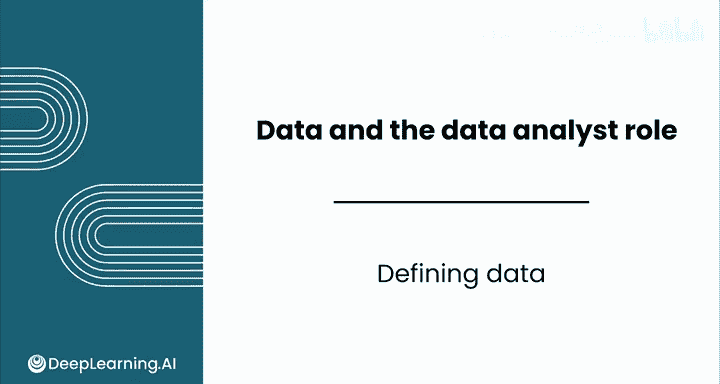
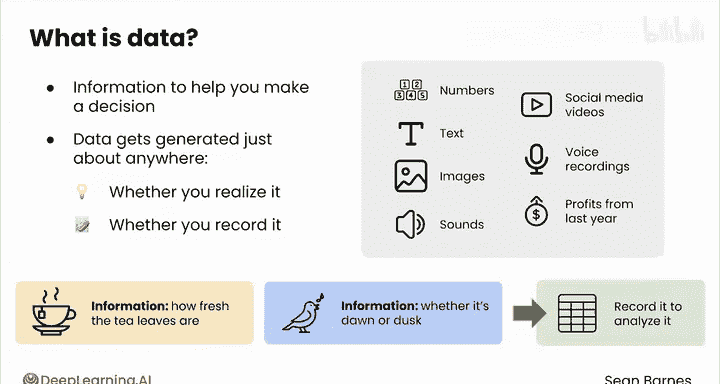
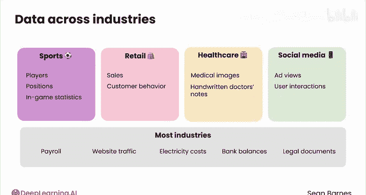
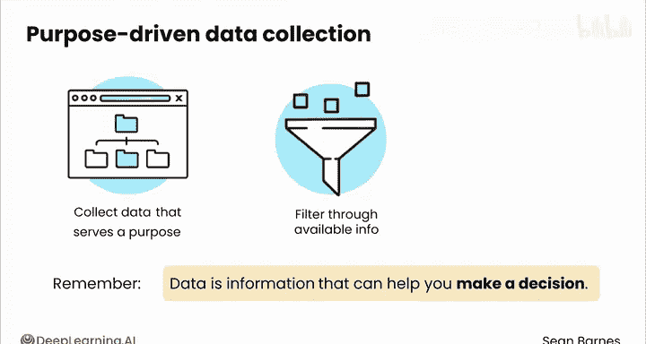
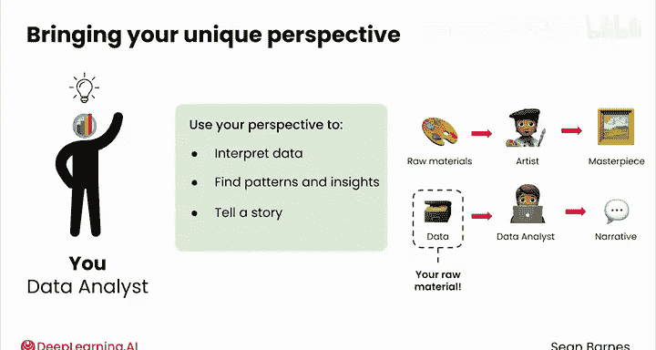

# 009：定义数据 📊

在本节课中，我们将学习数据分析的核心基础——数据。我们将探讨数据的本质、形式、来源以及数据分析师应如何理解和运用数据。

---

## 什么是数据？ 🤔

数据是驱动数据分析领域的原材料。数据是一个广义的术语。作为数据分析师，你应该将数据视为任何能帮助你做出决策的信息。

数据以多种形式存在，从数字和文本到图像和声音。社交媒体视频、语音记录、去年的利润，所有这些信息都能帮助你做出决策。

数据几乎在任何地方产生，无论你是否意识到或记录它。你早晨那杯茶的味道，提供了关于茶叶新鲜程度的信息，这就是数据。当你听到鸟鸣声，这可能提供关于现在是黎明还是黄昏的信息，这也是数据。

你可以将数据更进一步，记录下来以便分析。在上节课中，我们看到对数据的好奇心有着古老的根源，但我们在过去几十年里生成和捕获数据的能力已大大加速。

数千年前，古代民族通过追踪太阳的位置来确定种植和收获的最佳时间，但他们必须使用像巨石阵这样的岩石结构来实现。现在，我们可以通过卫星图像和数字日历，以更少的努力做同样的事情。请注意，这里明显缺少了25吨重的石头。

---

## 数据的类型与来源 📈

不同的行业会生成不同类型的数据。

以下是不同行业中常见的数据类型示例：

*   **体育行业**：你可能处理关于球员位置和比赛统计数据的高度结构化数据。
*   **零售行业**：你可能会遇到关于销售和客户行为的交易数据。
*   **医疗保健行业**：数据通常包括非结构化信息，如医学图像和手写的医生笔记。
*   **社交媒体平台**：收集关于广告观看次数和用户互动的数据。

大多数行业还会有薪资数据、网站流量数据、电费成本数据、银行余额数据、法律文件数据等等。如今，有时感觉一切可以被追踪的事物都被追踪了。

---

## 数据的收集与目的 🎯

但关键在于：仅仅因为你可以收集关于某件事的数据，并不意味着你应该这样做。你应该只收集有目的的数据。

记住我们的定义：作为数据分析师，数据不仅仅是信息，它是能帮助你做出决策的信息。你的工作是筛选所有可用信息，并决定哪些对当前问题最相关。

作为数据分析师，你还会为数据带来独特的视角。你不仅仅是消费数据，你还要解释数据。你寻找模式和洞察，并用它来讲述一个故事。

就像艺术家使用粘土、颜料等原材料创作杰作一样，你使用数据来构建一个能提供信息和启发的叙事。数据是你的原材料，你可以用它创造出既美观又实用的东西。

数据是驱动影响力的强大工具，无论你是试图分析客户行为、解读医学影像，还是推荐视频。

---

## 总结与预告 📝

在本节课中，我们一起学习了数据的核心概念。我们了解到数据是任何能辅助决策的信息，它以多种形式存在，并产生于各行各业。我们强调了有目的地收集数据的重要性，以及数据分析师在解释数据和构建叙事中的关键作用。

数据是一个宽泛的概念，因此不可避免地会有分类。在下一个视频中，你将学习非结构化数据的复杂性，这是一种非常自然和人性化的信息捕获方式。

我们下次视频见。

