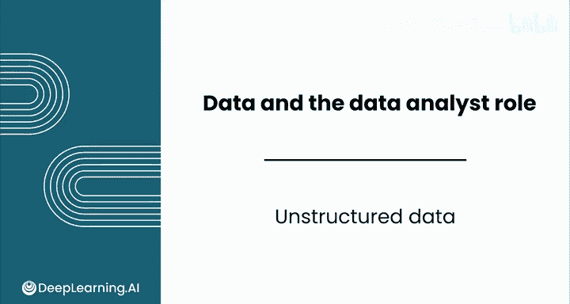
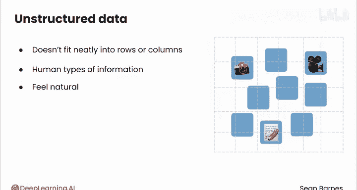
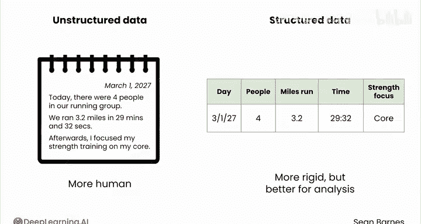
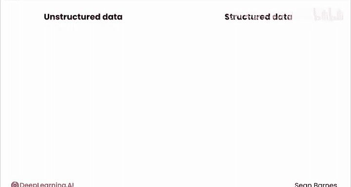
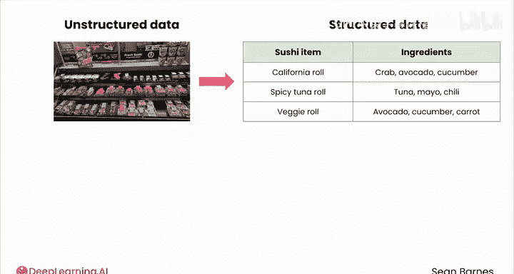
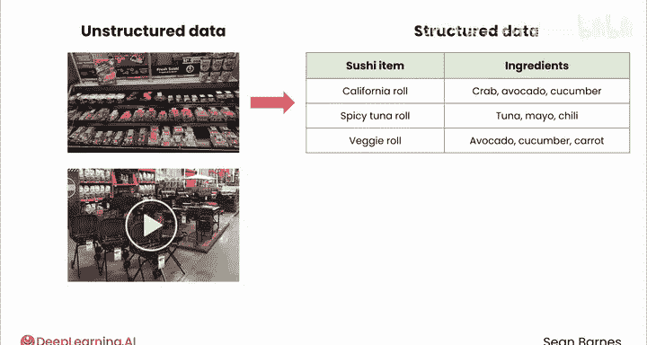
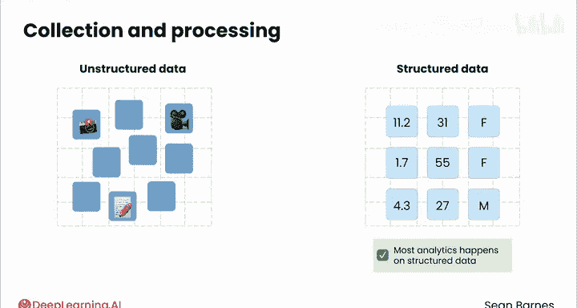
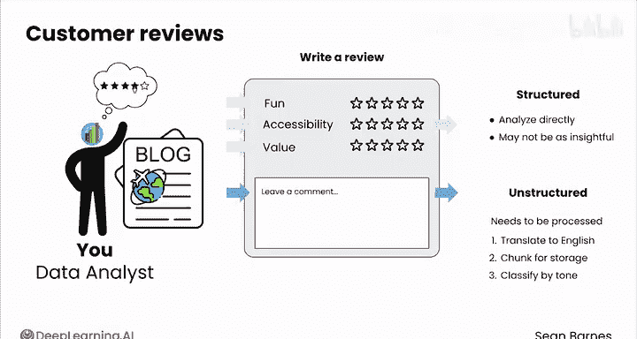
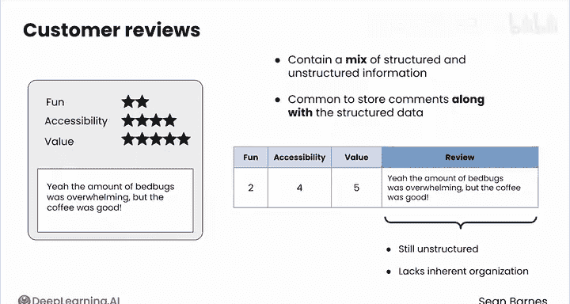

# 010：认识非结构化数据 📝

在本节课中，我们将要学习什么是非结构化数据，它为何普遍存在，以及它与结构化数据的区别。理解这一概念是数据分析的重要基础。

---

闭上眼睛一秒钟，和我一起想象一下你脑海中的数据。好的，睁开眼睛。你想到的是什么？是不是类似这样的东西：一个由数字、行和列组成的表格？这是对数据最典型的描绘。

但现实是，你在现实世界中遇到的很多数据最初并非如此。我们称之为**非结构化数据**。

具体来说，非结构化数据指的是无法整齐地放入行或列中的数据。它无处不在。当你拍照、录制视频或在日记中写下笔记时，你就在创造非结构化数据。这些都是人类自然产生的信息类型，对我们来说非常自然。

事实上，如果你只是为自己收集数据，你很可能会以非结构化的方式进行，甚至不加思索。例如，你可能只是用日记来记录和朋友的锻炼情况。

它可能看起来像这样：
> 今天我们的跑步小组有四人。我们跑了3.2英里，用时29分32秒。之后，我重点进行了核心力量训练。

这些信息也可以被组织成结构化形式，比如像下面这个表格，其中每个锻炼细节是一列，每一天是一行。

| 日期 | 参与人数 | 距离（英里） | 时长（分:秒） | 后续训练 |
| :--- | :--- | :--- | :--- | :--- |
| 2023-10-27 | 4 | 3.2 | 29:32 | 核心力量训练 |

你可以看到，左边的日记形式更人性化、更自然，而右边的表格形式更刻板，但更适合分析。

所以总结来说，像原始日记条目这样的文本数据被认为是**非结构化**的。

---

上一节我们了解了文本形式的非结构化数据，本节中我们来看看其他类型的非结构化数据。

以下是更多非结构化数据的例子：
*   **照片**：本周早些时候，我在杂货店拍了一张寿司选项的照片，以便我妻子挑选。这就是非结构化数据。如果它是结构化的，可能会更像一份菜单，整齐地列出每个项目及其成分。
*   **视频**：我在五金店录制了一段关于几种潜在烤炉选项的视频，这也是非结构化数据。如果我必须把它放入行和列中，我会放什么？也许我可以在每一行记录一个选项，包括价格、保修链接和一个1到5分的评分，代表我对每个选项的喜爱程度。

总结来说，**照片和视频是非结构化的**。

---

那么，区分结构化数据和非结构化数据为何重要呢？这完全关乎数据如何被收集和处理。

在某个时间点，所有这些非结构化数据通常都需要转换为结构化格式，以便进行有效分析。大多数数据分析都发生在结构化数据上，尽管现代技术越来越擅长直接分析非结构化数据。我们将在后续视频中更多地讨论结构化数据。

---

由于大多数数据并非一开始就以行和列的形式存在，它们通常需要经过转换才能成为结构化形式。作为一名数据分析师，你应该注意数据的来源，因为数据是否结构化通常会影响其预处理和分析的难易程度。

非结构化数据在变得有用之前通常需要更多的处理步骤，但它也更容易被人自然生成，并且由于其细节丰富，可能包含意想不到的洞察。

假设你正在处理一个旅游博客网站的客户评论。评论者可以对某个地点的趣味性、可达性和价值进行1到5星的评分，然后留下评论。评论数据是以非结构化方式生成的，它只是自由格式的文本。

在后台，这些文本需要通过一系列步骤进行处理，例如翻译成英文、分块存储到数据库、按积极或消极情绪进行分类等。与此同时，1到5星的评分则可以直接分析，例如用来计算每个地点的平均评分，但可能不如评论本身有洞察力，因为评论者可能会提供诸如“床虱多得吓人，但咖啡不错”这样的见解。

这些评论包含了结构化和非结构化信息的混合。即使评论是非结构化的，通常也会将它们与结构化数据一起存储。

例如，你可以像下面这样存储你的评论数据，每一行代表一条评论，包含不同评分的数字，以及一个包含评论内容的列。

| 评论ID | 趣味性评分 | 可达性评分 | 价值评分 | 评论内容 |
| :--- | :--- | :--- | :--- | :--- |
| 001 | 4 | 3 | 5 | 风景绝美，但交通极其不便。 |
| 002 | 5 | 4 | 2 | 体验超棒！就是门票太贵了。 |

这个“评论内容”列仍然是**非结构化**的，因为它缺乏内在的组织结构，人们可以写任何他们想写的内容。我们将在下一个视频中更多地讨论这种技术。

---

非结构化数据是我们作为人类捕获和交流信息的自然副产品。它是一种原材料，需要经过组织才能产生洞察。

在下一视频中，我们将讨论结构化数据，以及它为何会存在。我们下节课见。