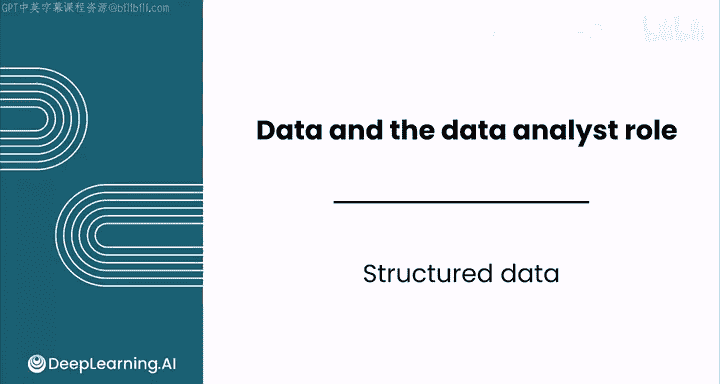
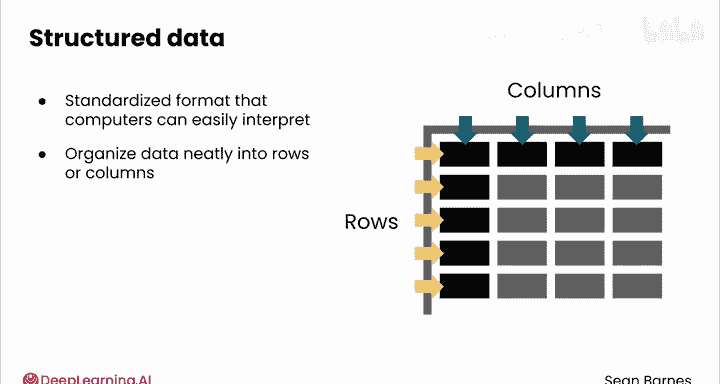
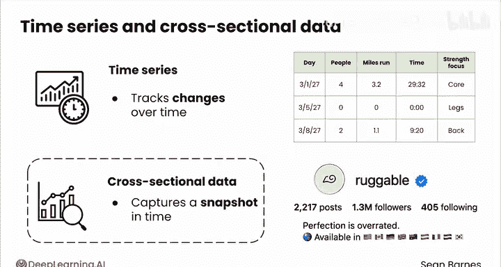
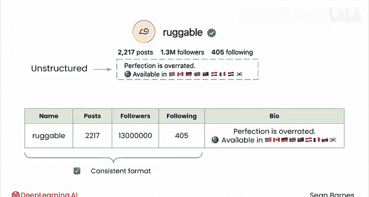
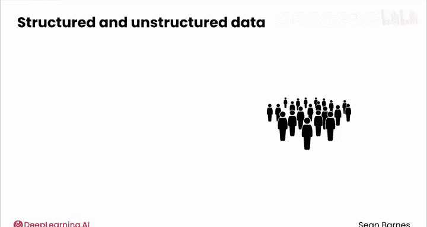
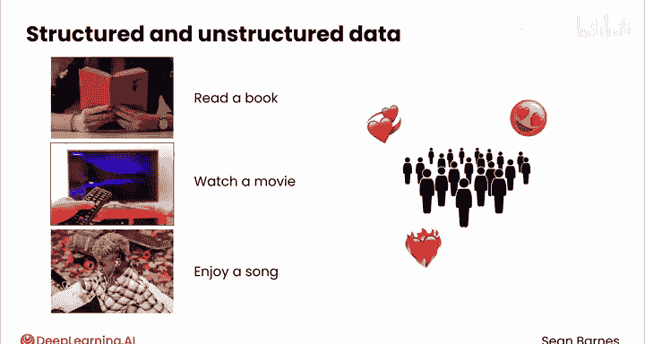
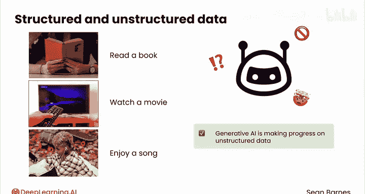

# 011：结构化数据 📊

在本节课中，我们将要学习什么是结构化数据，以及它为何对计算机处理和分析至关重要。我们会探讨结构化数据的特点、常见的数据类型，并将其与另一种数据形式——非结构化数据进行对比。

---

## 概述

当使用计算机处理数据时，通常需要为数据施加某种结构。当数据以预定义的方式组织时，计算机的工作效率最高。相比之下，人类对以意外形式出现的信息则更具适应性。

我希望你从本视频中获得的一个核心观点是：**结构化数据本质上是为了让计算机能够存储、处理和分析而存在的**。结构化数据就是将信息组织成计算机易于解释的标准化格式，最常见的形式是将数据整齐地组织成行和列。

---

## 结构化数据的组织与信息

上一节我们介绍了结构化数据的基本概念，本节中我们来看看这种组织方式本身如何蕴含大量信息。

让我们回顾一下追踪健身记录的例子。以下是该信息的结构化版本，并增加了两行数据，以便比较每次锻炼。

在每一列中，你（或更准确地说，你的计算机）可以预期看到同类型的信息。`时间`列将始终包含时间，`力量训练重点`列将始终是几个选项之一（如核心、腿部、背部）。永远不会出现“颈部训练日”（尽管个人喜好不同）。每一行（或每一天）都将包含每项运动的信息，即使你当天根本没有跑步。`跑步里程`和`参与人数`永远不会是负数。

这些例子代表了内嵌于这种数据组织结构中的部分信息。

---

## 数据的类型与分类

构建信息的任务通常涉及将数据分类为特定类型，例如**数值型**或**分类型**。

以下是数值型数据的两种主要子类型：

*   **离散型**：指整数计数。例如，你可能是和1个人或2个人一起跑步，不存在“1.5个人”这种情况。
*   **连续型**：可以包含分数。例如，你可以跑3.2英里或1.1英里。

此外，还有专门的数值格式，如**时间**，它也可以用离散或连续形式表示。

分类型数据使你能够将行划分为不同的组。例如，“核心、腿部、背部”是可用于分析不同类型力量训练重点的运动类别。

分类型数据最常以文本形式表示，但应具有有限数量的不同组。像评论这样的自由文本具有潜在无限的值，如果不经过进一步处理，无法构成有用的分类型数据。

数据也可以用数字表示，为每个组分配一个离散的数字。例如，为了效率，你可以用1代表核心，2代表腿部，3代表背部。**即使是用数字表示，它仍然是分类型数据**。

---

## 时间序列数据与横截面数据

结构化数据中另一个关键区别是**时间序列数据**和**横截面数据**。

*   **时间序列数据**：追踪随时间的变化。
*   **横截面数据**：捕捉某个时间点的快照。

你刚才看到的健身数据被认为是时间序列数据，因为你可以分析你的里程、时间、力量训练重点随时间的变化，并监控你的朋友是否遵守了与你一起训练的承诺。

另一方面，看看这个Instagram个人简介，它包含帖子数、粉丝数、用户名、图片和文本简介等数据。这是横截面数据还是时间序列数据？

这是**横截面数据**，因为它显示了某个时刻的账户信息。你无法通过这些数据了解粉丝数随时间的变化，或者此人更换头像的频率。

---

## 结构化与非结构化数据的共存

你之前了解到，在表格或电子表格中存储非结构化数据是很常见的。

以下是使用你刚才看到的同一个Instagram个人简介的另一个例子。你可以将个人简介中的结构化数据表示在一个表格中，列包括：`姓名`、`帖子数`、`粉丝数`、`关注数`。这些列中的每一列都具有一致的格式，可以被计算机处理。例如，你可以计算粉丝数与关注数的比率。

这里的`个人简介`（描述）是非结构化的，因为它是无组织的文本数据，计算机不易处理。为了将所有数据保存在一起，你可以将`个人简介`附加到这个表格中。它仍然是非结构化数据，并且与其他列相比，仍然需要更多工作来处理，但你可以将其与其他数据存储在一起，以保持一致性。

总结来说，**表格中的不同列可以是结构化的，也可以是非结构化的**。

---

## 人类与计算机的视角差异

现在你已经了解了结构化和非结构化数据的核心组成部分，让我们退一步，从人类的角度思考这两种数据类型的区别。

我们非常擅长解读非结构化数据。我们可以毫不费力地阅读一本书、观看一部电影或欣赏一首动人的歌曲。但对计算机来说，情况则不同。计算机需要数据以特定方式组织，才能有效地处理它。

尽管生成式人工智能在解释非结构化数据方面取得了重大进展，但一般来说，非AI技术在**结构化数据**上效果最佳。

---

## 总结

本节课中我们一起学习了结构化数据的核心概念。**结构化数据**的核心是以计算机能有效使用的方式组织信息。作为数据分析师，你将经常从结构化和非结构化数据中获取洞察。

在下一个视频中，你将探索大数据。大数据不仅仅是大量的数据，我保证其中还有更多内容。😊

---

在下一个视频中与我一起了解更多。