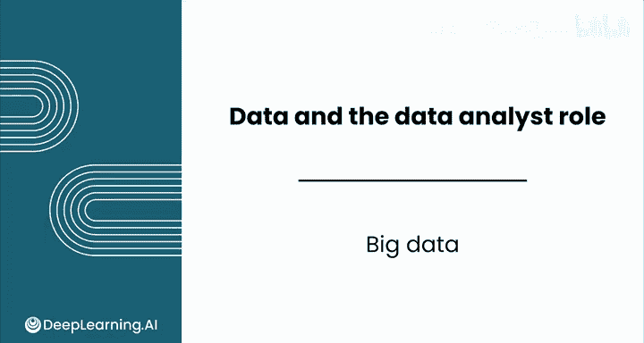
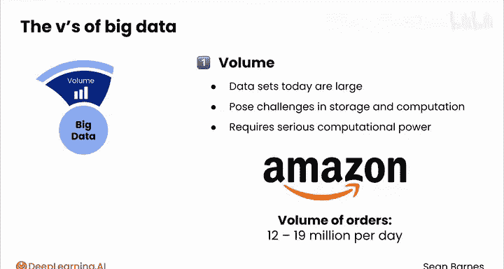
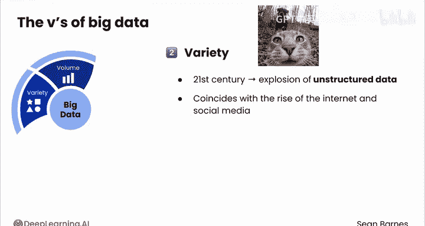
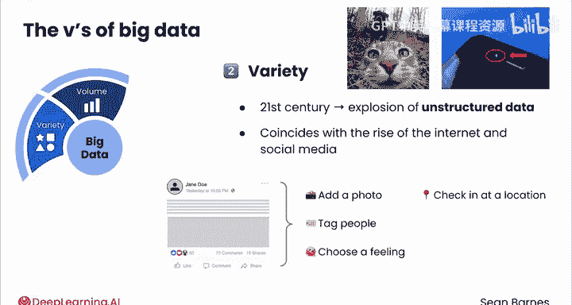
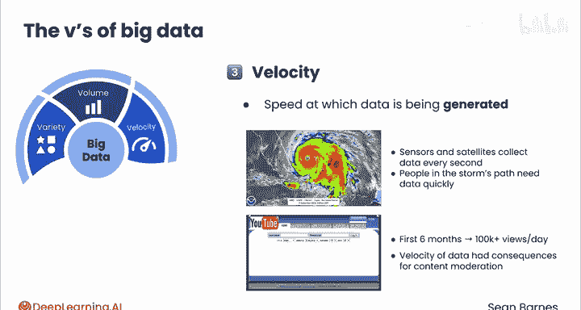
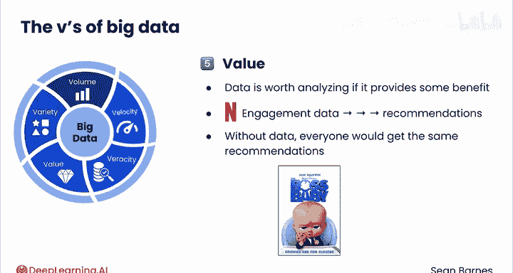
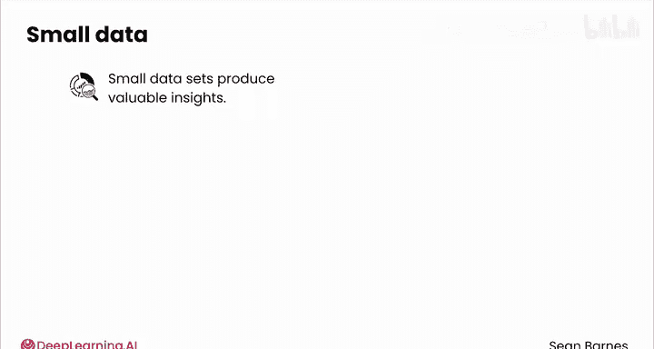
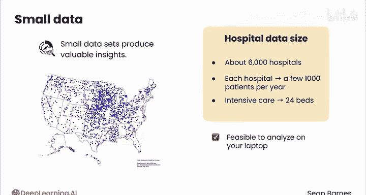

# 012：大数据 📊

在本节课中，我们将要学习“大数据”这一核心概念。我们将了解大数据的定义、关键特征，以及它与传统“小数据”的区别。

---

你可能听说过“大数据”这个词，但它究竟意味着什么？你可能会认为它仅仅意味着处理海量数据。这确实是其中的一部分，但它的含义不止于此。大数据由三个关键属性定义，被称为“三V”：**体量**、**多样性**和**速度**。

## 体量 📦

让我们从“体量”开始，这可能是大数据最直接的特征。如今的数据集通常非常庞大，在存储和计算方面都带来了巨大挑战。

以亚马逊公司为例，他们每天处理的订单量高达1200万到1900万。事实上，从你开始观看这个视频起，亚马逊可能已经处理了超过6000个订单。

体量之所以重要，是因为存储和分析这些数据需要强大的计算能力。如果你在亚马逊工作，想要分析哪怕只是一天的交易数据，你都无法在家用笔记本电脑上完成，也无法通过手动复制粘贴的方式将交易数据从一个地方转移到另一个地方。

## 多样性 🎭

接下来是“多样性”。过去，分析师处理的数据往往是**结构化**的，意味着它们能整齐地放入数据库或电子表格中。

但21世纪见证了**非结构化**数据的爆炸式增长，例如图像、文本、视频，甚至来自像Apple Vision Pro这类产品的增强现实数据。这种爆炸式增长与互联网，特别是社交媒体的兴起同步。

例如，现在的自拍数量比大约20年前多得多，因为第一款配备前置摄像头的智能手机直到2010年才问世。

以Facebook这样的平台为例，当用户创建新帖子时，他们可以添加照片、标记人物、选择感受、签到地点、发起募捐，甚至进行直播。每种帖子类型都需要其独特的预处理和分析方法。如果你想回答一个看似简单的问题，比如“某个用户通常发布什么内容？”，你需要分析一个极其多样化的数据集。

## 速度 ⚡

第三个“V”是“速度”。这指的是数据生成的速度。

你刚才看到了亚马逊处理订单的速度，但这不仅仅是科技领域的事。在飓风期间，传感器和卫星每秒收集大量数据，必须快速分析这些数据以预测飓风的移动路径。如果分析师不能迅速处理这些数据，处于风暴路径中的人们可能会收到延迟的信息。

特别是社交媒体上的数据速度是惊人的。在YouTube上线的前六个月，该网站每天的视频观看量就超过10万次。上传的视频数量如此之多，以至于人工审核根本不可行，YouTube转而采用自动化技术。换句话说，数据的速度影响了YouTube审核内容的方式，这对今天的内容审核仍持续产生着连锁反应。

以上就是最初的“三V”定义，你可以就此打住。但有一种趋势是在这个框架中加入更多的“V”。虽然你刚才看到的三个“V”是最重要的，它们将大数据与你可能称之为“小数据”的东西区分开来。

## 额外的“V”：真实性与价值

让我们看看额外的“V”。第四个“V”是**真实性**。这指的是数据的质量，它是一个至关重要的考量因素，尤其是在数据的体量、多样性和速度不断增加的情况下。数据是否来自可信的来源？在传输过程中是否可能被损坏？正如俗话所说：**垃圾进，垃圾出**。如果你的数据质量差，那么你的洞察以及随之而来的商业决策也会很差。

第五个“V”是**价值**。这里的理念是，只有数据能真正提供一些益处时，才值得分析。

以Netflix为例，我们收集的大量用户参与数据会输入到推荐系统中，从而实现个性化推荐。如果没有这些数据，每个人只会得到相同的通用推荐，就像你全家共享的那个Netflix账户一样，你知道的，就是那个《宝贝老板》旁边推荐着《惊声尖叫》的账户。

## 大数据与小数据

虽然大数据在当今的数据分析世界中非常普遍，但在许多情况下，相对**小**的数据集也能产生有价值的洞察。

你可能会惊讶地发现，美国只有大约6000家医院。这与每分钟29万次的Tinder匹配相比并不多。每家医院每年可能只服务几千名患者，一个重症监护室可能只有几十张床位。在你的笔记本电脑上分析这些数据是完全可行的，并且在这些背景下生成的数据对于改善患者治疗效果仍然具有难以置信的价值。

作为一名数据分析师，你的工作是在你试图解决的问题背景下考虑数据。有时这意味着处理海量、复杂的数据集，而其他时候则意味着调查一个更小、更聚焦的数据集。

---

## 总结

本节课中，我们一起学习了“大数据”的概念及其核心特征——“三V”：**体量**、**多样性**和**速度**。我们还了解了额外的“V”，如**真实性**和**价值**，并认识到数据分析的价值不仅取决于数据的大小，更取决于其与具体问题的相关性。在接下来的实践中，你将有机会在电子商务案例研究中同时处理结构化和非结构化数据。