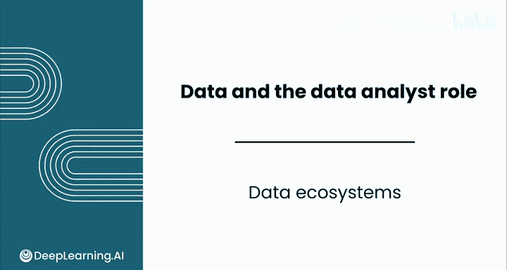
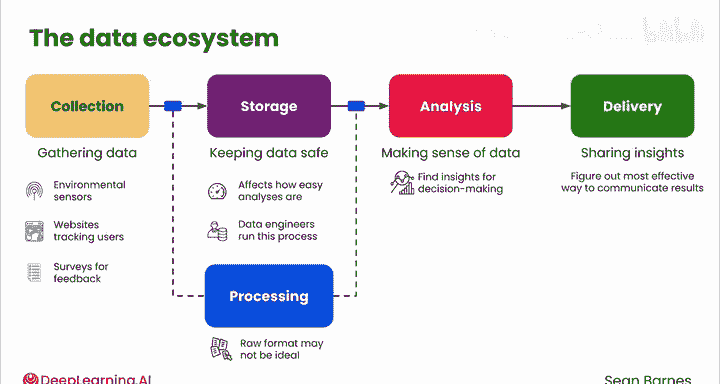
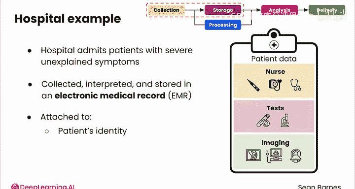
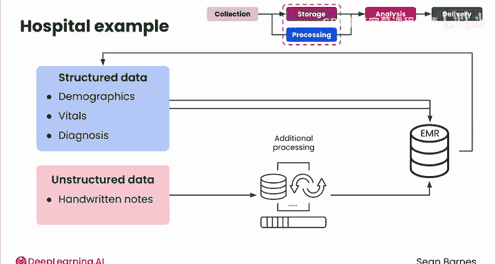
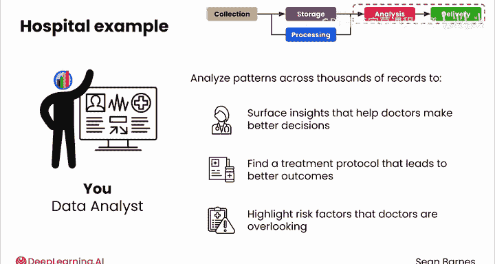

# 013：数据生态系统 📊

在本节课中，我们将要学习数据生态系统的基本概念。数据生态系统描述了数据从产生到最终用于决策支持的全过程。理解这一流程，有助于我们认识数据分析师在数据价值链中的位置和职责。

就像电力不会停留在发电厂一样，数据也不会停留在其产生的地方。数据会流经各种系统，最终转化为洞察力。让我们从高层次审视这一流程，它被称为数据生态系统。这是数据从产生到可供您用于驱动决策制定所经历的端到端过程。

## 数据流动的核心阶段 🔄

上一节我们介绍了数据生态系统的整体概念，本节中我们来看看数据流动的具体阶段。以下是数据从源头到洞察所经历的五个关键步骤：

1.  **收集**：正如您在之前的视频中所见，需要捕获数据才能有效使用。这可能表现为传感器收集环境数据、网站跟踪用户交互或调查收集客户反馈。
2.  **存储**：保持数据安全。数据的存储方式会影响执行不同分析的难易程度。数据工程师通常负责运行此过程，您稍后将了解更多关于他们角色的信息。
3.  **处理**：在大多数情况下，收集数据的原始格式可能不适合存储或分析。因此，处理实际上可以发生在收集和存储阶段之间，也可以发生在存储和下一阶段（分析）之间。
4.  **分析**：理解数据。您将调查数据以发现可以为决策提供信息的见解。
5.  **交付**：分享见解。您需要找出最有效的方式来传达分析结果，例如通过报告或仪表板。

核心数据团队（包括您作为数据分析师）将负责这些步骤。其他人将依赖于您的工作，包括任何生成数据的用户，以及产品经理、工程师等业务利益相关者。您对数据工程师和业务利益相关者负主要责任，因为他们是直接的上游和下游角色。更多内容将在接下来的视频中介绍。

## 一个具体的例子：医院诊断 🏥

让我们通过一个例子来具体说明。考虑一家接收患有严重不明症状患者进行诊断的医院。每位患者都会产生大量关于其健康的数据，初始诊断阶段涉及捕获这些数据。

例如，护士会测量他们的生命体征：用数字体温计测量体温，用听诊器测量呼吸模式。他们可能还会进行血液或尿液测试，这必须在实验室进行处理；或者他们可能要求进行成像检查，如X光、超声波或MRI，这些检查会生成需要专家解读的图像。这些数据存储在电子病历（EMR）中，与患者的身份信息相关联，同时还包括数据收集的时间和人员信息。

数据的存储和处理方式在很大程度上取决于其类型。**结构化数据**（如患者的人口统计信息或生命体征）可能很容易存储在传统数据库中。**非结构化数据**（如医生的手写笔记）可能需要在额外处理（如使用AI进行手写识别或手动数据录入）后存储在数据库中。

在所有数据流入EMR之后，患者的主治医生可以将其与自己的专业知识相结合来做出诊断，而诊断本身又成为记录在EMR中的另一个数据点。

此时，您作为数据分析师介入。您不会诊断任何单个患者，但通过分析数千份类似患者记录的**模式**，您或许能够发现有助于医生做出更好决策的见解。也许有一种治疗方案始终能带来更好的结果，或者存在某些医生可能忽略的风险因素。

## 总结与预告 📝

本节课中我们一起学习了数据生态系统的概念，它描绘了数据从收集、存储、处理、分析到最终交付洞察的完整旅程。我们通过医院的例子，看到了结构化与非结构化数据如何被处理，以及数据分析师如何通过分析群体模式来创造价值。

您并非独自完成这个过程。在接下来的两个视频中，您将见到您的主要协作者：从阅读您报告的业务利益相关者，到您日常交谈的数据工程师。我们稍后见。