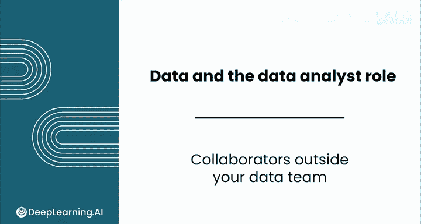
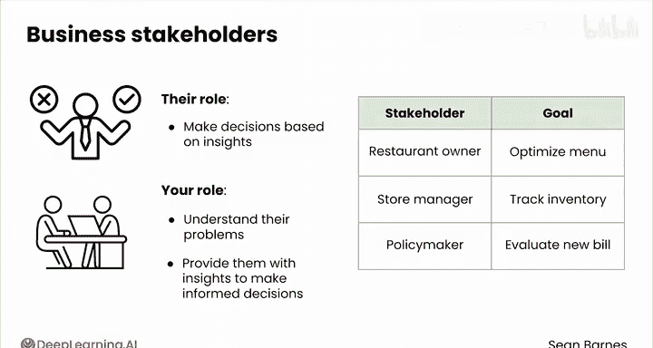
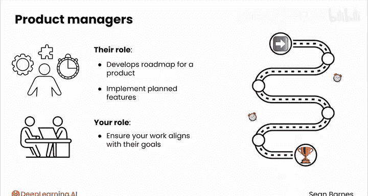
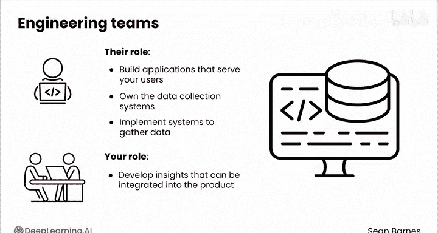
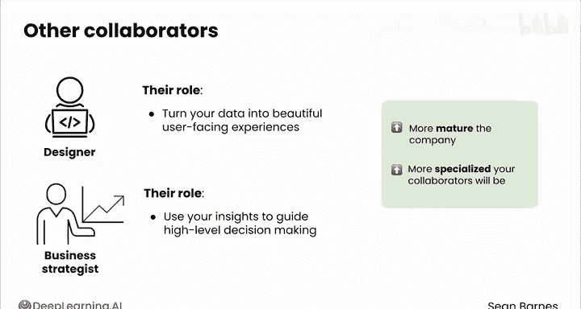
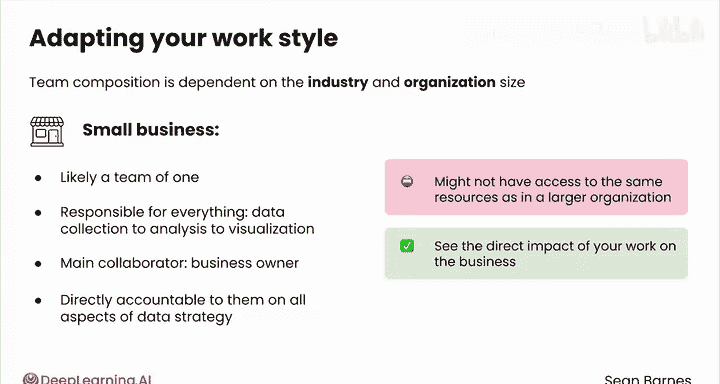
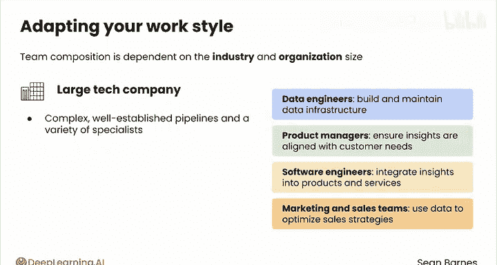

# 014：跨部门协作伙伴 🤝

在本节课中，我们将要学习数据分析师在组织内部需要与哪些关键的非数据团队伙伴进行协作。理解这些合作关系对于确保你的数据分析工作能够产生实际业务影响至关重要。

## 概述

数据工作涉及组织内每个团队的人员。让我们看看数据团队之外的一些关键协作者。

## 关键协作者

上一节我们介绍了数据分析师需要与组织内外部进行协作，本节中我们来看看具体有哪些核心的跨部门伙伴。

以下是数据分析师通常需要合作的几类关键业务伙伴：

*   **业务利益相关者**：他们根据你提供的洞察做出决策。他们可以是任何人，从试图优化菜单的餐厅老板，到跟踪库存的商店经理，再到评估新法案的政策制定者。你的工作是理解他们的问题，并提供他们做出明智决策所需的洞察。
*   **产品经理**：在许多组织，尤其是科技公司中，你会与产品经理紧密合作。产品经理负责制定产品路线图并努力实现计划中的功能。他们定义业务问题和优先级。你需要确保你的工作与他们的目标保持一致，因为他们通常是你的洞察的主要使用者。他们会根据你的洞察来决定优先开发哪些功能以及如何个性化产品。
*   **工程团队**：他们是另一个至关重要的协作者。他们构建服务于用户的应用，并且通常负责数据收集系统。工程师将帮助实施系统来收集新的、更好的数据。你的角色是开发可以被整合回产品中的洞察。

根据你所在的组织，你可能还需要与设计师合作，他们帮助将你的数据转化为美观的用户界面体验；或者与业务战略家合作，他们利用你的洞察来指导高层决策。

公司越成熟，你的协作者就越专业化。团队构成在很大程度上取决于行业和组织规模。你需要调整你的工作方式以适应环境。

## 常见团队类型

了解了关键协作者后，我们来看看在不同规模和性质的组织中，团队构成和协作方式有何不同。

以下是几种你可能会遇到的常见团队类型：

*   **小型企业**：你很可能是一个单人团队，负责从数据收集到分析再到可视化的所有事情。你的主要协作者将是企业主，你需要就数据策略的所有方面直接向他们负责。灵活性和适应性是关键。你可能无法像在大型组织中那样获得相同的资源和工具，因此你需要善于利用现有资源。好处是，你通常可以看到你的工作对业务产生的直接影响。
*   **政府机构**：你的关键协作者很可能是政策制定者。你可能无法接触到像在科技界那样复杂的工程系统。在这种环境中的关键挑战是确保你的洞察能以引起政策制定者共鸣的方式进行沟通。与商业环境相比，你可能需要提供更多的背景和指导。
*   **大型科技公司**：你可能会使用复杂且成熟的ETL管道，并与各种专家合作。数据工程师将构建和维护数据基础设施。产品经理将与数据团队紧密合作，确保洞察与客户需求保持一致。软件工程师将把这些洞察整合到产品和服务中。市场和销售团队将利用数据来优化销售策略。在这种环境中，你经常需要处理海量数据，并满足众多不同利益相关者的要求。洞察必须在大型的、有时是全球分布的团队中有效共享。你需要跟上最新技术，以跟上科技行业的快速创新步伐。

## 总结与核心原则

在本节课中，我们一起学习了数据分析师在不同类型的组织中需要与哪些关键伙伴协作，以及如何适应不同的团队环境。

在所有团队构成中，你与利益相关者的目标越一致，你的数据工作影响力就越大。通过弥合数据技术世界与业务实际需求之间的鸿沟，你将在工作中表现出色。

在下一个视频中，你将看到这种协作心态如何转化为在数据团队内部的工作。