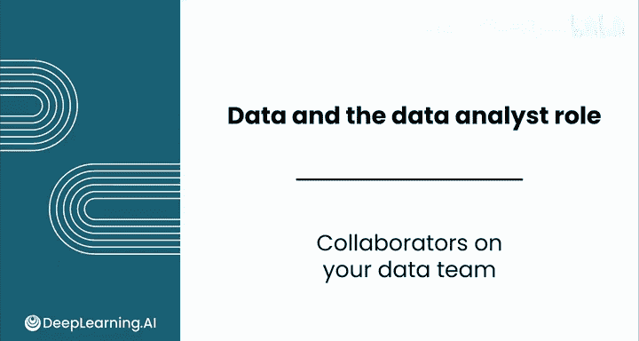
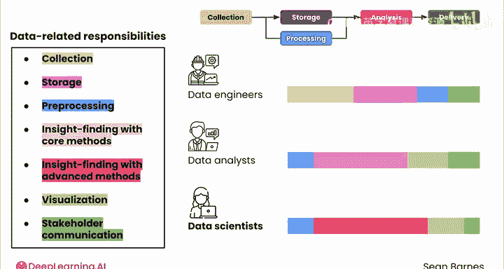
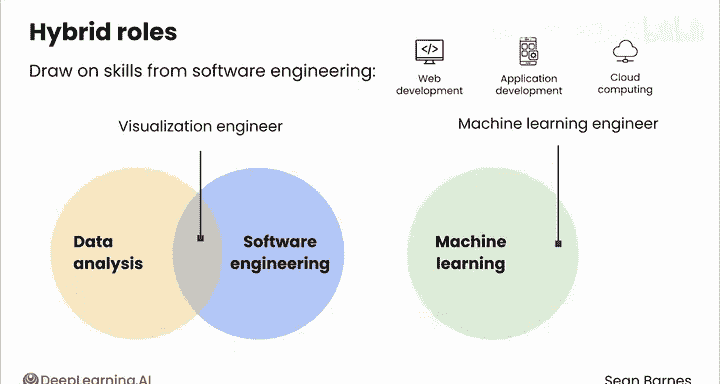
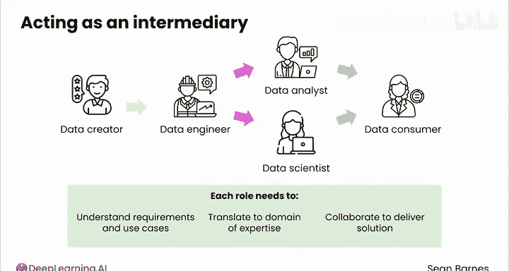
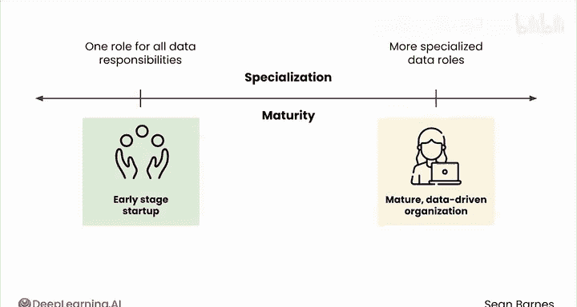

# 015：数据团队内部协作 👥

在本节课中，我们将要学习一个成熟的数据团队由哪些不同角色构成，以及这些角色如何分工协作，共同将原始数据转化为有价值的商业洞见。

一个成熟的数据团队通常承担着从数据收集到洞见交付的全链条职责。这些高级职责包括：**数据收集**、**数据存储**、**数据预处理**、**运用核心统计方法寻找洞见**、**运用高级统计方法与机器学习寻找洞见**、**数据可视化**以及**与利益相关者沟通**。理解业务问题本身是所有人的共同责任，因此不单独列出。

接下来，我们来看看构成团队的三个核心角色：**数据工程师**、**数据分析师**和**数据科学家**。这些职责是如何在他们之间分配的呢？

以下是各角色在不同任务上花费时间的细分，其中灰色条代表每个角色100%的工作时间。

*   **数据工程师**：主要负责**数据收集**和**数据存储**。他们的核心工作是构建数据管道，从各种来源捕获数据，并将其移动到合适的位置以供分析。数据工程师也可能参与一些**数据预处理**工作，为洞见发现做好准备。最后，他们通常也会花一些时间在**利益相关者沟通**上。
*   **数据分析师**：负责从数据中发现并传达洞见。这包括进行一些**数据预处理**以确保数据格式适合分析。你将主要专注于运用**核心方法**寻找与业务问题相关的洞见，并借助**数据可视化**来解释你的发现。沟通是你工作中很大的一部分，旨在帮助利益相关者做出明智决策。数据分析师通常拥有最广泛的技能组合，涵盖从SQL查询、数据可视化到编程和利益相关者管理的各个方面。
*   **数据科学家**：通常在分析中应用更深层次的技能。他们可能会进行一些**数据预处理**，但将大部分时间花在**洞见发现**上，这次侧重于更复杂的方法，如**机器学习技术**。数据科学家可能会设计实验、构建预测模型或开发新算法。他们也会做一些**可视化**工作来解释洞见，并负责与**利益相关者沟通**。

可以看到，这些角色的职责存在重叠，这非常有益，因为它促进了大量的协作。

你的团队中可能还有处于混合角色的成员，他们借鉴了软件工程领域的技能，例如**Web开发**、**应用开发**、**云计算**等。例如，**可视化工程师**结合了数据分析和软件工程技能；**机器学习工程师**则弥合了机器学习和软件工程之间的鸿沟。

这些角色中的每一个都充当着数据生态系统中不同部分之间的中介。也就是说，没有一个角色是数据的创造者或最终分析的消费者。每个角色都需要理解来自某一方的需求和用例，将其转化为自己专业领域的任务，然后与链条中的下一个角色协作以交付解决方案。

一个组织越成熟、越数据驱动，其数据角色往往就越专业化。在早期的初创公司，你可能需要负责从数据工程到分析的全方位数据职责。但随着组织成长，数据需求变得更加复杂，专业化分工允许公司在流程的每一步最大化其价值。

数据生态系统的美妙之处在于，拥有各种不同技能、背景和个性的人们为了同一个最终目标而协作。无论你身处哪个角色，你都是一个团队的一部分。

你现在已经学完了本节课的内容，本模块只剩最后一课。在下一课中，你将全面了解用于数据分析的大语言模型，包括其优势和局限性。此外，你还将通过动手实践实验室来构建你的提示工程技能。与AI合作总是一场冒险，希望你加入下一课，一起探索这项激动人心的新技术。

**总结**：本节课我们一起学习了数据团队的构成与协作。我们明确了数据工程师、数据分析师和数据科学家三大核心角色的主要职责与时间分配，理解了职责重叠带来的协作优势，并认识了混合角色。最后，我们看到了团队协作与角色专业化如何随着组织成熟度提升而演进，共同驱动数据价值最大化。