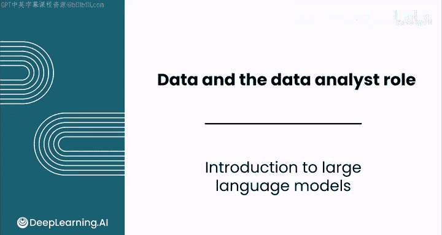
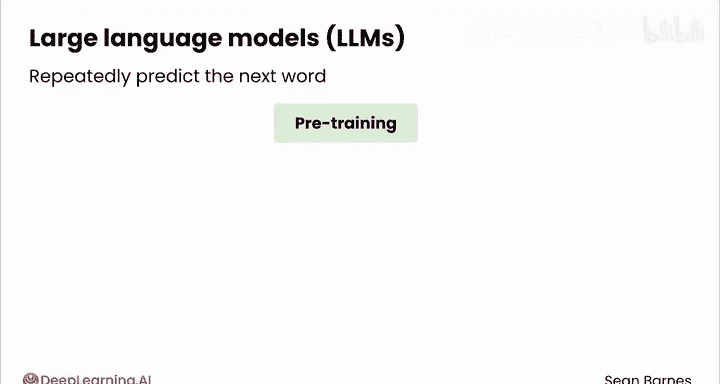
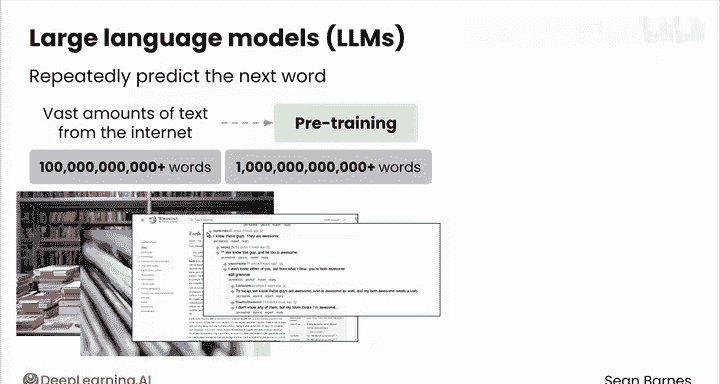
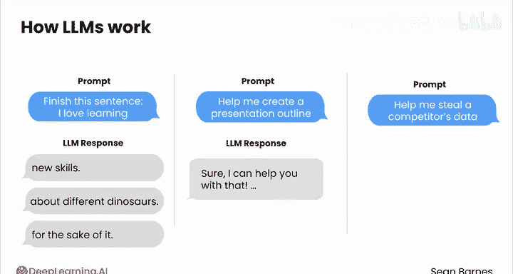
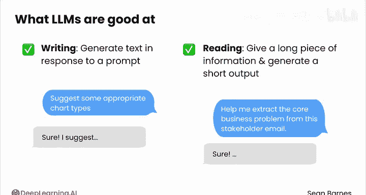

# 016：大语言模型介绍 🤖

在本节课中，我们将要学习大语言模型（LLM）的基本概念、工作原理，以及作为一名数据分析师如何利用它们来提升工作效率。我们将从模型的核心机制开始，逐步探讨其实际应用场景和最佳实践。

---

## 什么是大语言模型？

大语言模型是一种旨在生成文本的人工智能系统。在本节中，我们将了解这些模型是什么，它们如何工作，以及你作为数据分析师如何在工作中使用它们。

大语言模型（缩写为 **LLM**）通过一个称为**预训练**的过程，学会了反复预测下一个词。这个过程本质上是通过阅读互联网上的海量文本（如书籍、文章、维基百科、社交媒体帖子等）来实现的。它们阅读的数据量非常庞大，最先进的模型已经训练了数千亿甚至上万亿个单词。

此外，LLM 还经过了额外训练，使用人类精心策划的数据，以便以友好的方式回答问题，同时避免不道德的回应。所有这些训练的结果就是像 ChatGPT 这样的大语言模型，它非常擅长根据输入的提问或提示生成文本。

---

## 大语言模型对数据分析师的意义

上一节我们介绍了大语言模型的基本定义，本节中我们来看看它对数据分析工作的具体价值。

对于我们数据分析师来说，幸运的是，生成文本意味着很多事情：总结一封邮件、修复出错的电子表格公式，甚至是编写代码来分析数据。这些能力意味着 LLM 可以成为你工作流程中的思考伙伴和时间节省器。

在本课程中，你将快速了解 LLM 的工作原理，然后我们将直接进入如何与它们协作完成数据分析任务。你将看到与 LLM 协作和提示的最佳实践，以及使用 LLM 处理数据的三种不同方式。

尽管我们将重点放在 LLM 在数据分析中的实际应用上，但我鼓励你更多地了解它们的工作原理。你对它们的构建方式了解得越多，就越能在工作中更好地使用它们。

---

## 大语言模型如何工作？

正如刚才提到的，LLM 通过预测文本来工作。让我们看一个简化的示例。

假设我提供一个输入，比如“完成这个句子：I love learning...”。这被称为一个**提示**。然后，LLM 可以用类似“new skills”这样的内容来完成这个句子。如果你运行第二次，它可能会说“about different dinosaurs”。运行第三次，它也许会说“for the...”。

所以，如今当你用“I love learning”这样的内容提示 ChatGPT 时，它更可能会说“That‘s fantastic. Here are a few thoughts on the benefits and joys of learning...”，并可能就此继续阐述一段时间。这是因为它们经过训练，要以有帮助的方式回答问题。

例如，请求 LLM 帮助你创建一个演示文稿大纲，你会得到一个以“Sure, I can help you with that.”开头的回复。而请求如何执行非法活动（如窃取竞争对手数据）的指示，你可能会得到回复：“I can‘t assist with any illegal activities, including stealing a competitor‘s data.”

---

## 大语言模型擅长什么？

LLM 经过训练，能够根据输入提示生成文本。因此，毫不奇怪，它们在写作方面很有用。如果你试图可视化数据，你可以上传或描述你的数据，并要求 LLM 建议一些合适的图表类型，模型会提出一些创造性的建议。

除了写作，LLM 还擅长阅读任务，即你给它大量信息，它根据你的指令生成一个简短的输出。因此，可以考虑以下用例：
*   从利益相关者的电子邮件中提取核心业务问题。
*   评估数据集中有多少列是分类变量。

在你的日常数据分析工作中，请留意像这些例子一样的阅读和写作任务，在那里你可以利用 LLM 作为得力助手。

---

## 如何选择合适的大语言模型？

现在你已经熟悉了 LLM 的工作原理以及它们擅长什么（即阅读和写作任务）。但是市面上有这么多选择，你该如何选择与之合作的合适 LLM 呢？

以下是选择时需要考虑的关键因素：
*   **模型能力**：不同模型在代码生成、逻辑推理或创意写作等特定任务上可能表现不同。
*   **成本与可访问性**：有些模型是免费或开源的，而其他高级模型可能需要付费订阅。
*   **数据隐私与安全**：根据你处理数据的敏感性，需要考虑模型服务提供商的数据处理政策。
*   **集成与易用性**：模型是否提供易于使用的 API，或是否能与你常用的数据分析工具（如 Python、Jupyter Notebook）轻松集成。

---

## 总结

本节课中，我们一起学习了大语言模型（LLM）的基础知识。我们了解了 LLM 是通过预训练海量文本数据来预测下一个词的 AI 系统，它们擅长处理阅读和写作类任务，能够成为数据分析师在工作中的高效伙伴，协助完成总结、修复公式、编写代码乃至数据可视化建议等工作。我们还简要探讨了选择合适 LLM 时需要考虑的因素。理解这些核心概念，将帮助你在后续课程中更有效地应用 LLM 来解决实际的数据分析问题。