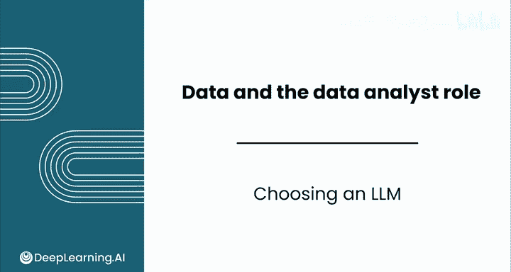
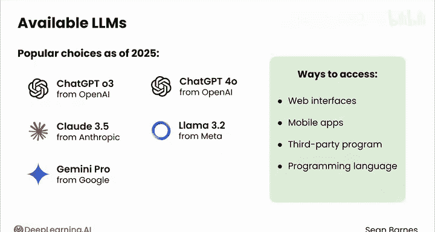
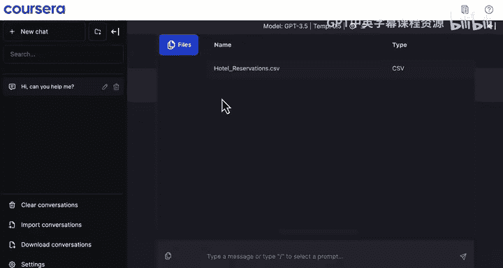
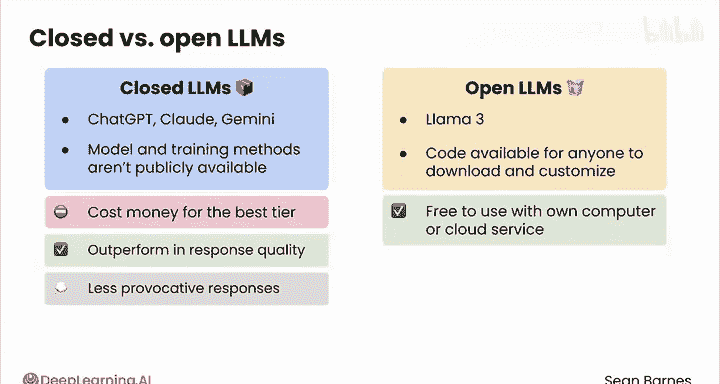

# 017：LLM选择策略 🤖

在本节课中，我们将学习如何选择和使用不同的大型语言模型（LLM），并熟悉Coursera平台内置的交互界面。

现在你已经了解了LLM的能力，你应该尝试使用它们，看看哪些模型最适合你。在本视频中，你将熟悉一些最流行的LLM以及如何使用它们。

## 主流LLM简介

目前有许多LLM可供选择，并且这个数量还在不断增长。就像你可能会针对不同类型的问题咨询不同的同事一样，你也可以选择与哪个LLM合作。

以下是一些流行的选择：
*   **OpenAI** 的模型，例如 ChatGPT-3.5 和 4.0。
*   **Anthropic** 的 Claude 3.5。
*   **Meta** 的 Llama 3.2。
*   **Google** 的 Gemini Pro。

在响应质量方面，这些都是强有力的选择。每个模型都有不同的优势和沟通风格，你可能会偏爱其中一种的语气。

## Coursera平台交互界面

在本课程中，你将使用Coursera内置的基于网页的界面与LLM进行对话。

该界面有一个相当标准的设置。你有一个可以在此处输入提示词的地方。当你提交提示词后，你将能够在此中间部分阅读LLM的响应。

例如，我可以输入一个问题：“你好，你能帮助我吗？”，然后你会在上方看到响应，同时在左侧看到你实际的提示词。现在，你可以查看你之前进行过的任何对话，或者开始一个新的聊天。在下方，你有一些选项来管理你已有的对话以及配置任何设置。

你可能还注意到提示词左侧的这个文件图标。在本例中，我们可以看到“酒店预订数据”的选项，这是我们将在未来视频中处理的内容。在此界面中，你只能处理与每个活动相关的预选文件。

## 开放与封闭模型

关于访问权限，还有一个注意事项。ChatGPT、Claude和Gemini的模型和训练方法对公众可用，这意味着它们被称为**封闭式LLM**。另一方面，Llama 3是一个**开放式LLM**，其代码可供任何人下载和定制。

一个封闭式LLM本质上是一个黑盒。你知道创建它使用了什么技术，但不知道具体细节。封闭式和开放式模型各有其优点。

在为特定任务选择正确的模型时，你应该考虑封闭式和开放式LLM之间的这些差异：
*   **封闭式模型**：最佳层级需要付费，并且在响应质量方面通常优于开源LLM。你可能还会发现它们倾向于给出更安全、或更少挑衅性、争议性的回应。
*   **开放式模型**：只要使用你自己的计算机运行它们，就是免费的；或者可以使用第三方服务在云端运行。它们具有良好的响应质量，但并非最先进的（尽管差距正在缩小），并且有时可能产生更尖锐或更不可预测的回应。

## 总结与建议

我鼓励你尝试两种类型的LLM，包括封闭式和开放式，看看哪种最适合你。如果你将LLM视为一个思维伙伴，它们几乎可以成为值得信赖的同事。像ChatGPT这样的LLM，全世界有数百万人正在与有史以来最复杂的人工智能系统进行交互。

在本节课中，我们一起学习了如何根据任务需求选择不同的LLM，熟悉了Coursera平台的操作界面，并了解了开放与封闭模型的核心区别。接下来，让我们进入下一个视频，看看在数据分析中使用LLM时有哪些最佳实践。