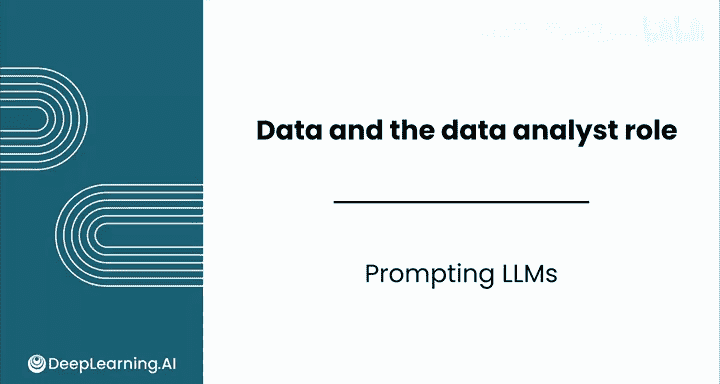
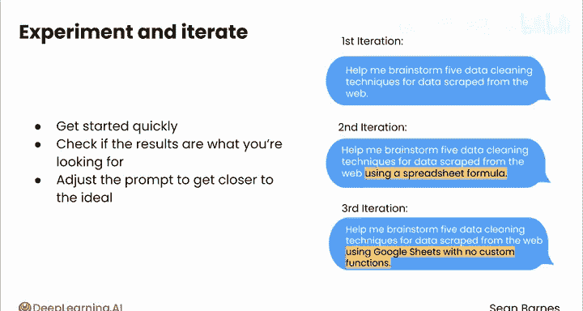

# 018：提示词工程 🧠💡

在本节课中，我们将学习如何与大型语言模型（LLM）进行有效协作，特别是掌握提示词工程的核心技巧。我们将了解如何通过撰写清晰、具体的指令来引导模型，并认识到其局限性。

与大型语言模型协作有时会显得神秘。让AI充当思考伙伴究竟意味着什么？让我们具体探讨一下，作为现代数据分析师，如何利用LLM完成阅读、写作及其他任务。你需要熟练掌握两项关键技能：**撰写高质量的提示词**，以及**识别所用LLM的局限性**。我们将学习三个主要的提示词技巧：**详细具体**、**引导模型分步思考**以及**实验与迭代**。

## 详细具体地撰写提示词

上一节我们提到了提示词工程的重要性，本节中我们来看看第一个核心技巧：提供详细具体的背景信息。

想象一下，你在处理电子表格时遇到了问题，需要向同事求助。你不会直接跑过去大喊“它不工作了”，这很可能无法解决问题。你可能会解释你的目标、你尝试过的方法以及得到的结果。同样，LLM也需要足够的背景信息或上下文来完成任务。你需要自问：一位同事需要哪些信息才能回答我的问题或与我一起进行头脑风暴？

## 引导模型分步思考

在提供了具体背景后，下一步是引导模型有条理地生成答案。

如果你只是要求模型“为从网络抓取的数据构思五种数据清洗技术”，它也能完成任务。但假设你希望获得每种技术的详细信息、实现该技术的电子表格公式，以及一个帮助记忆的相关表情符号，最佳方法是指导模型通过一系列步骤来生成更详细的回答。

以下是引导模型思考的步骤示例：
1.  要求LLM构思五种针对网络抓取数据的清洗技术。
2.  要求LLM为每种技术编写对应的电子表格公式。
3.  要求LLM为每种技术添加一个有趣且相关的表情符号。

通过这种方式，你可能会得到类似下表的清晰结果，其中LLM严格遵循了你的指令：

| 技术 | 公式 | 表情符号 |
| :--- | :--- | :--- |
| 删除重复项 | `=UNIQUE(range)` | 🗑️ |
| 修剪空格 | `=TRIM(cell)` | ✂️ |
| 转换大小写 | `=PROPER(cell)` | 🔠 |
| 提取子字符串 | `=MID(cell, start, num)` | 🎯 |
| 替换文本 | `=SUBSTITUTE(cell, old, new)` | 🔁 |

因此，如果你对自己想要的结果已有清晰的构思流程，那么用清晰的、分步的指令来提示LLM会非常有效。

## 通过实验与迭代优化结果

最后，我们需要认识到，获得理想输出往往需要多次尝试和调整。

不要期望一开始就能写出完美的提示词。可以先快速尝试一个简单的版本，例如：
`帮我为网络抓取的数据构思5种数据清洗技术。`

如果对结果不满意，可以澄清并补充提示词，例如添加：
`并使用电子表格公式实现。`

如果仍未得到理想结果，可以进一步明确限制条件：
`使用Google Sheets函数，无需自定义函数。`

提示词工程的关键不在于起点完美，而在于快速开始，检查结果是否符合预期，并知道如何调整提示词以逐步接近理想响应。

## 总结与展望

本节课中，我们一起学习了与LLM协作的三个核心提示词技巧：**提供详细具体的背景**、**引导模型分步思考**以及**通过实验迭代优化**。你应该将LLM视为一群多样化、富有创造力的同事，而不是替代你所有职责的工具。

事实上，在下一节视频中，我们将一起探讨LLM的局限性，了解这些模型会犯哪些错误及其原因。