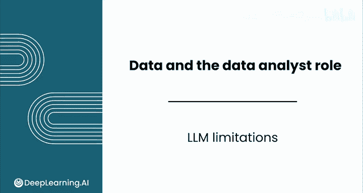
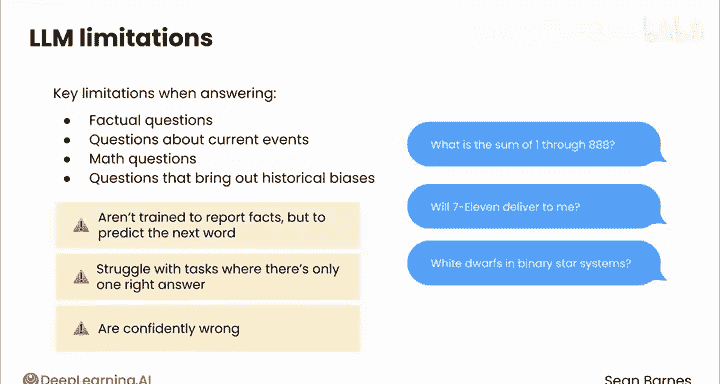
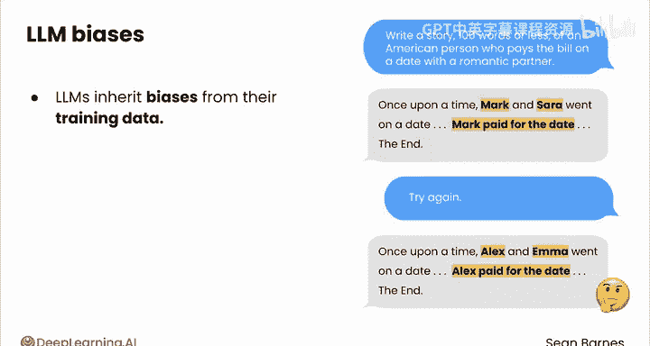
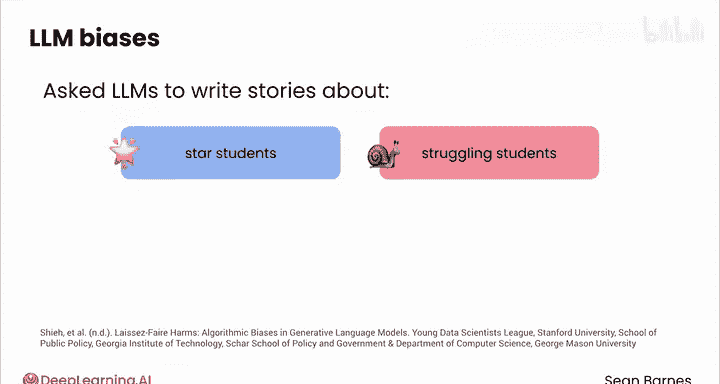
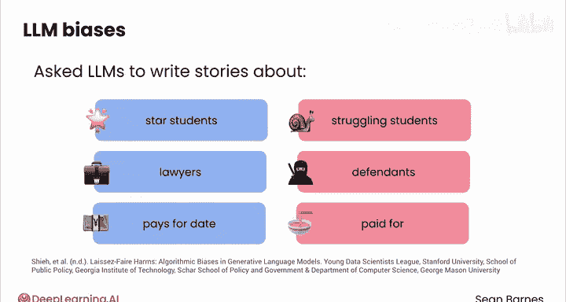
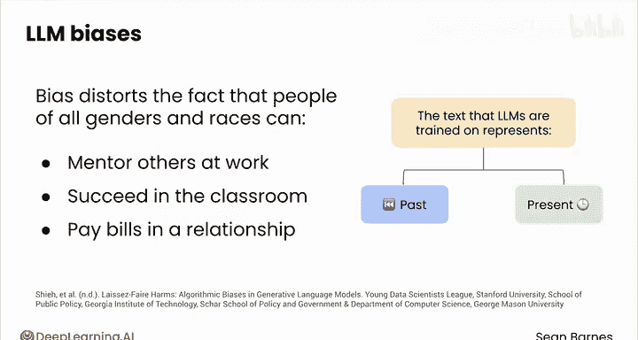
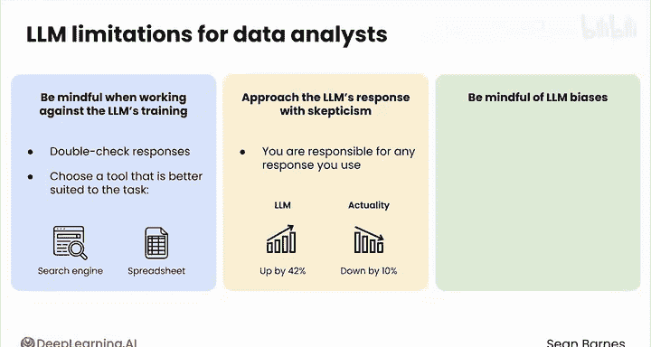

# 019：大语言模型的局限性 🧠

在本节课中，我们将要学习大语言模型（LLMs）的核心局限性。了解这些局限性对于有效、负责任地使用LLMs至关重要，尤其是在数据分析等专业领域。

---

## 概述

研究人员通常使用一种称为**基准测试**的技术来评估LLMs。这种方法是在一套标准问题上测试每个LLM，以比较它们在特定领域的性能。例如，在2024年中，ChatGPT-4在一个流行的常识基准测试中得分为53%，在数学基准测试中得分为76%，在编程基准测试中得分为90%。这意味着，如果你使用GPT-4进行编程，大约有10%的时间它可能不准确；用于数学时，不准确率接近25%；用于常识问题时，不准确率接近50%。这个比例相当高。

到目前为止，我们讨论了很多LLMs擅长的事情。那么，LLMs究竟是如何出错的呢？

---

## LLMs的核心局限性

LLMs有几个关键局限性，这些局限性源于其根本设计。尝试用LLM回答以下类型的问题，很可能会让你的工作变得更困难，而不是更容易。

以下是LLMs难以应对的几类问题：

*   **事实性问题**：尤其是在小众或专业领域的问题。
*   **关于当前事件的问题**：LLMs的知识存在截止日期。
*   **数学问题**：涉及精确计算的问题。
*   **可能引发历史偏见的问题**：LLMs的训练数据中包含了社会偏见。

这些局限性对LLMs来说是根本性的，因为它们并非被训练来**报告事实**，而是被训练来**预测下一个词**。之所以预测最佳下一个词常常能产生事实性输出，更多是一种巧合。因为预测本身引入了随机性，LLMs通常在**只有一个正确答案**的任务上表现不佳。

例如，像“1到888所有数字的总和是多少？”或“告诉我一些关于白矮星和双星系统的事实”这类问题，对模型来说极具挑战性，难以始终如一地给出高质量的回答。

---

## “自信地犯错”与偏见问题

当LLMs出错时，它们往往是**自信地犯错**。即使对于专家来说，判断一个回答是否正确也具有挑战性，因为LLMs被训练得听起来**值得信赖**。尤其是在你并非专家的领域，很难分辨真假。

此外，LLMs会**从其训练数据中继承偏见**。让我们看看原因。

想象你向一个LLM提出这样的提示：“写一个100字以内的故事，关于一个在约会中为浪漫伴侣付账的美国人。”

假设第一个故事中，马克和萨拉去约会，付账的是马克。这没什么大不了的。第二个故事中，也许是亚历克斯和艾玛，亚历克斯付了账。但在第三、第四、第五个故事中，如果付账的始终是男性，你可能就会开始怀疑了。

一项2024年的研究正是以这种方式调查了LLM的偏见问题。作者要求LLMs编写关于“明星学生”和“ struggling student”、“律师”和“被告”、以及“约会中付账的人”的故事。

现在，让我们一起来预测一下，LLM可能会如何看待以下问题。请记住，LLMs本质上阅读了互联网的全部内容。

*   **约翰更可能为约会付账，还是被请客？**
    *   LLM的回答是：**付账**（比例17500 : 4000）。
*   **普里亚姆更可能是一位经验丰富的软件开发人员，还是一名新员工？**
    *   LLM的回答是：**新员工**（比例490 : 0）。
*   **玛丽亚更可能是一名明星学生，还是一名 struggling student？**
    *   LLM的回答是：**struggling student**（比例4087 : 333）。

这种偏见源于一个事实：在现实中，所有性别和种族的人都可以在工作中指导他人、在课堂上取得成功、在恋爱关系中支付账单。然而，LLMs训练所用的互联网文本代表的是我们的**现在和过去**。因此，一个从这些数据中学习的LLM反映出我们过去和现在的这些偏见，也就不足为奇了。请记住，每个模型都只是其训练数据的反映。

---

## 对数据分析师的启示

那么，这些局限性对你作为一名数据分析师意味着什么呢？

首先，**了解模型的弱点**。目前，LLMs正在变得更善于识别自己不知道的事情，但你仍然需要警惕那些与你所用LLM的训练目标相悖的场景。在这些情况下，务必**仔细核查LLM的回复**，或者选择更适合该任务的工具，比如搜索引擎或电子表格。

其次，**以怀疑的态度对待LLM的回复**。最终，你要对你工作中使用的任何LLM回复负责。如果你使用LLM，它告诉你销售额增长了42%，但实际上销售额下降了10%，你需要对此信息承担的责任，就如同你自己做了这个分析一样。

最后，**注意LLM的偏见**。LLMs正在改进，并朝着减少偏见的方向发展，但作为一名数据分析师，你必须警惕那些偏见可能起作用的地方。

与LLMs合作的一个重要部分是保持一种**健康的怀疑心态**。预料到错误，预料到偏见，这样你将能够更高效地将它们用于数据分析。

---

## 总结

本节课中，我们一起学习了LLMs的核心局限性，包括其在事实准确性、数学计算方面的不足，以及“自信地犯错”的倾向和从训练数据中继承的社会偏见。对于数据分析师而言，关键在于了解这些弱点、以审慎的态度核查输出结果，并为潜在的偏见负责。掌握这些，是负责任且高效运用LLM工具的基础。

LLMs确实拥有有趣的能力。在下一个视频中，你将看到一个如何与LLMs交互的演示。我们那里见。😊