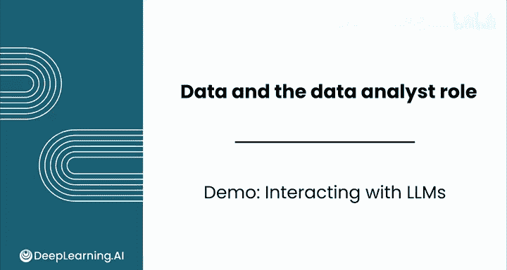
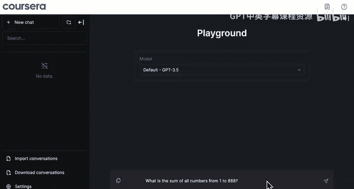
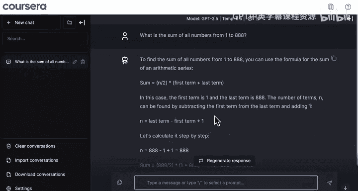
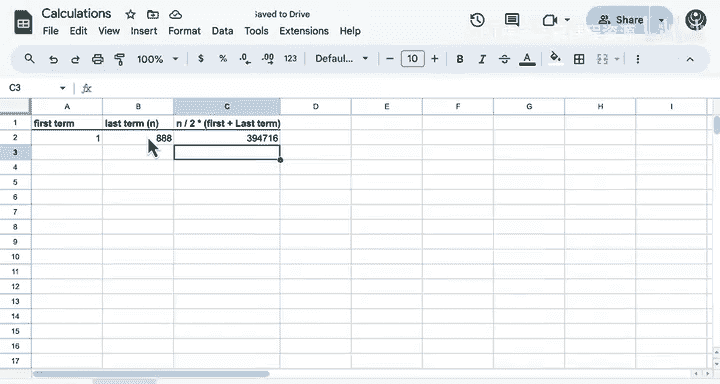
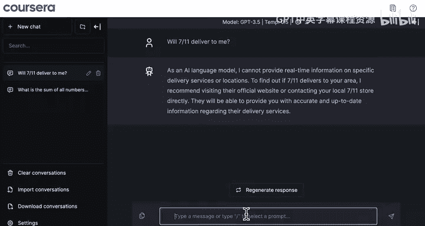
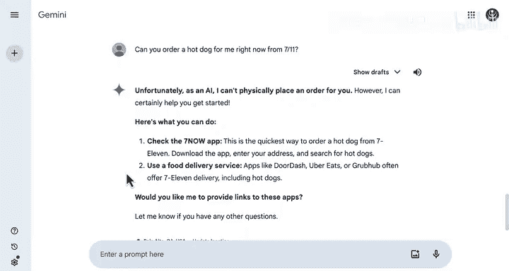
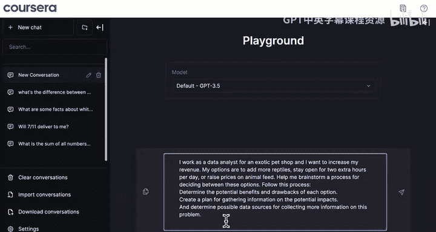

# 020：与LLM交互实践演示 🧠💬

在本节课中，我们将学习如何与大型语言模型（LLM）进行交互。我们将通过一系列具体的提示示例，了解LLM的优势与局限，并掌握如何有效地利用它来获取信息、解决问题。

---

## 概述：认识LLM的交互界面

上一节我们介绍了LLM的基本概念，本节中我们来看看如何在实际操作中与LLM进行对话。我们将使用Coursera平台上的LLM界面，并尝试不同类型的提示，以观察其响应。

首先，我们尝试一个数学计算类的提示。

---

## 尝试数学计算提示

以下是第一个提示示例：计算从1到888所有数字的总和。

> What is the sum of all numbers from 1 to 888.

LLM给出了一个用于计算等差数列总和的公式：

**公式：** `总和 = n / 2 * (首项 + 末项)`

其中，`n`是总项数。我们将具体数值代入公式进行计算：

`888 / 2 * (1 + 888) = 394716`

然而，LLM给出的结果是 **394116**。这表明LLM在此次数学计算中出现了错误。

**关键点：** 当需要进行精确数学计算时，使用计算器、电子表格或编程语言等比LLM更为可靠。

---

## 尝试获取实时信息

接下来，我们尝试一个需要实时信息的提示。

> What if you want a hot dog and you want it right now. Will 711 deliver to me?

LLM回应称，它无法提供特定送货服务或地点的实时信息，并给出了一些查找信息的建议。

为了对比，我们在其他商业LLM界面中尝试了相同的问题。

*   **Anthropic Claude：** 回应称7-11在某些地区提供送货服务，但可用性取决于具体区域，并给出了自行查找信息的建议。
*   **Google Gemini：** 由于具备网络搜索功能，它能够检测账户位置（例如帕洛阿尔托），并给出更具体的“是”或“否”的送货答案。但它也明确指出，作为AI，它无法直接为用户下单。

**关键点：** LLM在获取实时、具体的地点信息方面能力有限，且目前无法代替用户执行实际操作（如下单）。

---

## 尝试获取事实性知识

现在，我们询问一个关于天体物理学的知识性问题。

> What are some facts about white dwarfs and binary star systems?

LLM提供了一系列关于白矮星和双星系统如何形成、其质量、温度、密度等信息。

**问题在于：** 我们无法直接验证这些信息的真实性。对于这类专业主题，更可靠的做法是查阅搜索引擎或权威教科书等来源。

---

## 尝试课程相关学习问题

我们可以利用LLM辅助本课程的学习。例如，询问一个关于数据特征的概念。

> What‘s the difference between continuous and discrete numerical features?

LLM的回应是：
*   **连续数值特征：** 指可以在一定范围内取任意值的变量。
*   **离散数值特征：** 指只能在一定范围内取特定值的变量。

由于我们已经学习过相关内容，可以验证这个定义是正确的。LLM还提供了示例：
*   **连续特征示例：** 年龄、身高、体重。
*   **离散特征示例：** 家庭子女数量、拥有汽车数量、宠物数量。

对于这类常见且我们已有一定了解的主题，我们可以相对更信任LLM提供的信息，尤其是它补充的示例。

---

## 尝试复杂分析与头脑风暴

让我们给LLM一个更复杂的、需要分析和决策支持的提示。

假设你是一家异宠店的数据分析师，希望增加收入。你要求LLM为以下三个选项进行决策分析提供思路，并遵循特定的思考框架。

LLM列出了每个选项，并分别分析了其潜在益处和缺点。例如，对于“增加更多爬行动物种类”这个选项，它提到可以增加客户选择、吸引新客户，但也需要额外的空间、资源和员工工作量。

然而，它提出用于收集额外信息的建议（如“参观其他异宠店”）比较模糊，没有说明具体如何评估这些店铺。

**改进交互：** 不要完全接受LLM的初步回答。通过追问来引导它深入思考。

例如，我们可以追问：
> How might I evaluate other exotic pet shops for my analysis?

这次，LLM提供了更详细的评估维度，如**地理位置、产品范围、定价策略**等，以帮助我们进行更明智的决策比较。

---

## 本节总结与下节预告

本节课中我们一起学习了如何与LLM进行有效交互。我们看到了LLM擅长回答概念性问题、提供头脑风暴思路，但在精确计算、提供实时信息方面存在局限。最重要的是，我们学会了应保持审慎态度，通过多轮追问来获取更深入、更可靠的信息。

你将在接下来的实验课中练习这些技能，尝试更多类型的提示。

模块1的学习即将结束！完成本模块后，你将进行最终评估和一个关于面包店案例的评分实验练习。期待你获得更多数据处理的实际经验。

完成后，请跟随我进入下一个模块，我们将探索如何在电子表格中处理数据。我们下节课见！😊