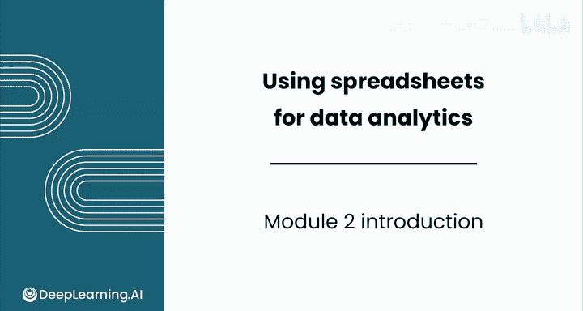
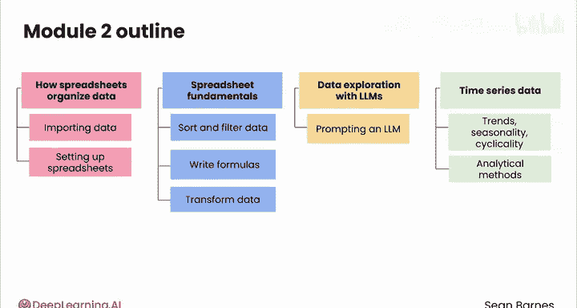

# 021：简介

在本模块中，我们将深入学习数据分析师工具包中最强大、最通用的工具之一：电子表格。我们将从了解电子表格为何是处理结构化数据的有效工具开始，逐步学习数据导入、处理、分析，并最终掌握时间序列数据的分析方法。

## 🧩 模块概览

上一节我们完成了数据分析的初步介绍，本节中我们来看看第2模块的具体学习路径。

第2模块包含四个核心课程，旨在帮助你掌握使用电子表格进行数据分析的完整流程。

以下是本模块的课程安排：

1.  **第1课**：探索电子表格作为处理结构化数据的有效工具。你将动手实践，学习如何将数据导入Google Sheets，并设置电子表格以支持分析。
2.  **第2课**：学习如何在电子表格中处理数据以提取有价值的见解。你将掌握数据排序、筛选、编写公式创建新特征和计算字段，甚至转换数据以简化分析。我们将通过分析酒店预订数据的真实案例，共同研究客户预订行为。
3.  **第3课**：练习如何提示大型语言模型来深入了解你的数据并进行数据分析。
4.  **第4课**：专注于时间序列数据，这是一种在一致时间间隔内测量的特定数据类型。你将识别时间序列的关键组成部分，包括**趋势**、**季节性**和**周期性**。你将使用一个关于美国流行婴儿名字的真实数据集，在电子表格中进行大量的分析方法练习。

## 🎯 学习目标

完成本模块的学习后，你将熟练掌握电子表格的核心操作，能够独立完成从数据导入到深入分析的全过程，为成为电子表格的高级用户奠定坚实基础。

现在，让我们直接进入第1课，学习电子表格如何帮助我们将原始数据的混乱转化为有序的信息。课堂上见。