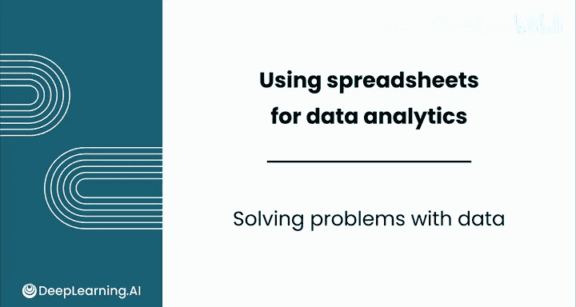
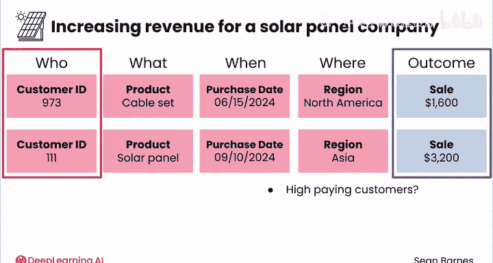

# 022：用数据解决问题 📊

在本节课中，我们将学习如何系统性地利用数据来解决实际问题。数据是验证直觉、获取深刻见解的强大工具。我们将重点介绍如何选取正确的数据进行分析，以确保分析结果能够有效指导决策。

---

## 概述

数据能以系统化的方式解决问题。你可能会有直觉，但数据能帮助你判断这个直觉是否正确。为了获得这些强有力的见解，你需要选取正确的数据进行分析。

根据经验，选取正确的数据有两个关键考虑因素，它们都聚焦于激发你进行分析的那个核心问题。

---

## 第一步：确定你关心的结果

你首先应该问自己的问题是：**我关心什么结果？**

例如，如果你试图提高一家太阳能电池板公司的利润，那么你希望看到销售额的**正向变化**或支出的**负向变化**。你可以调取销售和支出报告来进行分析。

或者，假设你正在与一家医院合作以改善患者治疗效果。在这种情况下，你关心的结果可能是**患者满意度的提升**和**住院天数的减少**。你可以从患者调查中收集数据来分析满意度，而入院和出院日期可以帮助你判断住院时长是增加还是减少。

---

## 第二步：识别为结果提供背景信息的数据

上一节我们确定了分析的目标结果，本节中我们来看看如何理解这些结果。接下来，需要识别能为你的“结果”提供背景信息的数据。

所谓“提供背景”，是指这些数据能告诉你更多关于所观察到的结果的信息，例如 **4W**：**Who**（谁）、**What**（什么）、**When**（何时）和**Where**（何地）。

例如，如果你关心的结果是销售数据，那么哪些数据点能为这些销售提供背景信息？你的销售数据可能与特定的**客户**（Who）、**产品**（What）、**购买日期**（When）和**地区**（Where）相关联。所有这些信息都有助于为销售数据提供背景，使你能够比较不同产品和地区的销售情况。

让我们聚焦于提高太阳能电池板公司收入的例子。假设我们只有右侧的销售数据。

记住，销售额是你关心的结果。我们拥有销售数据固然很好，但不幸的是，除此之外我们知之甚少。我们需要关于这些销售的背景信息，以便更好地理解太阳能电池板销售背后的驱动因素。

背景信息可能如下所示：

以下是两个数据观察示例，展示了背景信息如何与结果结合：

*   **客户ID 973** 于 **2024年6月15日** 在 **北美** 地区购买了 **电缆套件**。
*   **客户ID 111** 于 **2024年6月20日** 在 **欧洲** 地区购买了 **太阳能电池板**。

在这种情况下，你可以使用其他数据点来回答以下问题：

*   **是否有应该被定位进行额外购买的高价值客户？**
    *   **客户ID** 和 **销售额** 可以帮助回答这个问题。
*   **是否有特定产品推动了高比例的销售额？**
    *   **产品** 和 **销售额** 在这里是相关的。
*   **销售额随时间的变化趋势如何？**
    *   这次，**购买日期** 结合 **销售额** 将回答我的问题。
*   **总销售额是否因地区而异？**
    *   **地区** 和 **销售额** 可以帮助进行分析。

如果没有这些背景数据，回答上述任何问题都是不可能的。它与你关心的结果同等重要。

实际上，你还可以对每个数据点进行相当深入的挖掘。例如，你可能会注意到客户111的购买额最大。如果你想了解原因，可以提出以下问题：

*   这个客户是企业还是个人？
*   如果是企业，它的规模有多大？
*   他们下了多少订单？

---

## 总结

本节课中，我们一起学习了如何识别有用的数据以应对业务问题。你已经看到了如何通过确定**关心的结果**和收集提供背景的**4W数据**（Who， What， When， Where）来构建有效的分析基础。

在确定了需要分析的数据之后，你可以使用什么工具来组织和分析这些数据呢？在下一个视频中，你将了解更多关于电子表格如何成为数据分析世界中的强大盟友。