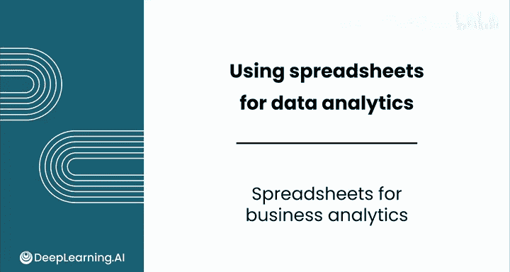
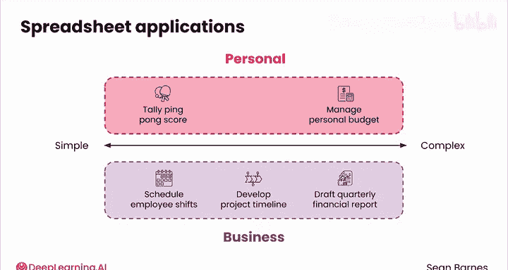
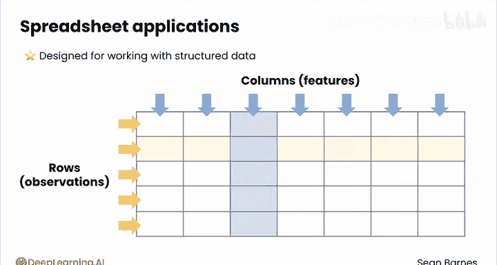
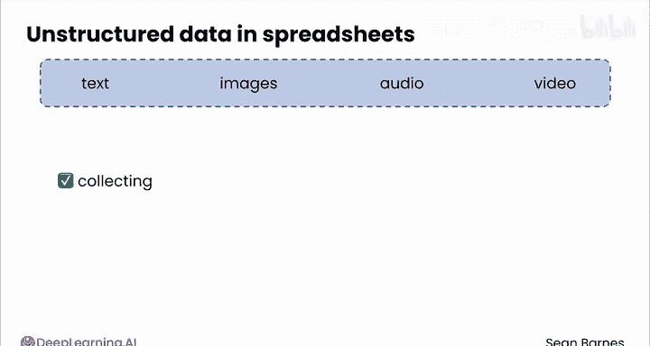
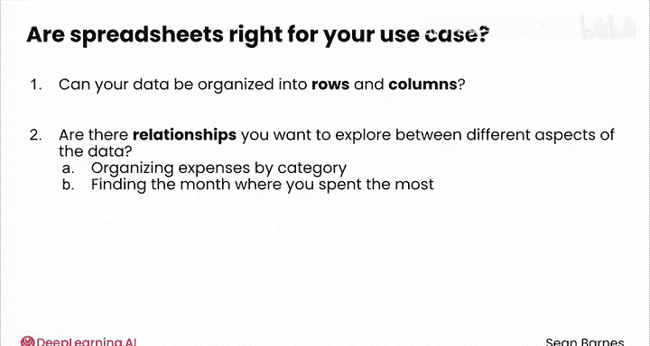

# 023：商业分析中的电子表格应用 📊

在本节课中，我们将学习电子表格在商业分析中的核心作用、适用场景以及其处理数据的基本原理。

电子表格为结构化数据带来了交互性。它们是行业标准工具，即使在我学习了更复杂的工具后，在我的整个职业生涯中，我也一直在持续使用它。电子表格不仅是谷歌、Netflix等公司日常使用的行业标准工具，而且你现在就可以在几秒钟内免费打开一个电子表格。

它们拥有广泛的用例。无论你的目标是分析家庭财务，还是计算公司的年收入增长率，电子表格的应用范围从非常简单到相当复杂，涵盖个人和商业用例。例如，在个人方面，你可以利用电子表格来记录乒乓球比赛的分数或管理个人预算。在商业方面，电子表格可用于安排员工班次、制定项目时间表或起草季度财务报告。只要你有机制以结构化方式收集和存储数据，其用例几乎是无穷无尽的。

上一节我们介绍了电子表格的广泛应用，本节中我们来看看它主要设计用于处理哪种数据。

电子表格主要设计用于处理结构化数据。正如你在模块1中学到的，结构化数据是指可以组织成行和列的数据，其中行代表观测值，列代表各种特征。一个观测值是你数据中的一个单一实例，比如一个客户或一笔交易。而特征是你为每个观测值测量的一个特性，比如年龄、价格或颜色。

我们已经了解了电子表格擅长处理结构化数据，那么对于非结构化数据呢？

当涉及到非结构化数据，如文本、图像、音频和视频时，电子表格可以用于收集和组织它们，但其分析这类数据的能力有限。想象一下尝试在这个界面中写一篇文章。或者整理你的照片。你甚至该从哪里开始？这可能会让你的任务变得更加困难。因此，如果你确定需要处理非结构化数据，你可能需要依赖计算机编程语言（如Python）或生成式人工智能工具。随着你扩展数据分析工具包，这两者你都应该探索。

为了帮助你判断电子表格是否适合你的任务，以下是两个你可以问自己的问题。

以下是两个关键的自问问题，用以判断电子表格是否适合你的用例：

1.  **你的数据能否被组织成行和列？** 这种组织方式是电子表格的基础。例如，预算可以被组织成每一行代表一项支出，列则代表金额、交易日期等特征。同时，非结构化数据（如一篇文章）则无法轻易以同样的方式组织。一篇文章的“列”是什么？这根本行不通。
2.  **你想要探索的数据不同方面之间的关系是什么？** 电子表格可以有效地计算这些关系。例如，按类别组织预算中的所有支出，或者分析购买记录以找出你花费最多的月份。

如果对这两个问题的答案都是肯定的，那么电子表格将是解决你试图处理问题的绝佳工具。

现在你已经看到了电子表格的强大功能，我希望你能在下一个视频中与我一起，在Google Sheets中动手进行翻新项目。

本节课中我们一起学习了电子表格的核心价值：它是处理**结构化数据**（即能组织成 `行（观测值）` 和 `列（特征）` 的数据）的行业标准工具，适用于从个人理财到复杂商业分析的广泛场景。同时，我们也明确了其局限性，即对非结构化数据分析能力较弱，此时可能需要转向编程或AI工具。通过两个关键的自问，我们可以有效判断一个任务是否适合使用电子表格来解决。