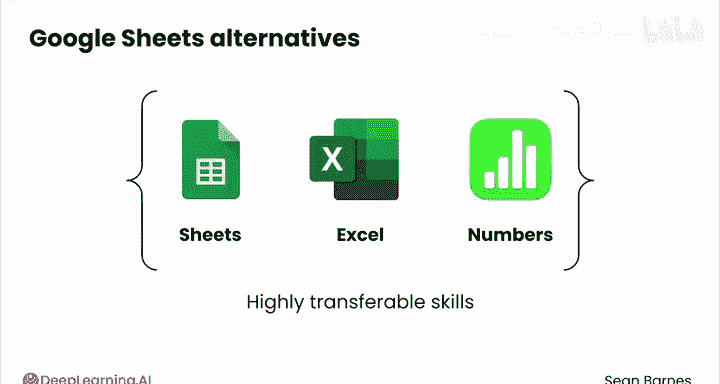
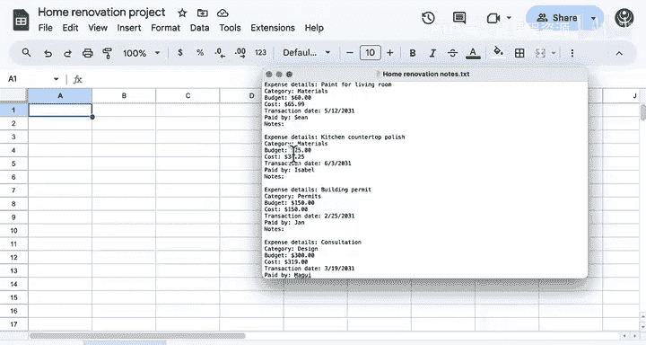
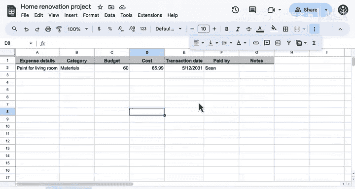

# 024：Google Sheets导航指南 📊

在本节课中，我们将学习如何使用Google Sheets这一常见的电子表格应用。我们将从界面导航开始，逐步学习如何整理、分析数据，并利用基础功能回答实际问题。无论你是数据分析的初学者，还是希望巩固基础技能，本教程都将为你提供清晰的指导。

---

## 电子表格应用简介

最常见的电子表格应用之一是Google Sheets。

它易于访问且功能实用，最重要的是，它对个人用户免费开放，你可以分享电子表格并与朋友和团队成员协作。

虽然Google Sheets被广泛使用，但你还有其他选择，例如Microsoft Excel和Apple的Numbers。在本课程中使用Google Sheets培养的技能，可以高度迁移到这些其他工具中。

让我们浏览一下Google Sheets，看看它是如何工作的。

顺便提一下，对于本课程中的任何演示，如果你想跟着操作，可以在本视频下方的下载选项卡中访问此电子表格的副本以及其他相关文件。

---

## 界面初览与数据准备

我已经在这里打开了一个新的表格。要创建一个新表格，你可以转到Sheets新建，或者从你的Google Drive中打开一个新的Google Sheets实例。

在Google Sheets中，你有所有的菜单选项，我们将逐步探索。还有一整套格式设置选项功能区，你可以应用到你的电子表格上，我们也会逐步探索其中一些。

假设我的朋友一直在帮助我进行家居装修项目。我这里有一些总结了一些交易的数据。仅仅看这些数据，很难看出任何整体趋势。我超预算了吗？哪项物品超支或节省最多？第一笔交易是什么？以这种形式的数据，很难识别出任何这些见解。

我记录的每笔交易都有几个特征，例如支出详情、类别、预算、成本等。让我们将其中一条记录复制到电子表格中。

---

## 构建结构化表格

我将首先把这些数据转换成一个表格，以便进行更深入的分析。

我将从列标题开始。

然后，我将输入这条特定记录的信息。

每一行和每一列的交汇处就是一个单元格。

请注意，我可以通过单击选择一个单元格，也可以通过双击或单击上方的编辑框进入一个单元格进行编辑。我还可以通过单击并拖动来选择多个单元格。

我也可以通过单击并拖动来选择一行、一列甚至多列。

你还可以仅使用箭头键在单元格之间导航：右、左、下、上。

你也可以使用命令键和箭头键移动到行或列的末尾。例如，按`Command + 右箭头`可以带我到达数据的末尾，`Command + 下箭头`可以带你到达底部。使用`Shift`键可以让你选择多个单元格。你也可以使用`Command + Shift`来选择一行或一列中的所有项目。

---

## 格式化数据以提高可读性

现在让我们把它弄得漂亮点。不必过于担心所有这些单独的步骤，但这将有助于组织你的数据，使其更易于查看。

首先，既然我已经输入了所有这些数据，我将移除它。现在，让我们稍微整理一下数据，使其更易于阅读。单击任意列标题之间的边界，它会自动扩展，以便你可以看到单元格中包含的所有信息。

选择这里的标题行，将其加粗并添加下边框，以便区分标题行和其余数据。

添加背景行颜色，使其更明显地表明这是标题行。

将所有标题行居中。

扩展“交易日期”列，以便看到完整的标题。

现在我们已经稍微格式化了数据，我将把其余的数据复制到这个表格中。从视频的这一点开始，我又添加了一些格式化。

不要试图记住你看到的所有不同步骤。只需专注于电子表格所具有的不同功能。

---

## 使用基础功能分析数据

现在我可以回答：我超预算了吗？

一个简单的方法是选择“预算”列中的所有单元格，然后在右下角看到一个很好的摘要，显示项目的总预算是多少。

总预算是**$1860**。

你也可以将其与成本列的总计**$1663.44**进行比较。

比较这两个总计，你可以看到我实际上没有超预算。

你也可以使用公式来比较这两个数字。

现在，我在下方添加了一个总计行，我可以插入一个求和函数来汇总所有单项的预算。

你将在接下来的视频中了解更多关于函数的知识。

这个函数的名称为`SUM`，括号内的值代表你想要求和的一系列单元格。

我也可以对成本列重复此操作。

现在我可以直接比较这两个数字，并再次确认总体上我没有超预算。

---

## 动态更新与数据排序

我刚刚想起了另一笔关于鲸鱼皂托的交易。

让我们添加一个新行。我将在任何行标题上右键单击，你可以选择在上方或下方插入一行。

请注意，当我添加鲸鱼形皂托时，预算和成本的列总计是如何更新的。

现在我想回答：第一笔交易是什么？所以我想按交易日期排序。

我将添加一个筛选器，就是这个漏斗按钮，它使我能够按交易日期排序。我可以单击列标题右侧的这个按钮，然后选择从A到Z排序，即升序。

现在我可以轻松地看到第一笔交易是建筑许可证。

---

## 应用筛选进行特定分析

接下来，假设我想分析Joy购买了哪些物品。

同样，我可以选择筛选器，现在通过“付款人”列进行筛选，我可以筛选出除Joy之外的所有人。

我将清除所有筛选器，然后只选择Joy并点击确定。

我可以看到Joy购买了三件物品：电源插座盖、植物和浴室镜子。

让我们返回，现在查看人工成本。

我将选择所有人以带回所有数据，然后筛选到仅显示“人工”类别。

为了计算总人工成本，我选择这两项，看到总人工成本是**$839**。

---

## 计算差异并识别异常

现在我想知道，哪项购买超预算最多。

为了实际计算哪项超预算最多，我需要插入一个新列来计算预算和成本之间的差异。

在“成本”列上右键单击，并在右侧添加一个新列。

这将是“差异”列。

为了计算差异，我将用预算减去成本。

通过选择这个填充柄并将其一直拖动到底部，将此公式复制下来。

进行排序以找到超预算最多或最少的项目。

“植物”超预算最多，而“管道维修”实际上为我们节省了很多钱。

---

## 总结与展望

我已经回答了我所有的问题。这比处理原始的文本文件要高效得多。

现在你已经具备了使用任何电子表格的绝佳能力。

在下一个视频中与我一起学习如何导入数据。我们那里见。

---

**本节课总结**：我们一起学习了Google Sheets的基本导航、数据录入、单元格操作、表格格式化、使用求和函数进行基础计算、添加/删除行、数据排序与筛选，以及通过插入列和公式来计算数据差异。这些是使用电子表格进行数据分析的核心基础操作。