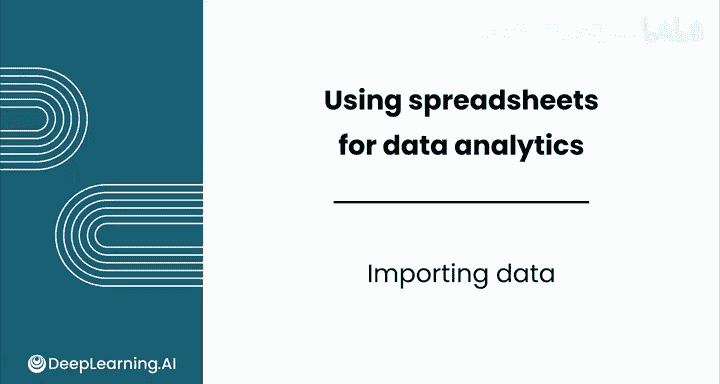
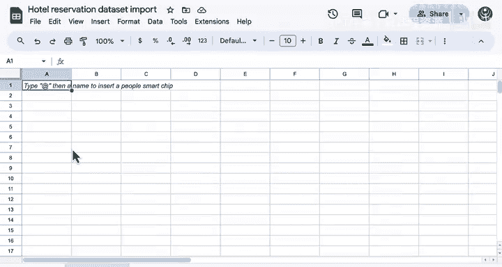
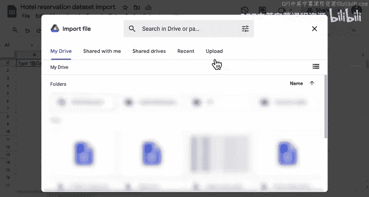
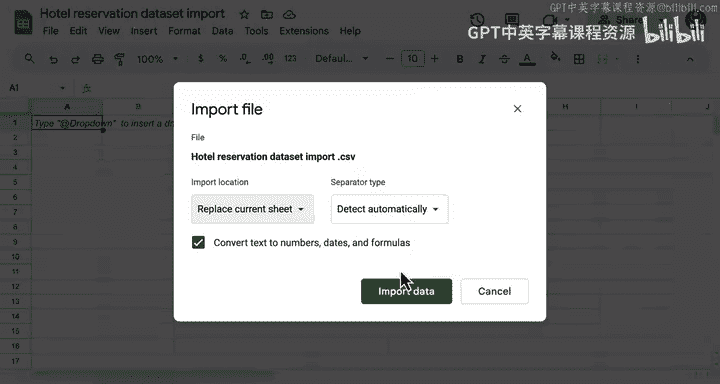

# 025：数据导入 📂

在本节课中，我们将学习在 Google Sheets 中导入数据的几种常见方法。你将了解如何将外部数据文件加载到表格中，并掌握一些处理大型数据集的基本技巧。

---

## 概述

数据导入是数据分析工作的第一步。Google Sheets 提供了多种方式来获取数据，你可以手动输入、打开现有文件，或者从外部文件导入结构化数据集。本节将重点介绍最常用的数据导入方法。

---

## 数据加载的几种方式

在 Google Sheets 中加载数据的方法取决于你的具体使用场景。

以下是几种常见的方法：

1.  **直接在表格中生成数据**
    这指的是手动输入数据。对于小规模的个人应用来说，这种方法很常见。你在上一个视频的家庭装修预算示例中看到的正是这种方法。

2.  **打开现有文件**
    当你已经在 Google Sheets 中处理过某些数据，并且只想从上次中断的地方继续工作时，可以使用这种方法。

3.  **导入结构化数据集**
    这是最常用的方法。大多数数据最初都存储在 CSV 或 Excel 文件中，而不是 Google Sheets 中。这两种电子表格文件格式与大多数软件兼容。

---

## 实践：导入酒店预订数据

上一节我们介绍了数据加载的几种方式，本节中我们来看看如何实际操作，导入一个真实的数据集。

为了更直观地理解，让我演示一下具体操作。

大多数时候，你会处理更复杂的数据集。例如，在研究酒店的预订模式时，你可能会寻找像这样的已收集数据。你将在本节和下一节中使用这个数据，它非常有趣。

这篇文章描述了两个酒店需求数据集。其中一个酒店 H1 是度假酒店，另一个是城市酒店 H2。两个数据集结构相同，包含 31 个变量，分别描述了 H1 的 40000 条观察记录和 H2 的 79000 条观察记录。数据中的每条观察记录代表一次酒店预订。

两个数据集都包含 2015 年 7 月 1 日至 2017 年 8 月 31 日期间的预订数据。由于这是真实的酒店数据，所有涉及酒店或客户身份识别的数据元素都已被删除。

如果你滚动到页面底部，会发现这些数据是公开可用的。如果你想下载数据，可以通过此链接获取。

现在，我想在 Google Sheets 中处理这些数据。

首先，我创建一个新的表格（这里已经完成）。我也已经从网站下载了数据，所以我们准备好导入数据了。

这个数据实际上非常大。因此，我们创建了一个更小的版本，它只是这些预订数据的一个子集，以便于操作。

让我们继续尝试导入这个数据。

以下是导入数据的步骤：

1.  转到“文件”菜单，选择“导入”。
2.  上传存储在我电脑上的数据文件。
3.  将数据文件拖入上传区域。
4.  选择“导入数据”并“替换当前工作表”。
5.  同时，启用 Google Sheets 自动检测分隔符。分隔符是分隔同一观察记录中不同值的字符，例如逗号或制表符。

现在数据已经显示出来，让我们查看一下。提醒一下，如果你想跟着操作，可以在本视频下方的“下载”选项卡中访问此表格。

数据已经导入，我们可以开始初步的整理工作。

以下是整理数据的几个操作：

*   **加粗标题行并添加下边框**：这有助于清晰区分表头和数据。
*   **添加筛选器**：以便轻松地对数据进行排序和筛选。
*   **冻结首行**：在探索数据时，冻结顶部行是一个技巧，可以让你在滚动时始终看到标题。这可以在“视图”菜单中找到，选择“冻结”>“第1行”。

现在，你可以看到标题始终可见。选择第一列，可以评估数据有多少行。你可以看到这个数据大约有 36000 行，比我们的家庭装修数据大得多。

---

## 协作与版本管理

假设我还想与数据团队的协作者共享这个数据。这是 Google Sheets 的一大优势。

我可以点击顶部的“共享”按钮，然后输入你想共享数据的公司内任何人员的邮箱。你可以选择希望他们拥有的权限：编辑者、评论者或仅查看者。你还可以发送一条消息，然后点击“发送”。或者，你也可以复制一个链接，直接通过电子邮件发送。

你可以看到文件的访问权限已更新，现在其他人将能够访问你的数据。

如果你希望你的分析公开，也可以返回共享设置，将“受限”访问权限更改为“任何拥有链接的人”或“贵组织中的任何人”。

假设我不小心关闭了文件，如何重新打开它？既然我已经复制了我的链接，我只需打开一个新标签页，粘贴该链接，它就会直接带我回到文件。

好消息是，你的 Google 电子表格将始终自动保存，因此你不会丢失工作。你还可以恢复到其他版本。所以，如果你犯了错误，可以点击这里的时钟图标，选择此文件之前的任何版本。

---

## 总结

本节课中我们一起学习了在 Google Sheets 中导入数据的核心方法。你现在已经知道如何手动输入、打开现有文件，以及最重要的——从 CSV 或 Excel 文件导入结构化数据集。我们还实践了导入一个真实的酒店预订数据集，并学习了如何通过冻结首行、添加筛选器来初步整理数据，以及如何利用 Google Sheets 的协作和版本控制功能。

现在你已经了解了如何导入数据，你可以处理互联网上的任何数据集了。在下一个视频中，请和我一起学习强大的排序、筛选和分析技术。我们下个视频见。