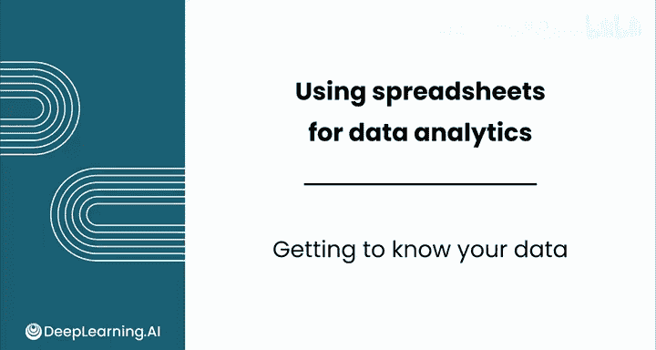
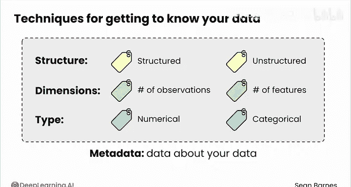
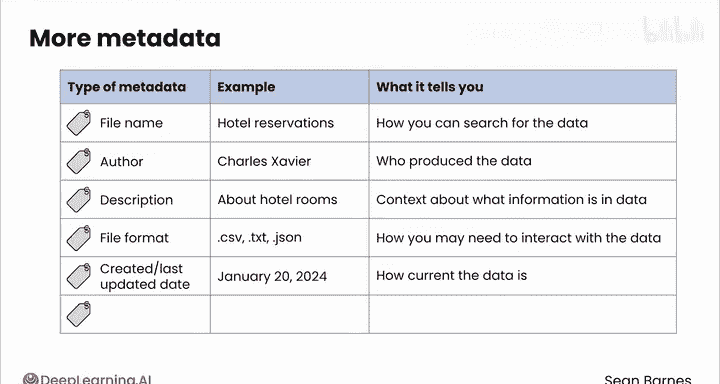
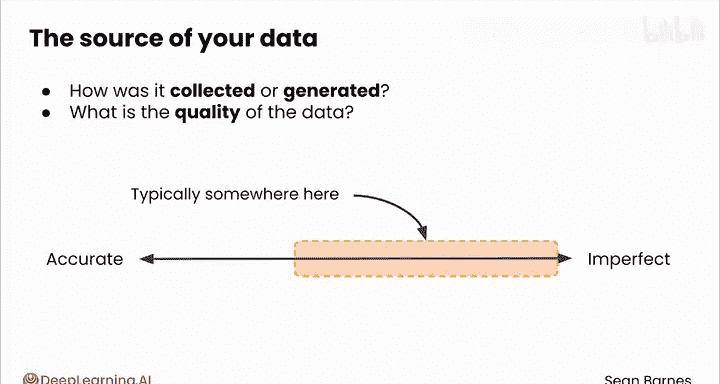
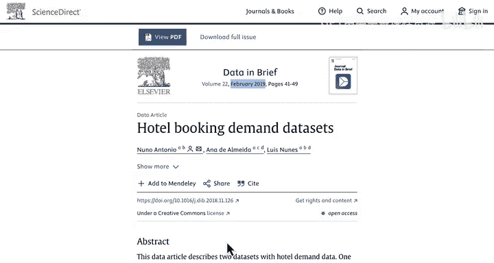
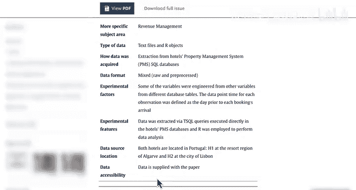
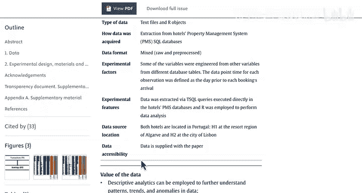

# 027：数据初探 🕵️

在本节课中，我们将学习如何初步探索和了解你的数据。在开始进行有影响力的分析之前，你必须先熟悉你的数据。

第一次打开一个数据集，就像认识一个新朋友。数据集有其历史和“个性”。关于一个新朋友，你可能会想知道哪些信息？例如，他们的年龄、来自哪里、从事什么工作。

你已经见过一些了解数据的基本策略：判断数据是结构化还是非结构化的、计算观测值和特征的数量、区分数值型特征和分类特征。这类关于数据的信息被称为**元数据**，即关于数据的数据。这是一个非常“元”的概念。

上一节我们介绍了元数据的基本概念，本节中我们来看看更多你通常会遇到的元数据类型。

以下是几种常见的元数据类型、示例及其能告诉你的信息：

*   **文件名**：例如 `hotel_reservations`。这告诉你如何搜索或找到该数据。
*   **原始作者**：告诉你谁生成了数据，以便你后续提问。
*   **数据描述**：提供关于数据包含哪些信息的背景。
*   **文件格式**：例如 CSV、TXT、JSON 等。这告知你与数据交互时可能需要的方式。
*   **文件创建或最后更新时间**：告诉你数据的“年龄”或时效性。
*   **访问控制**：告诉你谁可以访问数据以及他们如何与之交互。

你需要理解数据的来源或“起源故事”。数据是如何收集或生成的？是由人工生成还是由软件系统生成？

如果你知道数据是通过调查收集的，你就需要考虑一个事实：并非所有收到调查的人都会实际回复。如果你知道数据是通过软件收集的，你可能需要寻找系统性错误。

数据的总体质量如何？它是准确的还是存在缺陷？通常，答案是后者。理解来源可能帮助你识别潜在的问题。

让我们通过提问来探索上一课中遇到的酒店预订数据集的起源故事和“个性”。

这是包含此数据来源的期刊文章。这里有很多文字，让我带你浏览一下。

首先，这些数据有多“老”？你可以看到它发表于 2019 年 2 月，因此你不应期待有比这更新的预订记录。我们继续往下看。

让我们看看这个规格表。这些数据来自哪里？两家酒店都位于葡萄牙，H1 在阿尔加维的度假区，H2 在里斯本市。

这是一张地图，显示了这两个位置。南边是阿尔加维，它是葡萄牙最南端的地区，也被称为法鲁区。你还可以看到首都里斯本在西海岸。

请注意，这两个地点相距甚远，因此可能具有不同的特征。

这些数据是如何收集的？这段高亮文本提到，查询是直接在酒店的物业管理系统数据库中执行的。从物业管理系统提取数据表明这些数据是可靠的。记录可能是自动生成的，人为错误最少。这也表明这些数据归酒店本身所有。自动提取通常也会产生像这样的大型数据集：横跨两年的 36000 条观测记录，平均每天超过 50 个预订。

探索数据来源是重要的工作。跟随我进入下一个视频，看看如何探索一些关键的摘要信息。

本节课中我们一起学习了如何初步探索数据，包括理解元数据的各种类型以及通过询问关键问题来追溯数据的来源和收集方式，这是进行可靠数据分析的第一步。