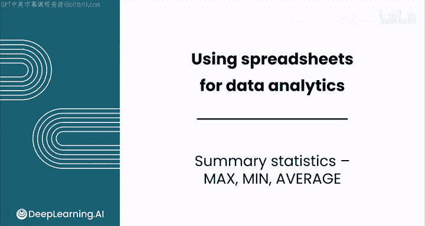
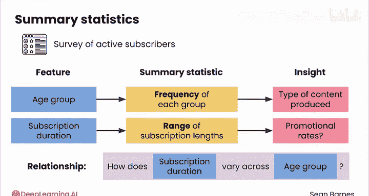
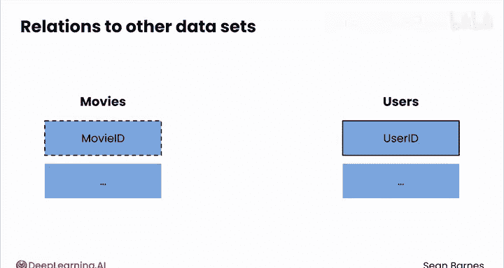
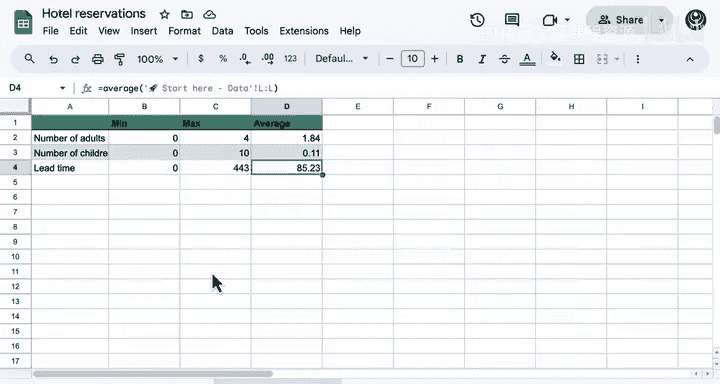

# 028：最大值、最小值、平均值 📊

在本节课中，我们将学习如何使用摘要统计来初步了解数据集。我们将重点介绍三个核心统计量：最大值、最小值和平均值，并通过一个酒店预订数据集的实例来演示如何计算和解读它们。



你已经知道了数据的来源和收集方式，但你是否清楚数据的具体内容是什么？

探索数据以寻找趋势和异常值，这有助于你回答业务问题，是一个充满乐趣的过程。

## 了解你的数据特征

一旦明确了数据来源，就应该计算一些摘要统计量，以便更好地理解数据特征。

以一项针对Netflix活跃用户的调查为例。你可能有一个“年龄段”的特征，例如18-24岁、25-34岁等。每个组的频率构成了用户年龄分布。你的用户群体是更年轻还是更年长？这些信息如何影响你制作的内容类型？

你的数据可能还包含“活跃订阅时长”。这些时长的范围是多少？或许最短的订阅时长是三个月，因为你为新用户提供了促销价。最长的订阅时长可能只有两年，因为这要追溯到服务首次推出的时间。你还需要了解典型的订阅时长，以便思考如何延长它。

你还应该理解特征之间的关系。例如，考虑年龄段和活跃订阅时长之间的关系。不同年龄段的订阅时长有何不同？原因是什么？



你的数据集也可能与其他数据集相关联，通常通过一个或多个共同特征连接。例如，一个电影数据集可能与一个用户数据集相关联，关联依据是每个用户观看过的电影。

## 探索酒店预订数据集

让我们通过查看酒店预订数据集中的一些特征来更好地了解它。

我们将探索其中一些特征，从“成人数量”开始。我将创建一个新的工作表来存储计算值。以下是我们将为“成人数量”特征计算的一些摘要统计量。

### 计算最小值

首先，计算成人数量的最小值。使用公式以等号（`=`）开始，这告诉Google Sheets你将输入一个函数。我们从最小值函数 `MIN` 开始。

每个函数后应跟一个左括号，之后会闭合。然后，我们回到数据选项卡，选择“成人数量”列，接着闭合括号并按回车键。



**公式示例：**
```excel
=MIN(Data!E:E)
```
结果是成人数量最小值确实是0。我想知道这是怎么回事。

### 计算最大值

接下来，编写公式计算最大值。同样以等号开始，引用最大值函数 `MAX`，回到数据并再次选择“成人数量”列，闭合括号并按回车键。

**公式示例：**
```excel
=MAX(Data!E:E)
```
可以看到数据集中确实有一些预订包含4位成人。

### 计算平均值

最后，计算成人的平均数量。再次以等号开始，输入 `AVERAGE`，忽略自动填充的建议，回到原始数据选择“成人数量”列，闭合括号并按回车键。

**公式示例：**
```excel
=AVERAGE(Data!E:E)
```
数据显示，每次预订的平均成人数量约为1.8。

## 深入分析与数据验证

一个预订怎么可能有0个人呢？数据中也有儿童信息。那么，有多少预订是只有儿童的呢？

让我们回到数据中，按成人数量升序排序。可以看到，数据中有相当多的预订成人数量为0，并且所有成人数量为0的预订都有儿童。直到第140行，我们的数据中成人数量都为0。通过排序可知，实际上有139个预订成人数量为0但包含一些儿童。

这会不会是错误？让我们再看看儿童数量。我将复制相同的公式，这次针对F列“儿童数量”。复制这一行并将其替换为儿童数量，然后更新这些公式以代表儿童特征，或者你也可以直接将其替换为F列。

儿童数量的最小值为0，这说得通。但谁会在一个房间里带10个孩子呢？平均值相当低，为0.11。所以大多数预订没有儿童。

让我们调查一下那些儿童数量很多的预订。按儿童数量从多到少降序排列数据，可以看到只有少数几个异常情况有很多儿童（10个、9个），然后降到3个。所以只是少数异常预订。

最后，让我们查看“提前预订时间”，即预订日期距离入住日期的天数。

有趣的是，最大提前预订时间远高于平均值。我对那些提前预订时间为0的最后一刻预订也感到惊讶。

让我们调查这些超过400天的预订。回到原始数据，按提前预订时间从高到低降序排序。有相当多的预订提前了443天。这很有趣。我想知道这是否是系统允许的最长提前预订时间。我还注意到有很多是433天、418天。我想知道这是怎么回事。

事实证明，如果你回到数据的左侧，可以看到所有这些预订的抵达日期也是相同的。所以这些一定是某种类型的团体预订，比如婚礼或商务会议。

## 总结与展望

以这种方式查看特征非常有价值。我鼓励你查看更多的特征。

随着你技能的提升，你将使用编程语言来快速获取这类摘要统计，从而对酒店预订数据集中发生的情况有良好的把握。

你如何分析这里发生的情况？在接下来的几个视频中，我将介绍一些分析数据的酷炫技巧，从条件格式开始，请与我一同继续学习。



在本节课中，我们一起学习了如何使用最小值、最大值和平均值这三个摘要统计量来初步探索和理解数据集。我们通过实际操作，发现了数据中的一些有趣模式和潜在问题，例如成人数量为0的预订以及异常长的提前预订时间，这为后续深入分析奠定了基础。