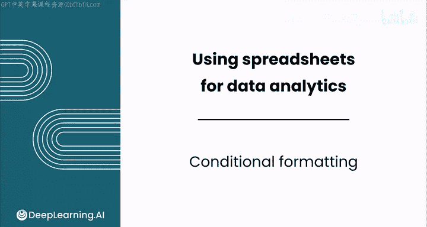
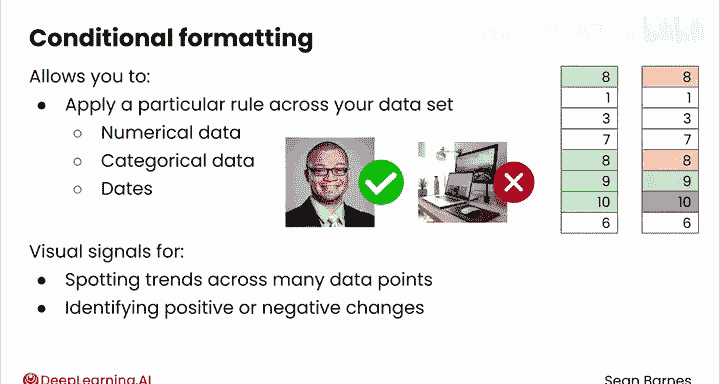
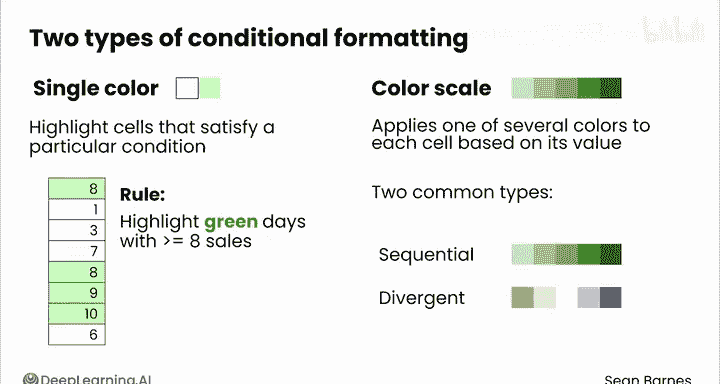

# 029：条件格式 📊

在本节课中，我们将学习如何使用条件格式这一强大的可视化工具，它能帮助你比单纯查看原始数据更容易地发现有意义的信息。我们将了解其工作原理、主要类型，并通过实际数据集演示其应用。

---

## 什么是条件格式？🔍

上一节我们介绍了数据分析中可视化的重要性，本节中我们来看看一个具体的工具——条件格式。

电子表格中的条件格式看起来像这样或那样，它允许你高效地对数据应用特定规则，包括数值数据、分类数据甚至日期数据。其主要好处在于它在你的数据之上提供了一个视觉层，使你无需在脑海中逐一评估每个数据点与规则的比较情况。

作为一个人类而非计算机，我欣赏条件格式提供的视觉信号，因为它使识别数据模式变得更加容易，例如：
*   发现众多数据点中的趋势和模式
*   识别积极或消极的变化
*   识别异常值
*   识别哪些特定值高于或低于某个阈值

---

## 条件格式的主要类型 🎨

以下是你可以应用于数据的规则类型，其中两种主要类型是单色格式和色阶。

### 单色格式

当你想要突出显示满足特定条件的单元格时，应用单色格式。例如，你可以突出显示太阳能电池板发电量达到8个或更多的日子（你可能将其归类为“好日子”）。应用条件格式将使你能够轻松识别哪些日子是“好日子”。

单色格式还允许你选择字体样式，例如加粗或斜体。

### 色阶格式

你的另一个选择是色阶，它根据每个单元格的值为其应用几种颜色之一。你无法应用其他样式（如加粗和斜体），因为这些样式无法在众多值之间进行缩放。

有两种常见的色阶类型：
*   **顺序色阶**：使用同一种颜色逐渐加深的色调。
*   **发散色阶**：在中心值的两侧使用不同的颜色。

让我们在电子表格中看看每一种，以便了解它们各自的用途。

---

## 在酒店预订数据集中的应用实例 🏨

现在让我们看看这些色阶在酒店预订数据集中如何工作。假设我想用条件格式识别最有价值的预订。

### 示例1：识别带有儿童的预订

一个想法是查看每个预订是否带有儿童。我们知道带有儿童的预订相对罕见，平均值约为0.11。在这种情况下，我们有两个条件：一个是儿童数量大于0，另一个是等于0。

对于这种类型的条件，我们可以应用单色格式。
1.  选择F列（儿童数量特征）。
2.  转到“格式” -> “条件格式”，这会打开侧边栏。
3.  有两个选项卡：“单色”和“色阶”，我们从“单色”开始。
4.  为了应用此条件，我们需要选择不同的格式规则。在本例中，我们想要的规则是“大于0”。
5.  我将选择蓝色以便更容易查看，同时将结果加粗，然后点击“完成”。

现在，儿童数量大于0的预订以蓝色突出显示，并且文本也加粗了。总体来看，带有儿童的预订相当罕见，大多数值为0，只有偶尔的值大于0。

### 示例2：显示预订提前期（Lead Time）的范围

另一个想法是显示提前期（预订提前的天数）的范围，这可能有助于你一眼识别异常值。

我们选择一个强调较高值的色阶。
1.  选择“色阶”。
2.  确保在格式规则中选择一个从低值（浅色）到高值（深色）的色阶。这里的默认选择正是我们想要的。
3.  在本例中，我们对绿色满意，因此可以直接应用色阶。

现在，较短的提前期显示为非常浅的颜色，而较长的提前期（例如224、211或346）则显示为更深的绿色。有趣的是，假设我想通过筛选市场细分来更仔细地查看公司预订。清除所有其他选项，只选择“公司”。你看到的主要是比我们在所有预订中看到的一些深绿色更浅的颜色。因此，这里的洞察可能是：公司预订的平均提前期较短。

### 示例3：分析每间客房的平均价格

接下来，分析每间客房的平均价格。假设你的盈亏平衡点是45。任何低于此价格的情况，你都在亏损，价格越低，亏损越多；高于此价格则是盈利，利润越高越好。

对于这种情况，你可以使用发散色阶。
1.  选择“色阶”。
2.  选择发散色阶（这些色阶在中间有一个明确的中性值，一侧是一种颜色，另一侧是另一种颜色）。
3.  对于发散色阶，你需要选择一个代表数据中心的中间点值。由于我们有一个特定的数字45作为数据的中心，我将选择一个数字。
4.  我们选择了红绿配色选项，但这个选项对于色盲人士可能难以辨认。因此，我将自定义一个：为较低的值选择橙色，为较高的值选择蓝色。

应用后，我看到大多数预订都是盈利的（这里有很多蓝色），只有偶尔的橙色值表示平均房价低于45美元。

假设我还想筛选这些数据，查看特定的市场细分。例如，我可能想查看“免费”市场细分。选择“免费”后，你会看到这些选项的客房平均价格，许多是0，大多数低于45美元。因此，这些都是非盈利预订的例子。

---

## 总结与回顾 📝

本节课中我们一起学习了条件格式的应用。

出色的工作！将条件格式应用于你的数据。条件格式对于探索数据和传达洞察非常强大。现在你已经看到了如何将其应用于真实世界的数据，请跟随我进入下一个视频，看看如何扩展这些洞察，以在电子表格中汇总数据。