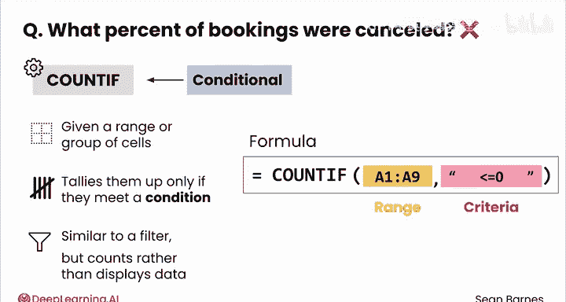
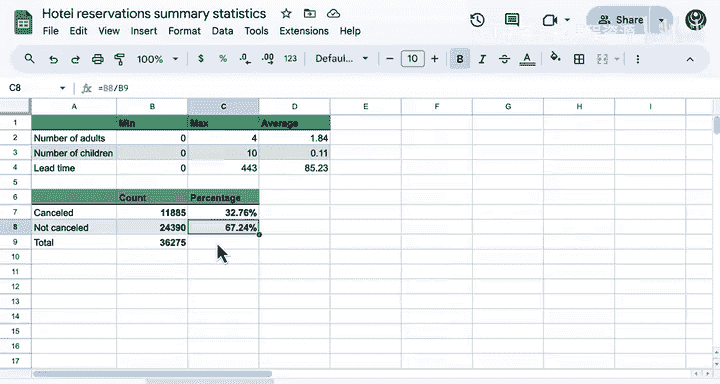

# 030：摘要统计之COUNTIF函数 📊


在本节课中，我们将学习如何使用Excel中的`COUNTIF`函数，这是一种强大的条件计数工具，能帮助我们快速分析数据集中满足特定条件的记录数量。

当面对一个包含大量特征的数据集（例如酒店预订数据集）时，你可能会不知从何开始分析。一种有效的策略是**对数据进行分割**，以尝试理解其中不同的潜在群体。

上一节我们介绍了数据分析的初步思路，本节中我们来看看如何从结果变量“预订状态”入手。这里有一个问题：**被取消的预订占总预订的百分比是多少？** 使用你现有的工具可能很难进行统计。

你可以使用`COUNTIF`函数来帮助回答这个问题。

## 理解COUNTIF函数

`COUNTIF`函数是一种**条件函数**，意味着它仅在满足特定条件时才执行操作。给定一个单元格范围或一组单元格，`COUNTIF`会统计其中**满足特定条件**的单元格数量。

`COUNTIF`类似于筛选器，后者仅显示满足特定条件的数据。不同之处在于，`COUNTIF`是**统计**这些数据的数量，而不是显示它们。

你的公式将如下所示：
```
=COUNTIF(range, criteria)
```
*   **`=`**：公式必须以等号开头。如果不包含它，你输入的内容通常会被视为纯文本。
*   **`COUNTIF`**：函数名称。
*   **`range`**：第一个参数，选择要统计的单元格范围。
*   **`criteria`**：第二个参数，在引号内添加条件。例如，如果你想统计范围内包含“hot pocket”的单元格数量，条件可以是`"hot pocket"`。如果要检查数字，条件可以是`">100"`或`"<=0"`。

## 函数实战：统计取消的预订

让我们看看这个函数如何实际应用。首先，统计被取消的预订数量。

1.  输入等号`=`，然后键入`countif`函数（函数名无需大写）。
2.  回到数据，选择“预订状态”列（即最右侧的列）。
3.  添加条件，检查其是否“等于”`"Canceled"`。
4.  闭合括号。



操作完成后，你会发现数据集中有近12,000个预订被取消，这相当于每天约有17个取消。

## 函数实战：统计未取消的预订

接下来，我们统计未取消的预订数量。

1.  以等号`=`和`COUNTIF`开始。
2.  再次选择“预订状态”列。
3.  条件设为`"Not_Canceled"`。

结果显示，数据中有超过24,000个预订未被取消，数量大约是取消预订的两倍。

**关于COUNTIF和公式的注意事项**：字母大小写通常不影响匹配，但**字符必须完全一致**。例如，对于“Not_Canceled”，即使我使用小写的`n`和`c`也能工作，但如果我省略了下划线字符`_`，则无法匹配。

## 计算百分比

仅看数字可能难以理解其含义。我想看看取消预订占所有预订的百分比。我不会总是在脑子里计算11,000除以36,000，所以我要计算数据集中每个类别的观察值比例。

以下是计算步骤：
1.  对于“已取消”的百分比：用取消数量除以总数。这是一个比例（介于0和1之间）。
2.  你可以将其乘以100转换为百分比，但更简单的方法是**将结果格式设置为百分比**。

同理，你能猜出计算“未取消”预订百分比的公式吗？同样是取该类的计数除以总数，然后将格式设置为百分比。

这两个百分比之和应该是多少？我们来验证一下：**100%**，完全正确。



## 本节总结

本节课中我们一起学习了`COUNTIF`函数的使用。通过分析，我们得到了一个很酷的摘要：数据中存在大量取消预订，数量可能超出你的预期。

无论如何，这个函数为我们快速洞察数据分布提供了有力工具。在接下来的视频中，我们将继续学习如何统计与成人同住和未与成人同住的儿童数量。