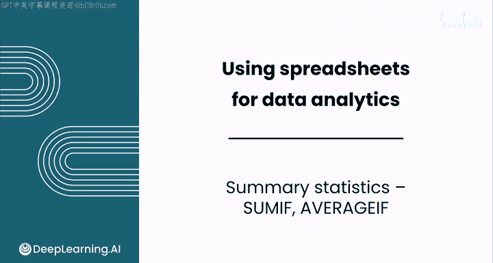
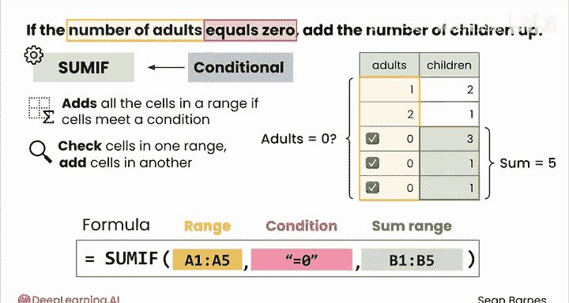
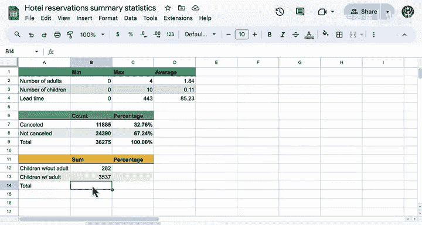
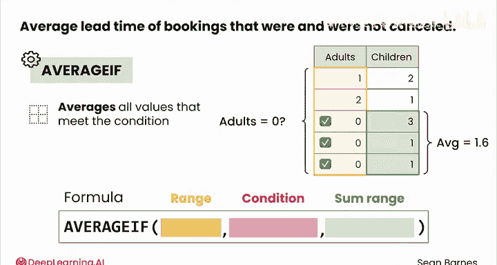
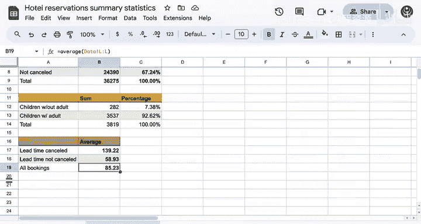

# 031：SUMIF与AVERAGEIF函数 📊

在本节课中，我们将学习如何使用Excel中的`SUMIF`和`AVERAGEIF`函数，根据特定条件对数据进行汇总和求平均值。这些功能强大的函数能帮助我们快速分析数据子集，例如计算满足特定条件的数值总和或平均值。

## 分析成人与儿童入住关系 👨‍👩‍👧‍👦

假设你想分析酒店中成人与儿童入住数量之间的关系。

接下来，我们将介绍一种高效的方法来实现这一目标。具体来说，你的目标是：当成人数量等于0时，汇总对应的儿童数量。为此，你可以使用`SUMIF`函数，这是一个非常有用的函数。

`SUMIF`函数会对特定范围内满足给定条件的所有单元格进行求和。与`COUNTIF`类似，你也可以检查一个范围内的单元格，并对另一个范围内的对应单元格进行求和。`SUMIF`是一个条件函数，它仅在满足特定条件时才对数值进行求和。

以下是它的工作原理：首先输入等号`=`，然后是函数名`SUMIF`和左括号`(`。`SUMIF`函数有三个参数：`range`（条件判断范围）、`criteria`（条件）和`sum_range`（实际求和范围）。首先，选择你想要检查的条件范围，这紧跟在`IF`逻辑之后。在本例中，条件是“成人数量”。接着，在引号内添加条件“等于0”。最后，选择你想要汇总的“儿童数量”列。

让我们实际操作一下。😊

## 计算有/无成人陪同的儿童总数 🧮

首先，我们来计算没有成人陪同的儿童总数。

以等号`=`开始，输入`SUMIF`函数。然后选择“成人数量”列作为条件范围，添加条件`"=0"`，最后选择“儿童数量”列作为求和范围，按回车键确认。

执行公式后，你可以看到大约有282名儿童在没有成人陪同的情况下入住。

接下来，我们看看这与有成人陪同的儿童数量相比如何。我们来计算成人数量大于0时的儿童总数。

我将开始一个新的公式：`=SUMIF`，选择“成人数量”列，添加条件`">0"`，然后选择“儿童数量”列，闭合括号并按回车键。

结果显示，有超过3500名儿童是由成人陪同入住的。

现在，我们来计算数据集中儿童的总数。在这种情况下，我可以直接按Tab键接受Excel的自动建议，因为它看起来是正确的。

然后，我们来计算282名儿童占总数的百分比。我将输入公式`=`，用没有成人陪同的儿童数量除以儿童总数。

计算得出，大约有7.38%的儿童在没有成人陪同的情况下旅行。

## 解读数据并引入AVERAGEIF函数 📈

因此，大约92%的儿童是与成人一同旅行的，这个发现很有趣。你还可以将这些百分比相加，总和应为100%。

至此，你已经根据是否有成人陪同，对儿童数据进行了细分分析。

假设你现在不想求和，而是想根据特定条件计算某一列的平均值。例如，你可能想调查被取消和未被取消的预订的平均提前预订时间（Lead Time）。

为此，你可以使用`SUMIF`的“表亲”——`AVERAGEIF`函数。`AVERAGEIF`函数的输入参数与`SUMIF`完全相同，区别在于它会对满足条件的所有值计算平均值，而不是求和。

让我们直接开始吧。也许提前预订时间能为我们提供关于哪类人会取消预订的线索。

你的预测是什么？你认为取消预订的人倾向于提前更久预订，还是更接近入住日期预订？

首先，计算被取消预订的平均提前时间。我将选择“预订状态”列作为条件范围，条件输入“已取消”，然后计算对应的“提前时间”平均值。

## 比较与分析 🤔

平均而言，被取消的预订大约提前了139天。我将这个单元格格式设置为数字，以减少显示的小数位数。

现在，让我们看看这与未被取消的预订相比如何。以等号`=`开始，输入`AVERAGEIF`函数。选择“预订状态”列作为条件范围，我们这次要检查“未被取消”的条件，然后再次计算“提前时间”的平均值。同样，将格式设置为数字。

平均而言，未被取消的预订的提前时间要短得多，只有58或59天左右。这是一个很大的差异。

那么整体的平均提前时间是多少呢？由于未被取消的预订约占所有预订的三分之二，这个整体平均值会更偏向于未被取消的预订数据。

对于整体平均值，我们可以直接使用`AVERAGE`函数，选择“提前时间”列即可。计算得出，所有预订的平均提前时间约为85天。

你认为如何解释这种差异？以下是一种可能的解读：被取消的预订平均提前了约4个月，这暗示这些可能是计划好的假期，但计划后来发生了变更。另一方面，未被取消的预订平均只提前了约2个月，到那个时候，计划可能已经更加稳定了。

无论如何，提前时间似乎以某种方式与取消预订相关，尽管没有进一步的分析，我们无法确切知道具体是怎样的关系。

## 总结 🎯

在本节课中，我们一起学习了如何使用`SUMIF`和`AVERAGEIF`函数进行条件汇总统计。我们通过分析酒店入住数据，实践了如何计算有/无成人陪同的儿童数量及比例，以及如何比较被取消与未被取消预订的平均提前时间。这些技能是数据细分分析的基础。

在下一个视频中，我们将学习一种基于多个条件进行计数和求和的类似技术，请跟随我继续学习。