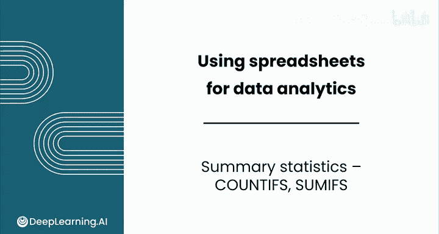
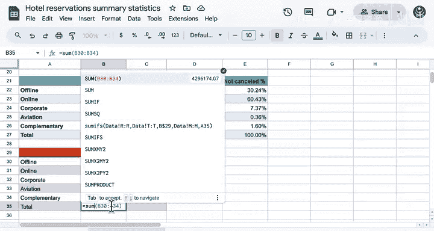

# 032：多条件统计函数 COUNTIFS 与 SUMIFS 📊

在本节课中，我们将学习如何使用 Excel 中的 `COUNTIFS` 和 `SUMIFS` 函数，基于多个条件进行计数和求和。这是对之前学习的单条件函数（如 `COUNTIF`、`SUMIF`）的扩展，能帮助我们进行更复杂的业务数据分析。



## 概述

在之前的视频中，我们使用了包括 `COUNTIF`、`SUMIF` 和 `AVERAGEIF` 在内的条件公式。这些函数只能检查一个条件。如果我们想基于多个条件进行计算，例如根据取消状态和市场细分来比较数量，该怎么办呢？让我们一起来看一下。

## 识别唯一类别

首先，我们需要了解数据中有哪些不同的市场细分类别。一眼看去，我并不确定有多少种。

我们可以使用 `UNIQUE` 公式来识别“市场细分”列中的所有唯一类别。但我不想选择标题行，因此我将数据范围从 M2 单元格开始。

```excel
=UNIQUE(M2:M1000)
```

现在，我得到了市场细分的所有唯一类别。我刚刚应用了一些格式，并将在下方添加一个总计行。

## 使用 COUNTIFS 进行多条件计数

现在，在第一个单元格中，我想计算如果市场细分也是“线下”时，被取消预订的数量。

这时需要使用 `COUNTIFS` 函数。如果你遇到困难，可以随时查看帮助菜单，它会展示如何使用这个函数的示例。

以下是使用 `COUNTIFS` 的步骤：

1.  转到数据并选择“预订状态”列。
2.  我只想包含状态为“已取消”的行。
3.  选择“市场细分”列。
4.  在这种情况下，与其输入“线下”，不如选择包含该值的单元格（例如 A22）。这将使后续复制公式变得更容易。

```excel
=COUNTIFS(Booking_Status_Column, "Canceled", Market_Segment_Column, A22)
```

很好，结果显示有 3153 个预订既是“已取消”又是“线下”。请注意，A22 是一个相对单元格引用。如果你使用填充柄，可以为每个市场细分计算数量。填充柄允许你将公式复制到许多单元格，而相对单元格引用会自动更新。

我准备使用填充柄向下拖动，这将为每个类别更新计数。大部分取消发生在在线预订中，而其他类别的取消情况则相对罕见。

我不小心包含了总计行，现在将其删除。

## 计算总计与百分比

现在，让我们计算预订的总数。在这里，我将使用 `SUM` 函数。可以看到，Excel 检测到了我想要做的事情，在这种情况下它是正确的——我想对表中上方的所有行进行求和。

```excel
=SUM(Above_Rows)
```

因此，我可以直接按 Tab 键来完成。已取消预订的总数等于我们之前计算的总数。

接下来计算百分比。我将用“线下”的取消计数除以总数，然后将格式设置为百分比。

```excel
=Cancel_Count_Offline / Total_Cancel_Count
```

我们在这里能使用填充柄吗？让我们试试看。你会注意到，下面的每一行都出现了“除以零”的错误。一定有什么问题，让我们来检查一下。

查看“所有航线”这一行，你会发现公式试图用“所有航线”的取消计数除以下面的空白单元格。你会注意到，当我向下应用填充柄时，两个引用都移动了，但我们只希望第一个条目的单元格引用移动，希望第二个保持不变。实际上，我们想除以的是“总计”。

因此，我将清除单元格，然后在公式中添加一个绝对引用。你可以使用美元符号 `$` 来防止行或列引用发生改变。在这种情况下，我想阻止第 27 行改变，所以我将在 27 前面添加一个美元符号，这将保持该引用固定。

```excel
=Cancel_Count_Offline / $B$27
```

现在，当我将这个公式向下填充到各行时，你会看到每个单元格都引用了包含总计的单元格。这种表示法可能有点不寻常，需要一点时间来适应。

例如，如果你希望行保持固定，就在行号前加美元符号；如果你希望列保持固定，就在列字母前加美元符号；如果你希望整个单元格固定，就在行和列前都加美元符号。

我们也可以计算总计，并将其格式化为文本。我将快速对“未取消”的预订进行同样的操作。你可以自己尝试，但我只想做一个快速的比较。可以看到，与已取消的预订相比，线下、公司和赠品预订在未取消预订中占了更大的比例。

## 使用 SUMIFS 进行多条件求和

现在，假设我想再次调查数据中所有预订的总收入，这次要跨越不同的市场细分类别，并基于预订是否被取消。

我在这里添加了一个名为“总价值”的新列，它是由“每间客房平均价格”乘以“工作日天数”加上“周末天数”计算得出的。

现在，我们想使用 `SUMIFS` 函数，根据不同预订状态和市场细分来汇总相关的总收入。

让我们再次从“线下”类别的已取消预订开始。编写 `SUMIFS` 函数：

1.  首先是求和范围，选择“总价值”列。
2.  第一个条件范围是“预订状态”列。
3.  条件是要等于“已取消”单元格。在这种情况下，我希望行名是固定的，所以我将在 29 前面添加一个美元符号。
4.  然后添加下一个条件，即检查“市场细分”列（列 N），并将其与左侧的类别进行比较。
5.  最后，关闭括号并回车。

```excel
=SUMIFS(Total_Value_Column, Booking_Status_Column, $A$29, Market_Segment_Column, B22)
```



你可以看到，已取消的线下预订总收入约为 900,000。让我们将这个公式向下拖动，看看得到什么结果。

与计数数据类似，你可以看到在线类别的数值最高，但下面的类别要小得多。让我们计算这些结果的总和，然后将所有这些结果格式化为欧元。这是一个很大的潜在收入，超过 400 万。

那么，未取消的预订呢？这些公式的唯一区别是，它们将引用“未取消”作为预订状态。现在，你可以根据这些数字进行各种分析和业务预测与规划。

比较这些结果，未取消预订的总收入超过 700 万，但与 400 万相比，这些预订留下了更多的收入机会。

## 总结

本节课中，我们一起学习了 `COUNTIFS` 和 `SUMIFS` 函数，它们为你提供了极大的灵活性。在本课的实践实验室中，你将计算每笔预订的收入，而不仅仅是总收入。请记住，如果你忘记了函数使用哪些参数，可以随时查看帮助菜单。


本课内容即将结束。请跟随我进入下一个视频，学习电子表格中的数据处