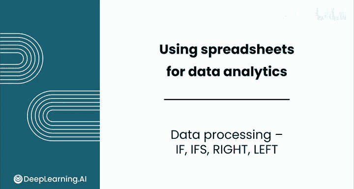
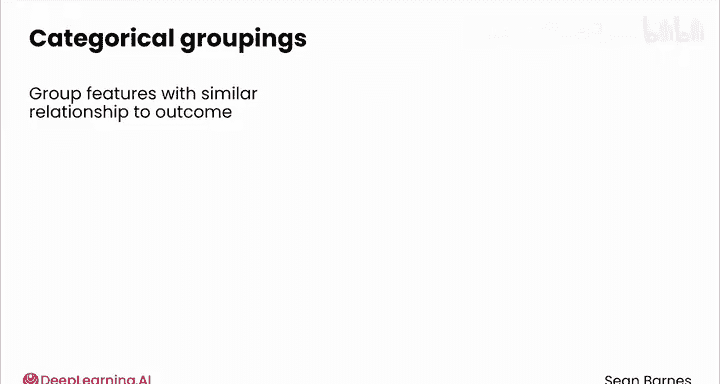
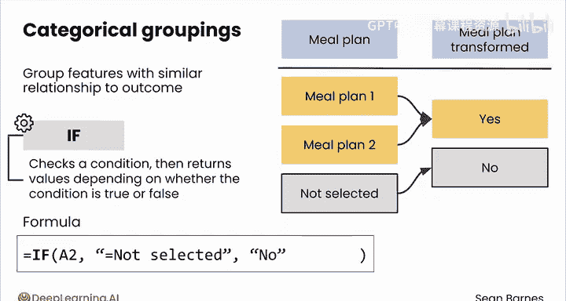
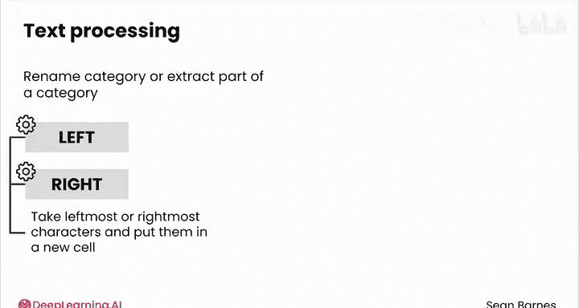
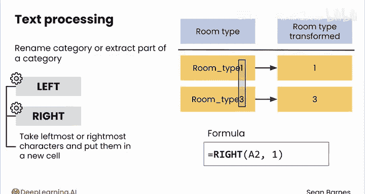
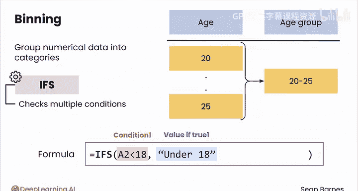

# 033：IF-IFS、RIGHT-LEFT函数 🛠️

在本节课中，我们将要学习如何对原始数据进行处理，以便更好地进行分析。我们将重点介绍如何使用IF、IFS、RIGHT和LEFT函数来对数据进行分类、分组和文本提取，使数据集更清晰、更易于分析。

到目前为止，你一直在使用酒店预订数据集的原貌。

但并没有规则要求你必须使用原始数据。

只要更改是有效的，你可以根据需要处理数据以解决问题。

让我们看看如何应用常见的数据处理技术。

## 分类分组 🗂️

上一节我们介绍了数据处理的基本概念，本节中我们来看看如何将多个类别合并为一个类别。

你可以将具有相似结果关系的特征进行分组。

或者某些类别的频率太低，你只想将它们归入“其他”类别。

例如，在酒店数据集中，你可以将膳食计划特征合并为仅两个类别：“是”和“否”。

这可能有助于使你的分析更清晰。

如果膳食计划1和2之间的取消率没有差异，那么将它们合并是合理的。

IF函数是进行类别分组的一个强大工具。

它是另一个条件函数，类似于COUNTIF。它检查条件，然后根据条件是真还是假返回不同的值。

以下是一个例子。如果此单元格显示“未选择”，我们只想返回“否”，否则，我们想返回“是”。

让我们在酒店预订数据集上进行一些数据处理，为即将到来的实践实验室中的更多分析做准备。

我提到过我们可能希望将膳食计划类别合并为仅仅是“是”或“否”。

事实上，让我们进一步扩展这个想法，将其设为“0”表示无膳食计划，“1”表示有任何类型的膳食计划。

创建一个新列来存放我们的新数据特征。

我们将其称为“有膳食计划”。使用IF函数编写一个新公式。

所以输入 `=IF( `，然后选择左侧的对应值，如果它等于“未选择”，我们将返回 `0`，否则返回 `1`。

因此，对于第一个结果，它没有显示“未选择”，因此返回 `1`。在第二行，它显示“未选择”，因此将返回 `0`。

你可以看到它为我们建议了自动填充。

所以我将选择确认，现在我们的公式已一直复制到底。

请注意，IF函数不是将单元格和条件作为单独的参数，而是将整个逻辑表达式作为第一个输入。

现在，一眼望去，我可以更容易地看出大多数人获得了某种膳食计划，该列中的大多数值都是 `1`。我也可以更容易地添加条件格式。

再次说明，条件格式使得查看有膳食计划的预订变得更加容易。

## 文本处理 📝

你的下一个数据处理工具是文本处理，例如重命名类别或提取其一部分，以使文本更易于阅读。

对于文本处理，你可以使用LEFT和RIGHT函数。这些函数提取最左侧或最右侧的字符并将它们放入新单元格。

例如，假设你只想提取房间类型的编号，你可以使用RIGHT函数提取原始特征的最右侧单个字符，这使数据更具可读性。

让我们尝试一下。

创建一个新列，称之为“房间类型编号”。在这种情况下，我们将使用RIGHT函数。

选择左侧的值，我们想要选择最右侧的单个字符。

然后我将双击填充柄，将公式一直复制到数据底部。

很好，结果看起来舒服多了。

## 数值数据分箱 📊

对于数值数据，你通常会直接使用它，但将其分组到类别中是有用的。这个过程称为“分箱”。

如果数值特征与你的结果之间的直接关系不明确，分箱就很有用。

分箱的一个常见例子是使用年龄组。通常，22岁和24岁的人在收入或健康结果方面没有太大差异。

你可以通过将人们分组到年龄组并重新分析来简化你的分析，这种策略可以帮助你发现新的见解。

对于这种技术，使用IFS函数非常有用。你能猜到它的作用吗？

它检查多个条件。IFS也使用你从IF函数中看到的相同逻辑表达式概念。你将整个条件作为第一个输入，然后是如果单元格满足该条件你想要显示的值，依此类推。

让我们在酒店预订数据集上看一下实际操作。

让我们看一个例子，我们将提前期分为少于50天、50到100天和大于100天的箱。

我将创建一个新列，称之为“提前期分箱”。

现在我要做的是检查这个单元格。如果它小于50，我将输入“短”，然后我可以检查它是否小于100，依此类推。

所以我将使用IFS函数来实现。首先，我将选择提前期，如果提前期小于50，那么我将返回“短”，然后如果它小于100，我将返回“中”，然后如果它大于或等于100，那么我将返回“长”。

它提供了自动填充我的结果，我接受后，你可以看到我们的公式似乎工作正常。

对于短的提前期，我们得到“短”类别；对于介于50到100天之间的中等提前期，我们得到“中”；对于大于100天的提前期，我们得到“长”。

所以一切似乎都工作正常。这使我能够轻松地按这些条件进行筛选，之前这会困难得多。现在变得容易多了。

## 总结 📋

本节课中我们一起学习了数据处理的核心技术。我们介绍了如何使用IF函数进行简单的二元分类，使用IFS函数进行多条件分箱，以及使用RIGHT和LEFT函数进行文本提取。这些技术将使你在实践实验室中的进一步分析变得更加容易。处理后的数据更清晰、更具可读性，为后续的深入洞察奠定了良好的基础。