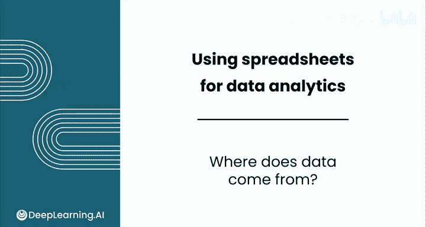
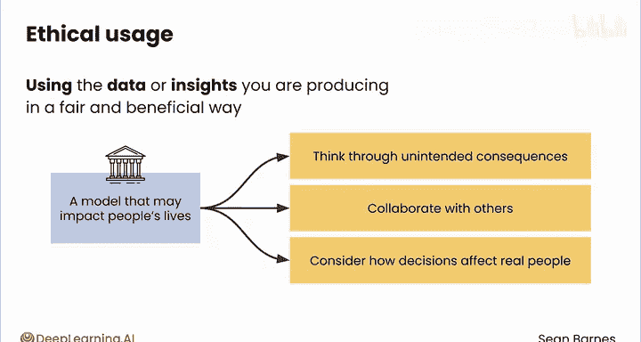

# 034：数据来源分析 📊

在本节课中，我们将要学习数据的来源。我们将探讨数据是如何被收集的，以及如何根据收集方式和所有权对数据进行分类。理解数据的来源是进行可靠数据分析的第一步。

我们已经接触了一段时间的数据，包括数字、日期和分类数据。现在，让我们退一步，花几分钟时间来谈谈数据从何而来。

是的，我们将进行一次关于数据的“谈话”。正如你在上一个模块中学到的，数据几乎可以来自任何地方：一位顾客对他刚购买的魔法球留下的评价、一个精确追踪每平方米消费的赌场，或者目前正在轨道上运行的数百颗气象卫星。每一个数据源都是独特的。

让我们看看如何描述这些差异。

## 数据收集方式

以下是数据常见的几种收集方式。

首先，数据可以通过**直接输入**来收集。这意味着数据是通过一个结构化的过程明确提供的，例如客户反馈调查或医生办公室的登记表。你的魔法球评价数据就属于这一类。

其次，数据可以通过**行为观察**来收集。这意味着系统通过被动观察个体的行为来收集数据。这类数据包括网站分析、移动应用使用情况或社交媒体互动。赌场监控也属于这一类别。

第三，数据可以通过**物理传感器**来收集，这些传感器持续监测某些现象。测量温度的智能恒温器、追踪驾驶模式的车辆或像卫星这样的环境传感器，都属于这一类别。

## 数据所有权与来源

即使你知道某些数据是如何生成的，你仍然需要了解更多关于其来源的信息。例如，谁收集了这些数据。

**第一方数据**是由你或你的公司直接拥有的。例如，赌场在整个游戏区域安装自己的摄像头来监控顾客。

**第二方数据**是由另一家公司作为其第一方数据收集的，你通常从可信的合作伙伴那里获取这些数据。一个赌场可能与邻近的酒店合作，共享客户数据，以了解大额消费者的信息。

**第三方数据**是第三方公司为了向多个买家出售数据这一普遍目的而收集的。赌场可以购买一个包含访问过在线赌博网站人员的大型数据集，用于新的营销活动。

如果你必须猜测，你对哪种类型的数据拥有最多的控制权？你对第一方和第二方数据有更多的控制权，通常可以确保它能满足你的特定目的。对于第三方数据，你可能需要处理较少的观察样本、相关特征，或者存在系统性的不准确性。

## 公开数据与获取方法

许多数据也是公开可用的，例如政府机构、资源组织和开源数据库发布的数据。这些数据通常旨在支持有益于整个社会的研究。公开数据对你作为数据分析师来说是一个很好的资源，因为它通常可以免费访问，并且通常是真实世界的数据。

其中一些数据可以直接从面向公众的网站下载。在其他情况下，你可能能够使用编程语言（如Python）来抓取数据。随着你数据分析技能的提升，你将学习这些更复杂的、以编程方式获取数据的方法。

## 数据使用的伦理考量

最后，我们来谈谈伦理使用。这是你作为数据分析师工作中重要的方面。你不仅仅是处理数字。很多时候，你将扮演真相的守护者和数据中存在的个体的倡导者。

你应该只分析你被授权访问的数据。数据通常受到法律保护，例如财务数据或个人健康信息。你可能需要接受培训才能访问敏感数据，或在安全计算环境中操作。在某些情况下，可能需要剥离数据中的个人可识别信息，如姓名、地址或社会安全号码。酒店预订数据就是一个移除了个人可识别信息的例子。

伦理使用意味着你以公平和有益的方式使用你正在产生的数据或见解。例如，你是否正在训练一个可能显著影响人们生活的模型，比如在刑事司法决策中？你如何确保模型是公平的，并且不会延续历史上的歧视？仔细思考你工作可能带来的潜在意外后果，这可能要求你与他人合作。你必须考虑基于你见解得出的商业决策将如何影响真实的人。

## 总结与展望

本节课关于数据来源的讨论到此结束，本课的系列视频也告一段落。

我鼓励你在日常生活中寻找数据来源，即使是在最微小和最奇怪的地方。在本课的实践练习中，你将亲自探索酒店预订数据集，以发现一些有趣的见解并练习所学内容。

一旦你完成了实践练习和评估，我希望你能加入下一节课，学习如何使用LLMs来探索数据。我们下节课再见。