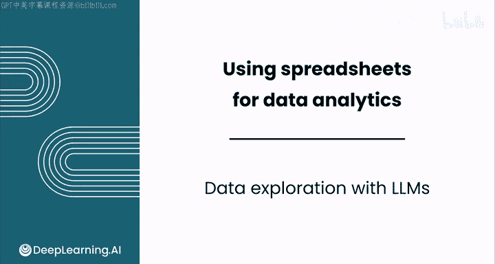
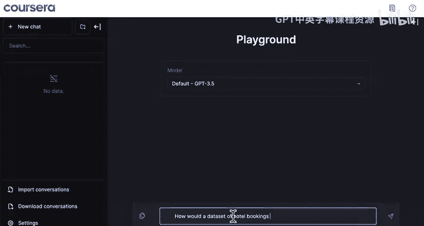
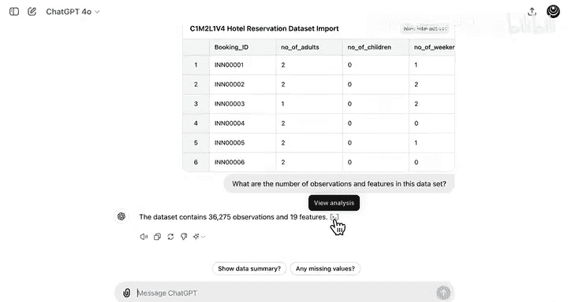
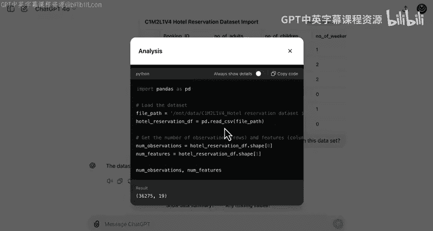
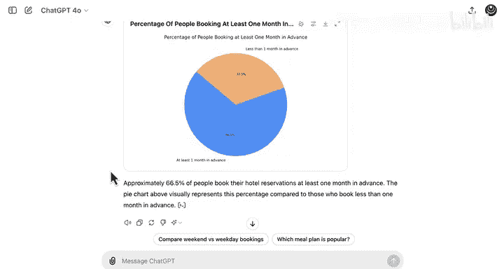

# 035：使用LLM进行数据探索 🧐

在本节课中，我们将学习如何利用大型语言模型（LLM）来探索和分析数据集。我们将以酒店预订数据为例，演示如何通过提问、提供上下文以及结合代码执行能力，让LLM帮助我们理解数据、发现潜在问题并生成初步分析。

---

## 概述：LLM在数据分析中的角色

上一节我们介绍了数据分析的基本流程。本节中，我们来看看如何将LLM作为辅助工具，加速数据探索阶段。LLM擅长理解和生成文本，并能结合代码执行进行数学计算，这使其成为数据探索的有力伙伴。

---

## 第一步：向LLM提出初步问题

首先，我们可以向LLM提出关于数据背景的开放式问题，即使它尚未接触具体数据。这有助于我们进行头脑风暴，构思数据可能的来源和结构。

例如，我们可以提问：“酒店预订数据集是如何生成的？”

LLM可能会从定义数据结构、收集数据等角度进行回答。如果初始回答不够具体，我们可以通过后续提示进行澄清。

---

## 第二步：提供上下文并获取摘要

当LLM的初步回答未能命中要点时，我们可以提供更多背景信息。例如，将数据摘要或规格表的文本直接提供给LLM，并要求它进行总结。

以下是向LLM提供数据网站摘要信息后，可能得到的回答要点：
*   数据集包含两个子集，分别代表度假酒店（H1）和城市酒店（H2）。
*   数据包含大量观测值和多个变量（特征）。
*   每条观测代表一次酒店预订，包括已取消和已完成的预订。
*   数据包含特定的日期范围和信息来源。

如果总结过于冗长，我们可以进一步要求LLM提供更简洁的版本。

---

## 第三步：上传数据文件进行直接分析

为了让LLM获得更深入的洞察，我们可以直接上传数据文件（如CSV格式）。请注意，文件越大，LLM处理速度可能越慢，因此建议先使用数据子集（例如前200行）进行测试。

上传数据后，我们可以提出更具体的问题。LLM擅长阅读和写作，我们可以据此设计问题。

**首先，询问数据的基本内容：**
“这份数据是关于什么的？”

LLM的回答可能包括：数据涉及酒店预订、文件类型、预订详情、日期范围，并可能建议分析方向，如预订模式、取消率、定价和客户偏好。

**接着，探查数据质量问题：**
“数据中存在缺失值吗？”

LLM可能无法进行系统性分析，但能指出一些值得注意的观察，例如某些特征值大多为零，或存在异常值（如某条记录的每间客房平均价格仅为1）。要绝对确认缺失值，通常仍需在Python等环境中运行专门的函数进行检查。

---

## 第四步：利用具备代码执行能力的LLM进行深入分析

对于需要精确计算的问题，我们可以使用具备代码执行功能的LLM（例如ChatGPT Advanced Data Analytics）。它能编写并运行代码来分析数据。

**首先，询问数据规模：**
“数据中有多少观测值和特征？”

LLM会生成类似 `df.shape` 的代码来获取答案，例如：数据集包含超过36000条观测和19个特征。

**然后，进行更复杂的分析：**
1.  **检查数据顺序**：“这些观测值是按时间顺序排列的吗？”
    *   代码可能使用 `pd.to_datetime()` 和 `.is_monotonic_increasing` 进行检查。
    *   结论：数据集未按时间顺序排序。
2.  **分析特征分布**：“‘儿童数量’这个特征的范围是多少？”
    *   答案可能是0到10。我们可以要求可视化：“请可视化儿童数量的分布。”
    *   生成的图表（如直方图）会显示，绝大多数预订的儿童数量为0，超过1个儿童的预订非常少，10个儿童的极端案例在图中几乎不可见。
3.  **计算业务指标**：“提前至少一个月预订的客人百分比是多少？”
    *   LLM会编写代码计算日期差并统计比例。
    *   结果：约66.5%的客人提前一个月以上预订，其余约三分之一为临时预订。

---

## 总结与后续步骤

本节课中，我们一起学习了三种使用LLM进行数据分析的方法：
1.  **初步提问与头脑风暴**：在没有数据时获取背景思路。
2.  **提供上下文摘要**：让LLM帮助快速理解数据文档。
3.  **结合数据文件与代码执行**：进行具体的描述性统计和可视化分析。

LLM并非猜测数学结果，而是在代码支持下进行准确计算。在接下来的实践练习中，你将有机会继续培养提示工程技能，探索如何与LLM协作完成数据分析工作。

完成练习后，请加入下一节课，我们将全面学习时间序列数据分析。