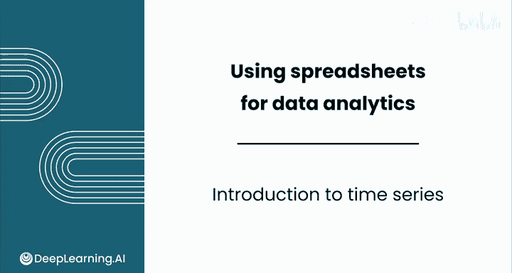
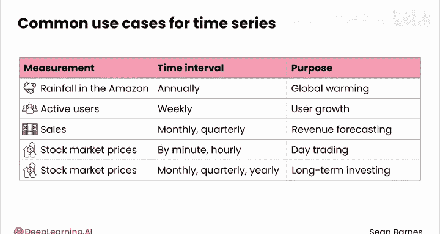
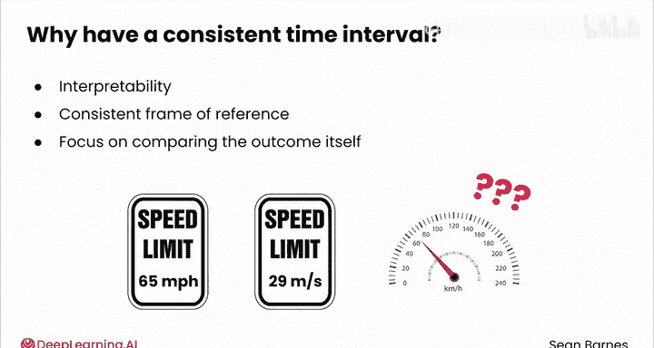
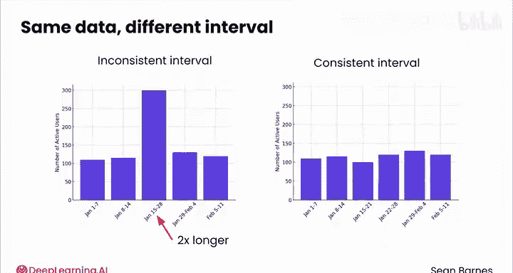
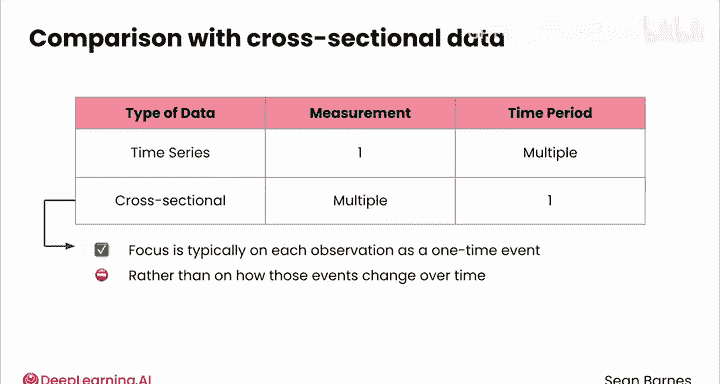
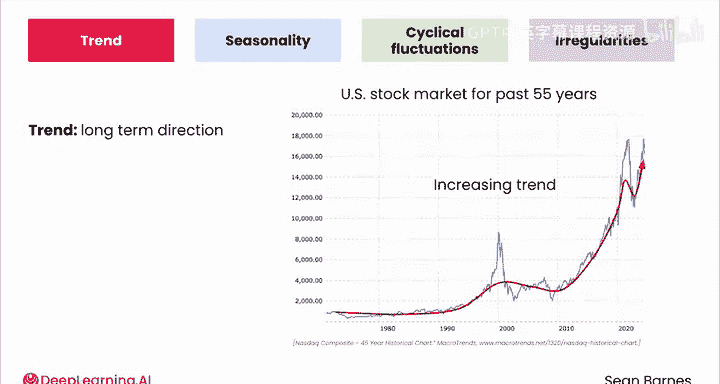
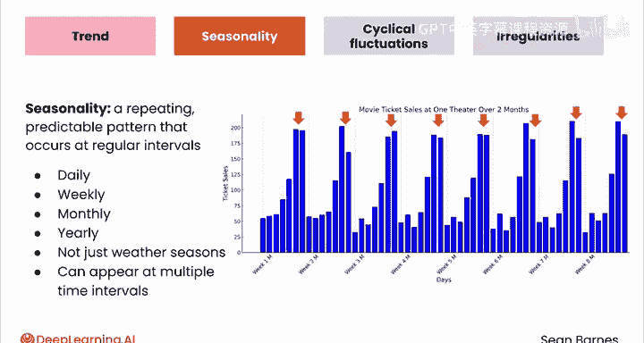
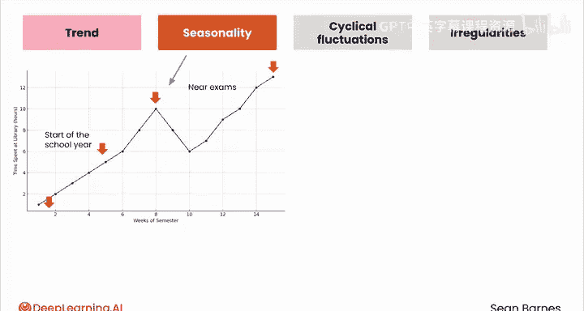
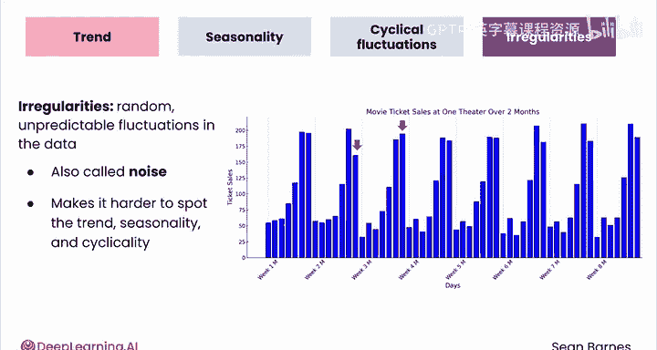

# 036：时间序列分析入门

在本节课中，我们将要学习时间序列数据的基本概念、其与截面数据的区别，以及构成时间序列的四个核心组成部分：趋势、季节性、周期性波动和不规则波动。

理解气候变化、追踪动物种群数量，甚至预测地震，这些任务都依赖于对随时间变化的数据进行分析。时间序列数据是一种本质上不同的数据类型。

让我们开始学习。

***

## 什么是时间序列数据？

时间序列数据是通过在固定的时间周期（例如分钟、小时或天）内测量一个或多个结果而生成的。时间序列分析的目标是理解这些结果如何随时间变化。

你可以用它来识别增长或下降的趋势、发现不寻常的事件或预测未来的结果。

***

## 时间序列数据的应用

许多行业都使用时间序列数据，在一致的时间间隔内捕获相同的测量值。

以下是几个应用实例：

*   一个环保组织可能每年测量亚马逊地区的降雨量，以更好地理解全球变暖趋势。
*   科技公司通常每周测量活跃用户数量，以了解有多少人定期使用其产品，这有助于他们预测用户增长。
*   大多数公司都有某种类型的销售数据。作为数据分析师，你通常会按月或按季度测量销售额，以帮助理解随时间变化的趋势。
*   股票市场价格经常在多个时间间隔内被分析。日内交易者可能对一家公司的股票每分钟或每小时的变化感兴趣，而长期投资者可能对月、季度或年度的间隔更感兴趣。

***

## 一致的时间间隔

时间序列数据要求你使用一致的时间间隔，因为一致的时间参考框架提供了可解释性。这样，你可以专注于比较结果本身，而不是计算不同的时间长度。

想象一下，某天看到一个限速标志写着“65英里/小时”，第二天却写着“29米/秒”，而你的车速表是以“公里/小时”为单位测量的。这将是一片混乱，你的注意力将集中在所有单位之间的转换上，而不是遵守法律。

这里有一个解释不一致时间间隔的例子。

我将展示两张图表，X轴是时间，Y轴是活跃用户数量。在左侧的图表中，中间的时间段是其他时间段的两倍长，这可能会让你认为用户活动出现了激增。然而，当间隔一致时，如右侧的图表所示，整体趋势并不包含这样的激增。

***

## 时间序列数据 vs. 截面数据

你刚才看到，时间序列数据是在多个时间段内对一个结果的测量。

如果你反转这个定义，你会得到在单个时间段内收集但跨越不同测量的数据。这种类型的数据称为**截面数据**。

截面数据也可以随时间收集，但重点通常是将每个观察视为一次性事件，而不是这些事件如何随时间变化。在酒店预订数据中，每个预订都被视为一次性事件。你并不试图跟踪单个预订随时间的变化。

***

## 时间序列的组成部分

时间序列数据通常基于四个组成部分进行分析：**趋势**、**季节性**、**周期性波动**和**不规则波动**。

查看这张过去55年美国股市的图表，X轴是时间，Y轴是市场规模。数值越高越好。关于市场规模随时间的变化，你能看出什么？虽然有起有伏，但总体上它朝着什么方向变化？

这张图表呈现**上升趋势**。趋势是数据在整体上的长期方向：它是上升、下降还是保持平稳？

***

### 趋势

趋势可以是**上升的**（在观察期内数值趋于上升）、**下降的**（随时间推移数值普遍下降）或**平稳的**（没有一致的长期增长或下降，也称为无趋势）。

***

### 季节性

看看这张当地影院两个月内电影票销售的图表。X轴显示时间，Y轴显示售出的票数，每个条形代表一天。你注意到什么重复的模式？

电影票销售在周末比工作日更高。这就是**季节性**，一种在固定间隔内重复出现的、可预测的模式。

季节性可以每天、每周、每月或每年发生。它不一定与天气季节相关。它甚至可以出现在多个时间间隔。例如，电影票销售通常在夏季或节假日期间增加，这种模式年复一年地重复。

***

### 周期性波动

让我们回到刚才看到的股市图表。你能发现任何似乎在不规则间隔重复出现的涨跌模式吗？

你正在识别股市泡沫和崩盘，例如互联网泡沫、2008年金融危机和疫情。这些被称为**周期性波动**。

股市经历重复的涨跌，但不像周末或季节那样发生在固定的间隔。涨跌的幅度也常常不同。这些不规则性使得周期性模式比季节性更难预测。很难知道下一个股市泡沫何时会发生。

这里有一个更贴近生活的例子，帮助你记住季节性和周期性的区别。

想想你在校园图书馆学习的时间。在学年开始时，你可能学习得少一些，因为课程刚刚开始。然后在考试临近时，你会在图书馆花大量时间学习。这些是季节性模式还是周期性模式？

这些是**季节性模式**，因为它们发生在有规律的、可预测的间隔。每个学期，你都会预期到相同的模式。

现在，考虑像图书馆施工这样的事件，它每两到三年发生一次，但没有固定的时间表。施工可能会因为噪音和灰尘使你难以在那里学习。这个事件是季节性的还是周期性的？

它是**周期性的**，因为施工确实在图书馆定期发生，但不是在固定的间隔。现实世界的数据通常不能清晰地归类为季节性还是周期性。在从高度规律到完全不可预测的可预测性光谱上，许多事件处于中间位置。

***

### 不规则波动（噪声）

让我们再回到电影票销售的图表。为什么第2周的周日值比其他周低得多？为什么第3周是唯一一个周日销售额最高的一周？这些是数据中随机的、不可预测的波动，因此被称为**不规则波动**或**噪声**。

可以把噪声想象成电话通话背景中的静电干扰，是随机的、使听清对方说话变得更困难的声音。类似地，时间序列数据中的噪声使得识别趋势、季节性和周期性变得更加困难。

***

## 总结

本节课中，我们一起学习了时间序列分析的基础知识。我们了解了时间序列数据是通过在固定时间间隔内测量结果而生成的，并探讨了其与截面数据的区别。我们重点学习了构成时间序列的四个核心组成部分：**趋势**（数据的长期方向）、**季节性**（在固定间隔重复出现的规律模式）、**周期性波动**（在不规则间隔重复出现的涨跌模式）以及**不规则波动**（随机的、不可预测的噪声）。作为数据分析师，你将经常分析时间序列数据的这些方面，以洞察变化、预测未来并支持决策。