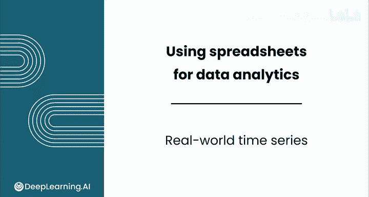
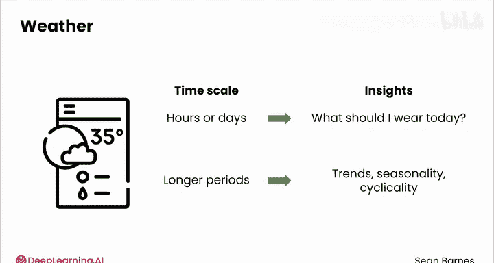
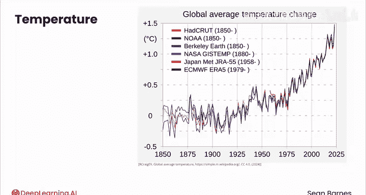
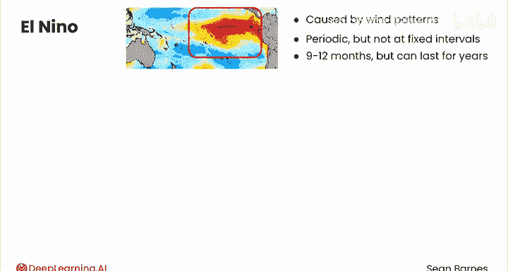

# 037：现实世界中的时间序列 📈

在本节课中，我们将学习如何识别和分析现实世界数据中的时间序列成分。我们将通过具体的例子，如全球气温、厄尔尼诺现象和股票市场，来理解趋势、季节性、周期性和噪声是如何在实际数据中组合和呈现的。

---

## 时间序列成分的组合

上一节我们介绍了时间序列的四种基本成分。本节中我们来看看这些成分在现实世界的数据中是如何组合的。

时间序列数据可以包含你在上一视频中看到的全部成分，也可以不包含任何成分。

以下是分析时间序列数据图以视觉识别这些成分的方法。

---

## 实例一：全球气温 🌡️

当你打开手机上的天气应用时，你通常看到的是未来几小时或几天的温度预报。这可以帮助你回答诸如“今天该穿什么？”的问题。然而，当你观察更长的时间周期时，你可以分析温度、降雨量和其他天气测量的长期趋势、季节性和周期性。

请看这张1850年以来的全球平均气温图。Y轴数值代表以摄氏度表示的温度，其基准是1850年至1900年的平均温度，该时期被用作工业化前时代的参考。

这张图表上绘制了多个时间序列，即不同颜色的线，它们来自不同类型的温度传感器测量结果。

你可以看到，从1850年到1925年，趋势是平坦的，但之后平均温度开始相当一致地上升，可能在1940年至1975年间略有停顿。

在整个时间序列中，你还可以看到季节性模式的组合，这些模式随着天气季节上下波动。同时，也存在**噪声**，这使得模式看起来并不完美。

使用此图表很难确定存在哪些周期性模式，因为大量的季节性可能掩盖了它们，而且天气模式通常是局部的。

---

## 实例二：厄尔尼诺现象 🌊

这是一个与天气相关的周期性例子——厄尔尼诺现象。厄尔尼诺指的是由特定风型引起的太平洋海面变暖。它周期性发生，但间隔不固定。它通常持续9到12个月，但也可能持续数年。

这是一张厄尔尼诺现象图。X轴表示从1990年1月到2024年1月的时间，每条垂直灰线代表一年。Y轴是与海洋表面温度相关的测量值。

持续高于0.0基线的数值对应厄尔尼诺年。97到98年的厄尔尼诺非常强烈，持续了大约一年，而15到16年的厄尔尼诺甚至更强，持续了近一年半。同时，也存在许多较小的例子，例如2017年2月到7月左右的这一次，只能被归类为弱厄尔尼诺。

厄尔尼诺被认为是周期性的，因为它确实会周期性发生，但其强度和持续时间难以预测。你知道厄尔尼诺会再次发生，但很难准确说出它何时发生、持续多久以及强度如何。

---

## 实例三：股票市场 📊

让我们从天气转向你在上一个视频中看到的股票市场图的一个更复杂的版本。这些数据通常被分析用于做出投资决策。

在这种情况下，你看到的是标准普尔500指数的折线图，该指数是对美国500家最大公司股票价格的综合衡量。

观察其趋势。总体而言，它是在上升的。然而，在短期内，这些趋势几乎不可能预测。大多数投资者并不打算持有一只股票120年。

想象一下，如果你在这张图表上放大到不同的时间段，趋势可能是上升、下降或平坦的，这取决于你开始和停止的位置。

但是当你缩小视野时，趋势显然是随时间上升的。即使是过去30年中一些最大的经济衰退，例如2000年的互联网泡沫破裂、2008年的大衰退，甚至是新冠疫情，尽管它们在当时对世界产生了影响，但在这张长期图表上显得相对微不足道。

这些是对应更广泛经济状况的**周期性模式**。这些周期的另一半是经济增长期，例如2010年代。

股票市场价格也表现出大量的**噪声**。价格受许多因素影响，并非所有因素都被完全理解。

---

## 总结

本节课中我们一起学习了如何通过现实世界的例子来识别时间序列数据中的成分。我们分析了全球气温数据的长期趋势和季节性，探讨了厄尔尼诺现象的周期性特征，并观察了股票市场数据中长期的上升趋势、经济周期以及短期噪声。

现在你已经看到了现实世界的时间序列例子，请加入下一个视频，学习一些我们可以用来处理时间序列数据的概念。