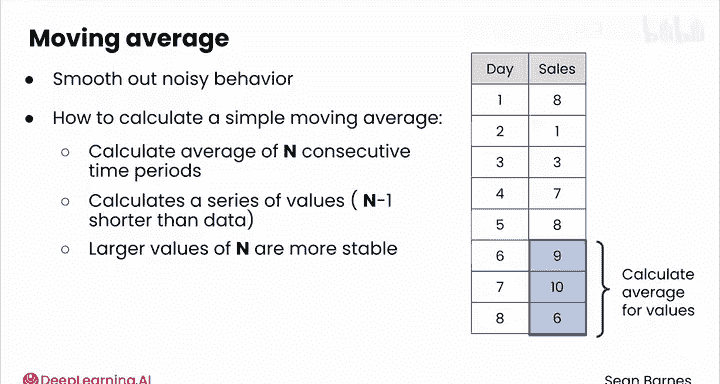
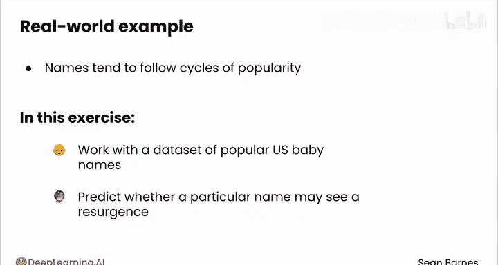
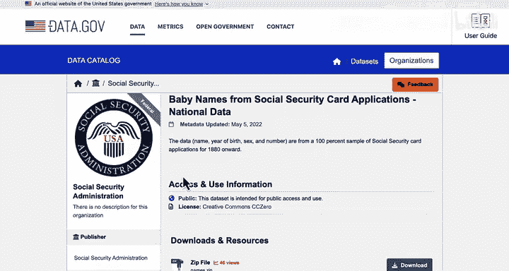

# 038：时间序列分析之移动平均线 📈

在本节课中，我们将学习时间序列分析中一个独特且强大的工具——移动平均线。它能帮助我们平滑数据中的噪声，从而更清晰地识别数据的整体趋势和模式。

## 时间序列分析的独特性

上一节我们介绍了时间序列数据的基本概念。本节中我们来看看时间序列分析中一些更有趣的独特方法。

其中一种方法叫做**移动平均线**，它允许你平滑可能带有噪声的数据。

这种方法对于在**小时间间隔内收集的数据**或**数据量很大**的情况尤其有用。

## 什么是移动平均线？

让我们回顾一下太阳能电池板销售的练习。

假设你有一个时间序列，记录了每天的销售数量。在这个例子中，你会计算出8个时间序列值的平均值为6.5个单位。

现在你有了一个参考值，可以知道每个单独的值与这个参考值的比较情况。

例如，在第1天，你卖出了8个单位，这高于平均水平；但在第2天，你只卖出了1个单位，这远低于平均水平。

正如你刚才看到的，时间序列数据可能带有噪声，这使得难以清晰地识别数据的整体行为。

**移动平均线**平滑了这种噪声行为，可以为你的分析带来清晰度。

## 如何计算简单移动平均线

让我们看看如何计算一个**简单移动平均线**。

简单移动平均线计算的是**连续几个时间段内的平均结果**。

时间段的**数量用N表示**。想象一下，在你的数据上放置一个高度为N个单位的窗口，然后计算窗口内值的平均值。

然后，你可以将这个窗口沿着数据一次滑动一个时间段，直到到达数据的末尾。

每个窗口汇集了太阳能电池板的总数，并将其重新分配到N天中，就好像你每天卖出相同数量一样。

因此，移动平均线不是计算一个单一的数字来总结数据，而是计算**一系列值**。

这个系列比我们数据的长度**短N-1个单位**。

你无法在窗口内数据点少于N个的情况下计算简单移动平均线。

**较大的N值**往往使结果随时间更稳定，而**较小的N值**往往使结果更嘈杂。

## 应用示例：太阳能电池板销售

让我们再次回顾第一课中的太阳能电池板销售练习。

假设你有一个时间序列，记录了每天的销售数量。

以下是计算该数据的简单移动平均线的方法。我们选择**N=4**，即窗口大小为4。

首先，将窗口放在前N个值上，并计算窗口内的平均值。

在这个例子中，窗口内的数字是8、1、3和7，平均值为4.75。

然后将窗口向下滑动一个位置。现在它包含值1、3、7和8，平均值也是4.75。

以此类推，直到窗口到达时间序列的末尾。

请注意，右侧简单移动平均线序列的长度比原始时间序列短了三个时间段。

你可以将这个长度计算为时间段数（本例中为8）减去窗口大小，即**N-1**。

## 实战演练：分析婴儿名字趋势

让我们看看如何将移动平均线应用于真实世界的数据集。

就像时尚潮流一样，名字往往遵循流行周期，旧名字常常会重新流行起来。

在这个练习中，你将学习如何使用美国流行婴儿名字的数据集，来预测某个特定名字是否会在未来几年重新流行。

让我们看看这个数据源。这个数据源来自Data.gov。

数据来自社会保障局，该局在婴儿出生时登记他们的名字。这些数据最后更新于2022年，所以你应该理解，在此日期之后不会有额外的数据。

描述还告诉我们，这是自1880年以来社会保障卡申请的100%样本，因此包含了所有在美国出生的婴儿。

你还应该问自己，这些数据是否存在任何潜在的偏差。也许它遗漏了任何未在数据库中注册的无证移民。

让我们来看看数据。数据集包含婴儿的名字、性别、出生年份，最后一列是具有相同名字、性别和年份的婴儿数量。

例如，在1880年，有9655名男性婴儿名叫John。

这个数据中有多少观测值？我可以选择计数列，一直滚动到底部，你会看到这个数据中大约有106,000个观测值。

请注意，这些数据已经按年份和数量排序，给出了每年最流行的名字。

名字太多了，让我们只看一个——我祖母的名字Ruby。

筛选名字列，清除所有内容，然后只搜索Ruby。

将这些数据复制到一个新的工作表中，这样我就不用担心它可能如何影响其余的数据。

数据如何随时间变化？一眼看去很难看清，所以我会添加一些条件格式。

默认的格式规则在这里是合适的，因为我们希望较低的值与较浅的颜色相关联，较高的值与较深的颜色相关联。

这种条件格式让我可以轻松地滚动数据并识别模式，例如女性婴儿名字Ruby的流行度何时随时间增加（比如20世纪20年代初），以及何时随时间减少。

Ruby经历了流行度的复苏。让我们将其可视化。

你将在下一个模块中学习如何完成所有这些操作，但现在我只是插入一个图表来帮助可视化这些数据。

有趣的趋势。你可以看到Ruby这个名字的流行度一直在增加，一直到20世纪20年代（这是我之前强调的），然后在19世纪中叶及以后迅速下降，直到2000年后最近才重新流行起来。

我的祖母大约在20世纪20年代出生，那时这个名字最流行。

现在，让我们看看数字上发生了什么。从平均值开始。

平均而言，每年大约有2560名出生时被指定为女性的婴儿被命名为Ruby。

这一个数字有多大帮助？它有点笼统。让我们计算一个移动平均线。

在这种情况下，我将计算一个**10年移动平均线**。

我将在这里的第11行开始我的公式。使用平均公式，并选择该单元格左侧或上方的10个值。

因此，数据集中前10年的移动平均值大约是260个婴儿。

然后，我可以将这个公式一直填充到数据的末尾。

很难看出这些数据实际上更平滑了，所以让我们通过将系列添加到折线图中来将其可视化。

好的，现在平滑多了，尤其是在最近几年。上升趋势很明显，但似乎正在趋于平稳。

你可能还会注意到，移动平均线滞后于实际数据。这是因为移动平均线只能回顾过去，所以它总是会比整体数据趋势稍微落后一点。

## 总结

本节课中，我们一起学习了时间序列分析的核心工具——移动平均线。

我们了解到，移动平均线通过计算连续时间段内的平均值来平滑数据噪声，帮助我们更清晰地识别长期趋势。

其核心公式是计算一个滑动窗口内数据的平均值，窗口大小N决定了平滑的程度。

通过分析婴儿名字“Ruby”流行度的实际案例，我们看到了移动平均线如何有效地揭示数据背后的整体趋势，即使原始数据存在波动。

在下一节视频中，我们将学习另一个用于时间序列分析的强大工具：百分比变化。