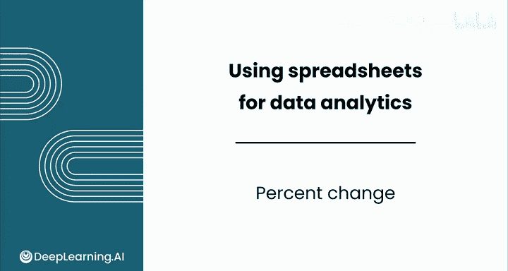
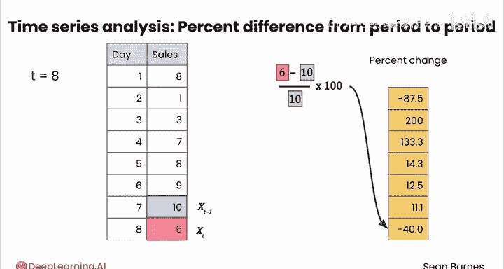

# 039：百分比变化 📈📉

在本节课中，我们将要学习如何计算时间序列数据中的百分比变化。这是一种强大的工具，可以帮助我们识别数据是平稳变化还是突然变化。我们将通过太阳能电池板销售和婴儿名字“Ruby”的流行度这两个数据集来演示其应用。

## 概述：为什么需要百分比变化？

上一节我们介绍了移动平均线，本节中我们来看看另一种分析时间序列趋势的方法：百分比变化。

与原始数据的绝对差值相比，百分比变化能提供更一致、更易于理解的解释。例如，销售额从8变为1，与从108变为101，虽然差值都是-7，但其意义却大不相同。百分比变化能帮助我们标准化这些差异，直观地判断变化的“大小”。

## 百分比变化的计算方法

百分比变化的核心思想是：与前一时期相比，当前时期的变化有多大比例。

其通用计算公式如下：

**公式：**
`百分比变化 = (当前值 - 前一期值) / 前一期值 * 100%`

我们可以用变量来表示：
*   `X_t` 代表当前时期（t）的值。
*   `X_{t-1}` 代表前一时期（t-1）的值。

那么公式可以写作：
`百分比变化 = (X_t - X_{t-1}) / X_{t-1} * 100%`

计算结果可以是正数（表示增长），也可以是负数（表示下降）。零则代表没有变化。

## 应用示例：太阳能电池板销售

让我们通过一个简单的例子来实践这个公式。假设以下是连续几天的太阳能电池板销售数据：

以下是计算步骤：
1.  **计算第一个变化**：从第1天（8）到第2天（1）。
    *   差值：1 - 8 = -7
    *   百分比变化：(-7) / 8 * 100% = -87.5%
    *   这是一个巨大的跌幅。
2.  **滑动窗口，计算下一个变化**：从第2天（1）到第3天（3）。
    *   差值：3 - 1 = 2
    *   百分比变化：2 / 1 * 100% = 200%
    *   这是一个显著的增长。
3.  **重复此过程**，直到序列结束。

通过这个过程，我们可以清晰地看到销售数据的波动性。对于较小的数值，日环比变化通常显得更为剧烈。

## 实战演练：分析“Ruby”婴儿名数据

现在，让我们回到“Ruby”这个名字的年度使用次数数据集。之前我们已经计算了其移动平均线，现在用百分比变化来识别突然的激增或下降。

以下是操作步骤：

**第一步：插入新列并应用公式**
在数据旁边插入一个新列。从第二个数据点（1881年）开始，应用百分比变化公式。
在单元格中输入公式：`=(本期计数 - 上期计数) / 上期计数`
然后将单元格格式设置为百分比格式。例如，从1880年到1881年，女性“Ruby”婴儿的数量增长了29%。将此公式向下填充至所有行。注意，第一个数据点（1880年）没有百分比变化值，因为没有前一期数据可供比较。

**第二步：使用条件格式高亮显示**
为了让变化趋势一目了然，我们可以使用条件格式。

以下是选择颜色方案的思路：
*   百分比变化数据有一个明确的中间值：**0%**。这是正负变化的分界线。
*   因此，**发散色阶** 是最合适的选择。它可以用两种颜色分别表示零值以上和以下的数据。

具体操作：
1.  选中百分比变化数据列。
2.  进入“条件格式”设置。
3.  选择“发散色阶”规则。
4.  将中间点配置为 **0**。
5.  选择两种对比色，例如用蓝色表示负值（下降），用橙色表示正值（增长）。

**第三步：解读数据趋势**
应用格式后，数据中的模式变得更加明显：
*   在数据集早期（19世纪末），名字的流行度持续增长（多为橙色）。
*   进入20世纪20年代后，开始出现持续的下降趋势（多为蓝色）。
*   在持续下降的过程中，1963年出现了一个异常的激增（橙色高亮），增长率高达20%。

**第四步：调查异常点**
发现异常后，下一步就是调查原因。1963年发生了什么？
通过简单的网络搜索（例如查阅“Ruby”这个名字的维基百科页面），我们可以发现一位著名人物：**Ruby Bridges**。她是1960年第一位在路易斯安那州进入废除种族隔离学校的非裔美国儿童。她的勇气和故事很可能在1963年左右激励了许多父母以她的名字为孩子命名。她的故事甚至在1998年被迪士尼拍成了同名电影。

这种从数据中发现有趣趋势、深入调查并得出有用结论的过程，正是数据分析的核心。

## 总结

本节课中我们一起学习了：
1.  **百分比变化的概念**：一种标准化时间序列变化幅度的方法，比原始差值更易于解释。
2.  **核心公式**：`(当前值 - 前一期值) / 前一期值 * 100%`。
3.  **计算步骤**：从第二个数据点开始，滑动计算每个时期相对于前一时期的变化百分比。
4.  **数据可视化技巧**：使用以0%为中间点的发散色阶进行条件格式设置，可以快速识别增长和下降周期。
5.  **完整分析流程**：从计算百分比变化，到可视化识别异常，再到根据发现进行调查研究，最终得出有意义的结论。

掌握百分比变化，能让你在时间序列分析中多一个敏锐的工具，帮助你洞察数据背后的故事。接下来，你将在模块测评和分级实验室中，运用所学技能分析电子游戏销售与评分数据。完成后，请跟随我进入下一个模块，探索我最喜欢的话题之一——数据可视化。我将在那里等你。