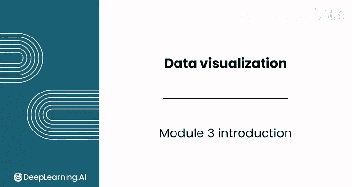
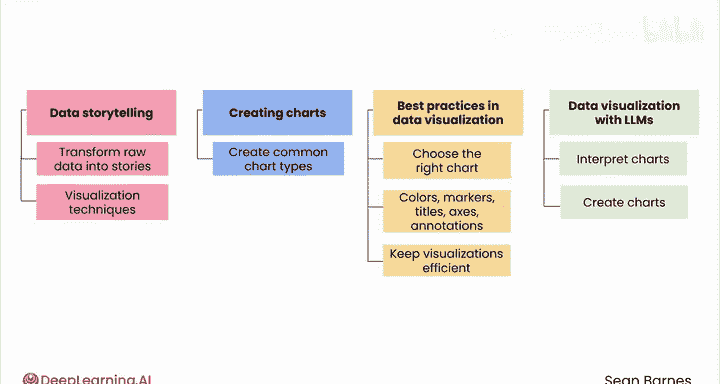

# 040：数据可视化简介 📊

在本模块中，我们将学习数据可视化的核心概念与实践技巧。你将了解如何将原始数据转化为引人入胜的图表故事，并掌握有效传达数据洞察的方法。



---

## 模块3：数据可视化简介

欢迎来到数据分析基础课程的模块3。

到目前为止，你已经学习了什么是数据，以及如何使用电子表格处理和分析数据。现在，你将开始动手实践数据可视化——这门通过图形传达数据的艺术。

你将看到如何将原始数据转化为能引起观众共鸣的迷人故事。

---

## 探索有效的可视化沟通技巧

接下来，我们将探索有效传达洞察的可视化技术，包括数据分析师最常用的图表类型。

图表可能被误用和误解。你将学习如何为你的数据选择合适的图表。

此外，你还将学习如何使用颜色、标记、标题、坐标轴和注释来突出关键洞察。

---

## 提升可视化效率的原则

你还将看到如何通过**最大化数据墨水比**和**最小化图表垃圾**来保持可视化的高效性。

数据墨水比的核心原则是：`图表中用于呈现数据的墨水量应最大化，而非数据元素的墨水量应最小化`。

---

## 利用LLM辅助图表工作

你还将练习如何使用大型语言模型（LLM）来解读和创建图表。

以下是利用LLM辅助分析的示例代码思路：
```python
# 伪代码示例：使用LLM生成图表建议
prompt = “基于给定的销售数据集，建议最合适的图表类型并说明原因”
chart_suggestion = llm.generate(prompt)
```

你将带着审慎的思维模式使用这些工具，以节省时间并避免错误。

---

## 模块学习目标

在本模块结束时，你将掌握核心的可视化技能，这些技能是驱动现实世界影响所必需的。

让我们开始吧。



---

## 总结

本节课中，我们一起学习了数据可视化的基本介绍。我们了解了将数据转化为故事的重要性，探索了图表选择与设计原则，并介绍了利用现代工具提升效率的方法。这些核心技能将为你后续的数据分析工作奠定坚实基础。