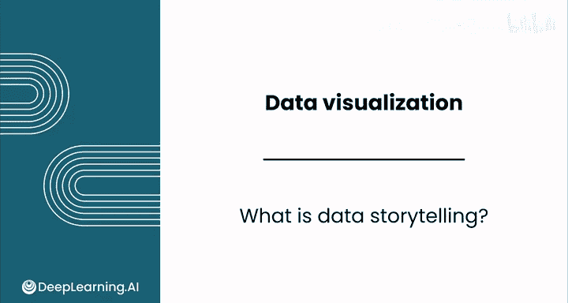
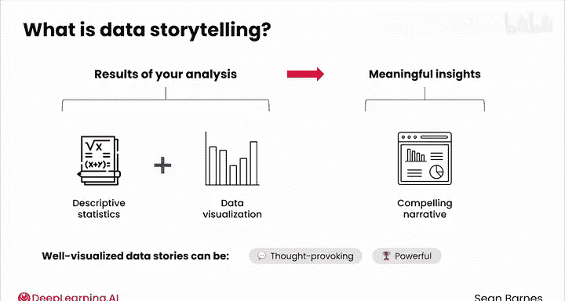
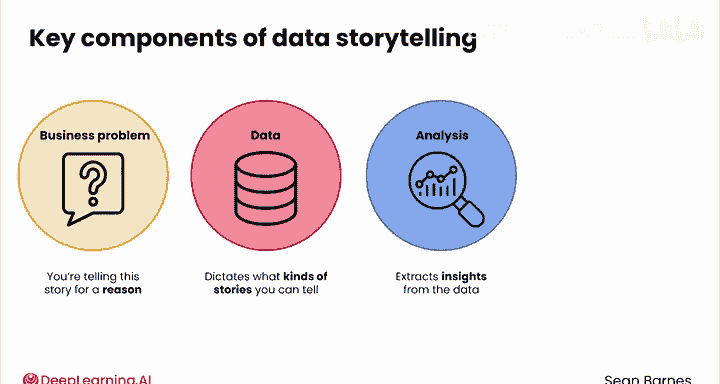
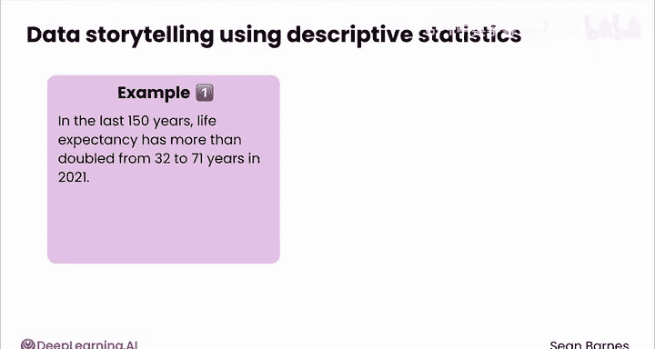
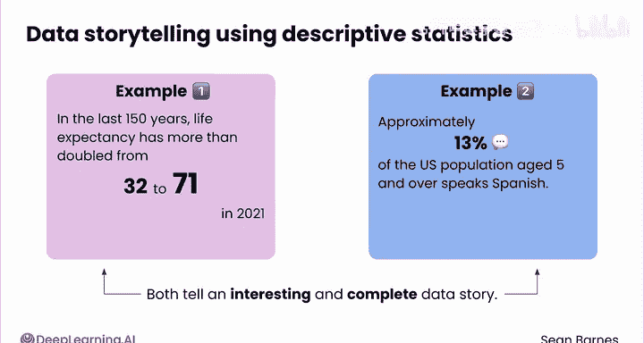
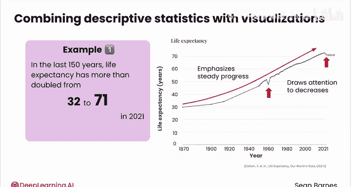
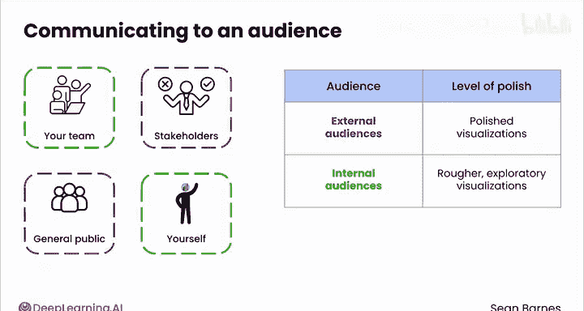
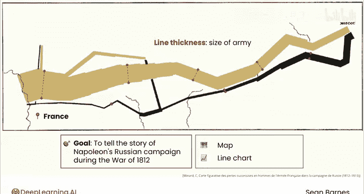

# 041：什么是数据叙事 📊

在本节课中，我们将要学习数据叙事的概念、核心组成部分及其重要性。数据叙事是将枯燥的数据转化为引人入胜的故事的关键技能，它能帮助你和你的受众更有效地理解数据背后的含义。

---

想象你正在观看同一组数据的两种不同呈现方式。

一种是一串枯燥的数字和统计列表，另一种则是色彩丰富、能立刻吸引你注意力的视觉化叙事。

数据叙事正是枯燥与吸引人之间的区别。

## 从例子开始：肖恩的故事

上一节我们介绍了数据叙事的基本概念，本节中我们来看看一个具体的例子。

这是一个关于“Sean”和“Shawn”两个名字拼写的故事。它使用了你在上一个模块中见过的婴儿名字数据，由凯利·吉尔伯特创作。

以下是一张展示“Shawn”（带W）和“Sean”（不带W）随时间变化的图表。
*   X轴代表时间，从1960年到2024年。
*   Y轴代表使用每个名字出生的婴儿百分比。
*   绿色线条代表带W的“Shawn”。
*   蓝色线条代表不带W的“Sean”。

在20世纪60年代末，蓝色的“Sean”开始流行起来。它与绿色的“Shawn”并驾齐驱了几年，随后再次失宠，最终在1980年超过了绿色的“Shawn”。自那以后，蓝色的“Sean”一直是主导拼写，但最近两者的差距正在缩小。如果你想给孩子一个更独特的拼写，可以选择绿色的“Shawn”，而蓝色的“Sean”可能更受欢迎。

## 数据叙事的定义与核心

数据叙事的核心在于**将你的分析结果转化为有意义的见解**。它是一门结合描述性统计和数据可视化的艺术，用以传达一个引人入胜的叙事。正如俗话所说，一图胜千言。精心设计的可视化数据故事可以发人深省、充满力量，甚至触动情感。

那么，数据叙事的关键组成部分有哪些？

以下是构成有效数据叙事的四个核心要素：

1.  **业务问题**：始终记住，你讲述故事是有原因的。要专注于你的受众和你的目标。
2.  **数据本身**：数据是你的原材料，它决定了你可以讲述什么类型的故事。
3.  **分析过程**：这是从数据中提取见解的过程。你在上一个模块中计算的描述性统计量（如平均值和百分比）是极好的工具，更复杂的分析当然也很有价值。
4.  **可视化呈现**：这是你向受众直观展示数据的方式。

## 如何讲述数据故事

上一节我们了解了数据叙事的组成部分，本节中我们来看看如何实际运用它们来讲述故事。

你可以不使用可视化，仅用描述性统计来讲述一个数据故事。

以下是两个例子：

> “在过去的150年里，全球平均预期寿命从32岁增加了一倍多，到2021年达到71岁。这反映了营养和医疗保健等领域的巨大进步。”
>
> “在美国，大约13%的5岁及以上人口说西班牙语。这反映了西班牙裔和拉丁裔社区在全国范围内深厚的文化根基和日益增长的影响力。”

这两个描述性统计都讲述了一个有趣且完整的数据故事。

你甚至可以使用电子表格中的条件格式等技术来帮助直观地解释你的数据。也许可以把71这个数字做得比30大一点，在13%旁边加一个小对话气泡。这样，我已经开始以更视觉化的方式强调关键点了。

然而，将这些描述性统计与精心制作的可视化结合起来，可以将你的数据故事提升到一个新的水平。

例如，你可以将第一个故事与折线图结合起来。X轴是年份，Y轴是全球平均预期寿命。它强调了稳步的进步，并吸引了人们对下降时期的注意。这种结合提供了背景信息，帮助你的受众一目了然地掌握关键见解。

## 数据叙事的受众与目的

数据叙事通常是为了与受众沟通，无论是你的团队、利益相关者还是公众。但你也可以为自己创建数据故事，以便快速发现时间序列数据中的趋势，或大致了解当前哪些收入流最大。

对于外部受众，通常需要更精美的可视化；而对于内部分析目的，更粗略、更具探索性的可视化可能就足够了。在本课程中，我们将主要关注叙事本身以及构成引人入胜的数据故事的设计元素。

## 经典案例：情感化的数据故事

我之前提到了情感化的数据故事，现在让我们看一个例子。

我最喜欢的可视化作品之一是查尔斯·约瑟夫·米纳德的“进军莫斯科”图。文字是法语花体字，所以请专注于图形，我会带你一步步了解。

米纳德的目标是讲述拿破仑在1812年战争期间的俄国战役故事。作家需要数千字才能解释清楚的事情，他用一张图片就说明了。这个可视化既是一张地图，也是一个显示时间序列数据的折线图。

线条的粗细代表了军队的规模。它从左侧的法国开始，向右侧的莫斯科进军，然后返回。
*   棕色线条代表前往莫斯科的军队规模。
*   黑色线条代表返回的军队规模。

你认为这是一次成功的战役吗？你不需要懂法语或知道拿破仑损失了近41万人，就能看出这场战役是灾难性的。正如一位历史学家对此图的评价：“它以其残酷的优雅，似乎让历史学家的笔都相形见绌。”

## 总结与预告

本节课中我们一起学习了数据叙事的定义、核心要素及其强大作用。你已经看到了一个精心讲述、精心可视化的数据故事所蕴含的力量。

在下一个视频中，我将带你学习数据可视化的语言，以及如何将其分解为组成部分。我们下节课见。