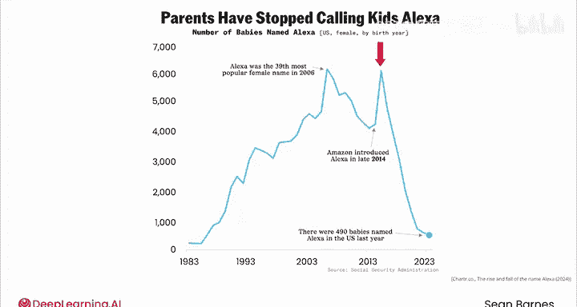
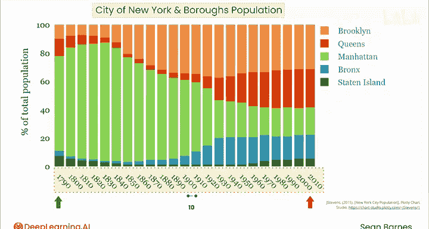
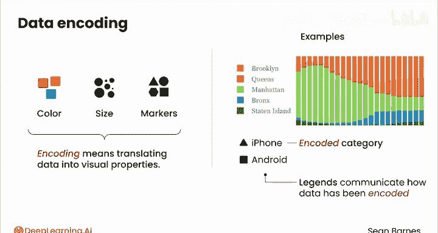
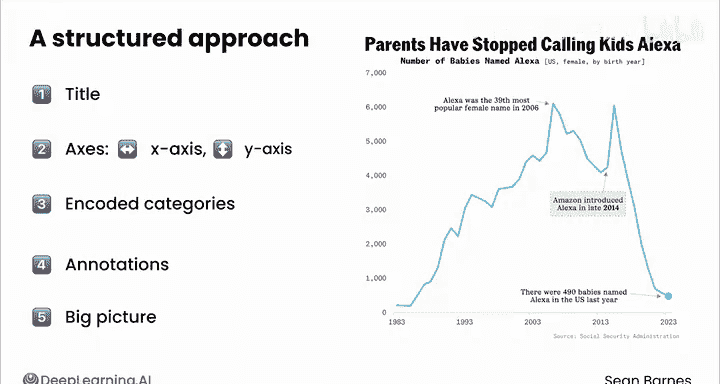

# 042：数据可视化语言 📊

在本节课中，我们将学习如何系统地解读数据可视化图表。通过理解图表的基本构成元素，你将能够更准确地获取图表所传达的信息和洞察。

你是否曾看着一张图表感到有些困惑？这很正常。一个名为“丑陋数据”的社区拥有超过10万名成员。并非所有的可视化图表都同样优秀，有些图表确实比其他图表更容易解读。让我们来分解可视化的常见组成部分，以便你能熟练地解读它们。

## 图表构成要素解析

让我们从另一个婴儿名字的例子开始，先熟悉这张图表。

首先，是标题：“父母已停止给孩子取名Alexa”。这很清晰，它告诉我应该期待看到什么。

接下来是X轴。它没有标题，但由于它从1983年开始到2023年结束，我可以清楚地知道它代表时间，展示了过去40年，最早的日期在左边，最近的日期在右边。

然后是Y轴。同样没有标题，但它从0开始到7000结束，以1000为均匀增量。不过，当我看到图表副标题时，上面写着“名为Alexa的婴儿数量 - 美国女性”。所以，这表示每年有多少女婴被取名为Alexa。有时，这种在副标题中描述Y轴标签的方法是为了在左侧保留一些空间。

现在，我来寻找颜色、线条上的标记和图例。线条是蓝色的，但由于只有一条线，这个颜色似乎没有特定的含义。也没有图例。我看到2023年处有一个标记，表示图表的终点。它将注意力引向图表制作时趋势所处的位置，这有助于强调标题。

最后，我来看注解。我看到线条在这里有一个峰值，表明Alexa曾是一个非常流行的名字，每年有近6000名女婴取此名。这里是另一个注解，关于亚马逊推出Alexa语音助手。然后在最右下角，注解显示2023年有490名婴儿被取名为Alexa。

那么，核心洞察是什么？看起来Alexa这个名字总体上相当流行，直到大约2016年，之后出现急剧下降。如果不看标题和注解，这会让我想知道下降的原因是什么。但注解让原因变得很清楚：在推出Alexa虚拟助手仅仅两年后，父母们就停止给孩子取这个名字了。你认为原因是什么？也许人们认为叫孩子的名字时可能会意外触发他们的Alexa设备。图表让你自己去推断原因，这种神秘感本身就很有趣。

## 解读复杂图表

现在，花点时间阅读这张图表。它试图传达什么信息？

你可能会感觉自己的眼睛从一个区域跳到另一个区域，最重要的部分可能没有凸显出来。让我带你一步步解读这张图，以理解其主要洞察。

我注意到标题是“纽约市及各行政区人口”。所以这是一张关于人口的图表，它显示了五个行政区，类似于区划。

我来看看X轴。我可以看出这些是年份。从最左边的1790年开始，一直到最右边的2010年。快速检查告诉我，这些是以10年为单位的均匀增量，这意味着横跨X轴的所有条形图之间可以进行公平的比较。

现在看Y轴。这个轴确实有标签：“占总人口的百分比”。它从底部的0开始，到顶部的100结束。所以这告诉我，每个条形图代表纽约市总人口的100%，并按行政区细分。

我知道你一直在想这些颜色。在这种情况下，每个柱状分段的颜色代表居住在五个行政区中某一个的人口占总人口的百分比。

## 识别趋势与编码

在较早的时期，大约从1790年到1920年，曼哈顿显然是人口最多的行政区。但大约在1920年到1930年间，布鲁克林取代了其位置，并一直保持领先。这些行政区在柱状分段的堆叠顺序和图例中的顺序，都是根据它们在2010年的人口排序来排列的。这种一致的排序方式允许你追踪每个类别随时间变化的趋势。

那么，整体的故事是什么？这张图表总结了纽约市历史上五个行政区的人口趋势。再次强调，在早期，大部分人口集中在市中心曼哈顿。而在现代，人口在四个行政区中的分布要均匀得多，史泰登岛相对于其他行政区的比例较小。

颜色、大小和标记都是“编码”的例子。编码意味着将数据转化为视觉属性。例如：
*   **浅绿色** 代表曼哈顿。
*   **蓝色** 代表布朗克斯。
*   **三角形标记** 可能代表iPhone销量。
*   **方形标记** 可能代表Android销量。

三角形本身并不代表iPhone，它是一个被编码的类别。这是图表以视觉方式传达含义的一种方法。我们使用图例来传达数据在特定可视化中是如何被编码的。

## 五步解读法

当你看到任何图表时，请采用结构化的方法来识别它试图告诉你什么。

以下是解读图表的五个步骤：

1.  **检查标题和副标题**。这张图表是关于什么的？创作者是否试图传达某个关键洞察？

2.  **审查坐标轴**。几乎每张图表都至少有一个轴。坐标轴可以有刻度线或网格线，用于标记该轴上的主要步长。首先检查你的X轴：从左到右发生了什么变化？在这两个例子中，它是以年为单位表示的时间。通常X轴从左到右数值增加，但不要想当然。然后检查你的Y轴：从下到上发生了什么变化？和X轴一样，它通常也是数值增加的。

3.  **审查任何被编码的类别**。阅读图例以识别被编码的类别，并寻找颜色、标记或大小的差异。

4.  **寻找注解**。注解是添加到图表中的注释或标签，用于提供背景信息或突出关键点。这些有助于将你的注意力引向图表中最重要的部分。

5.  **评估整体情况**。你在寻找什么类型的洞察？你应该进行比较吗？你应该寻找随时间变化的趋势吗？寻找令人惊讶的信息、巨大的变化、渐进的变化。利用注解以及图表标题或副标题来引导你的思考。

## 总结与实践

当你遇到数据可视化时，无论是在新闻、工作中还是在本课程中，尝试使用刚刚学到的五步法来解读它们。这是练习你数据可视化素养的好方法。

在本节课中，我们一起学习了如何系统地解读数据可视化图表。我们分解了图表的构成要素，包括标题、坐标轴、颜色编码、图例和注解，并介绍了一个实用的五步解读法。掌握这套方法，你将能更自信、更准确地从各种图表中提取关键信息和洞察。