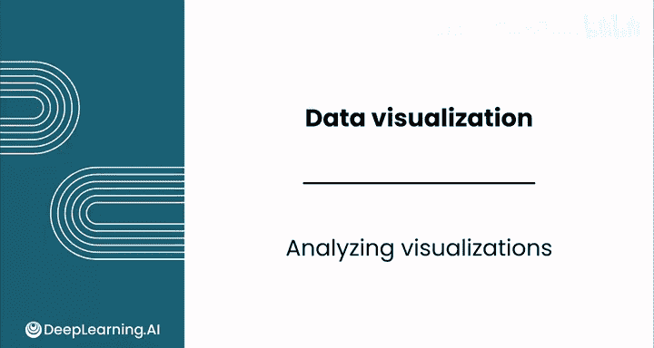
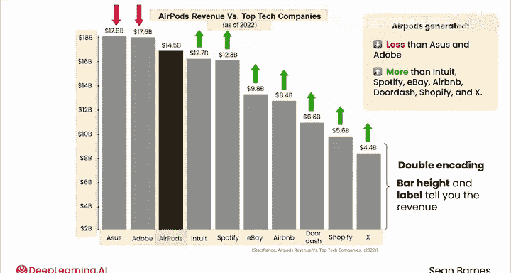
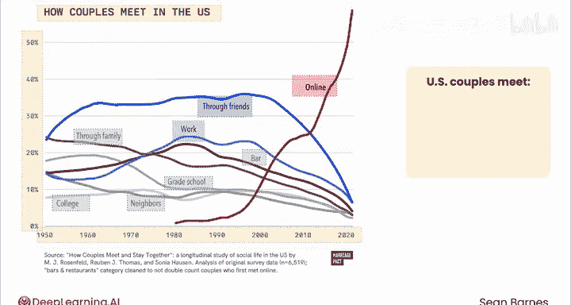
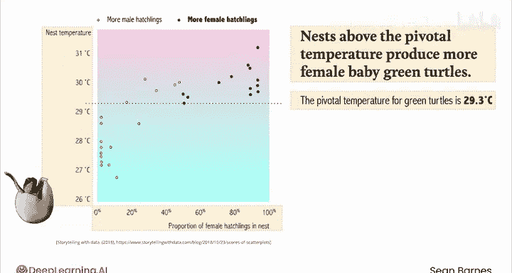

# 043：可视化分析 📊

在本节课中，我们将学习如何运用数据可视化的核心知识，通过分析三个具体的图表实例来实践解读技巧。我们将遵循一个五步流程，深入理解每个图表试图传达的故事。

---

## 实践解读：柱状图分析

上一节我们介绍了数据可视化的核心组件，本节中我们来看看如何将它们应用于实际分析。首先，我们分析一个关于AirPods营收的柱状图。

**第一步：阅读标题。**
图表标题是“Airpods revenue versus top tech companies”，副标题是“as of 2022”。这表明图表将展示AirPods与一些顶级科技公司在2022年的营收对比。

**第二步：观察坐标轴。**
X轴显示了一些顶级科技公司的名称，如Ass、Adobe、Intuit、Spotify等。Y轴没有明确的标题，但根据图表主题可以推断，它代表2022年的营收，单位是十亿美元。每个柱子上都标有具体的营收数值，这便于我们进行直接比较。

**第三步：识别编码类别。**
这个图表使用了颜色编码。AirPods的柱子被特别标出，以区别于其他公司。这种同时利用柱高和数值标签来传达信息的方法被称为**双重编码**。

**第四步：寻找标注。**
此图表中没有额外的文字标注。

**第五步：总结核心洞察。**
这个图表的核心目的是比较AirPods的营收与这些大型科技公司的营收。分析显示，AirPods产生的营收略低于Ass和Adobe，但高于Intuit、Spotify以及图表中列出的其他所有公司。这是一个令人惊讶的发现，因为它表明一款单一消费电子产品能与大型科技公司的整体营收相匹敌。

---

## 实践解读：折线图分析

接下来，我们分析一个关于美国情侣如何相识的折线图，看看趋势变化能告诉我们什么。

**第一步：阅读标题。**
标题是“How couples met in the US”。它告诉我们数据仅限美国，但未明确定义“情侣”的范围（例如，此数据可能仅指异性恋情侣）。

**第二步：观察坐标轴。**
X轴代表数据年份。Y轴刻度从0%到50%，虽未明确标注，但根据标题可推断它代表“情侣的百分比”。

**第三步：识别编码类别。**
图表中没有图例标记，但每条线都用不同颜色表示。“在线相识”的线是醒目的红色。“通过朋友”和“通过工作”相识的线是不同深浅的蓝色。其他相识方式则用灰色表示。颜色的选择可能暗示了重要性或流行度的差异。

**第四步：寻找标注。**
此图表中没有额外的文字标注。

**第五步：总结核心洞察。**
这个图表鼓励我们比较“在线相识”与其他所有显示方式的变化趋势。大约从2000年社交媒体（如Myspace、Friendster、Facebook）兴起开始，“在线相识”的曲线急剧上升，而其他方式的曲线则大幅下降。在线相识在2012年左右（Tinder发布的年份）超过了之前最主要的“通过朋友相识”的方式。到2020年，超过一半的美国情侣是在线相识的。图表中还隐藏着其他洞察，例如从1950年到2000年，约有10%的情侣在大学相识的比例保持稳定，而通过家庭、中小学或邻居相识的比例则持续下降。

---

## 实践解读：散点图分析

最后，我们来分析一个更具挑战性的散点图，它展示了科学发现，内容是关于绿海龟的孵化。

**第一步：阅读标题。**
主标题是“Nests above the pivotal temperature produced more female baby green turtles”，副标题是“The pivotal temperature for green turtles is 29.3 degreesC”。这告诉我们，巢穴温度高于一个关键值（29.3°C）时，会孵化出更多雌性幼龟。

**第二步：观察坐标轴。**
X轴表示在巢穴中发现的雌性幼龟百分比（0%到100%）。由于每个巢穴孵化的幼龟数量不同，关注百分比比绝对数量更有意义。Y轴标注为“巢穴温度”，单位是摄氏度（°C）。26°C约等于78°F，31°C约等于87°F。

**第三步：识别编码类别。**
颜色编码在这里运用得很巧妙：较低温度用蓝色表示，较高温度用粉色表示，这是一种自然的视觉映射。此外，根据顶部的图例，数据点使用了不同的标记：空心圆代表雄性幼龟占多数的巢穴，实心圆代表雌性幼龟占多数的巢穴。

**第四步：寻找标注。**
标注不一定总是文字。图中有一条虚线，标示了绿海龟的**关键温度（29.3°C）**，提示我们关注这条线附近的变化。

**第五步：总结核心洞察。**
对于散点图，一个有用的技巧是想象一条穿过所有数据点中心的线，即**最佳拟合线**。随着温度（沿Y轴上升）增加，雌性幼龟占多数的比例明显上升。观察关键温度线：在该线以下，没有雌性幼龟比例超过30%的巢穴；在该线以上，则出现了大量雌性幼龟占多数的巢穴。这引发了人们对背后科学机制的好奇。

---

## 课程总结

在本节课中，我们一起学习了数据叙事的强大力量，以及数据可视化在构建引人入胜的数据故事中所扮演的角色。我们通过分析柱状图、折线图和散点图这三个实例，实践了一个结构化的五步流程来解读数据可视化图表。完成本课的练习评估后，请跟随进入下一课，我们将学习如何在Google Sheets中创建美观的可视化图表。