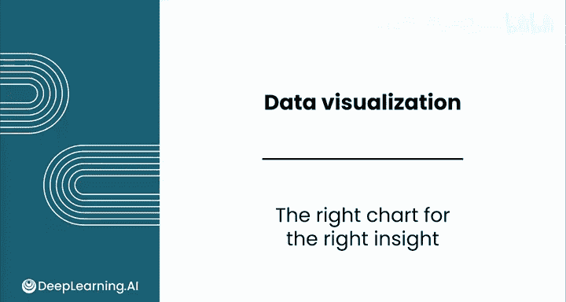
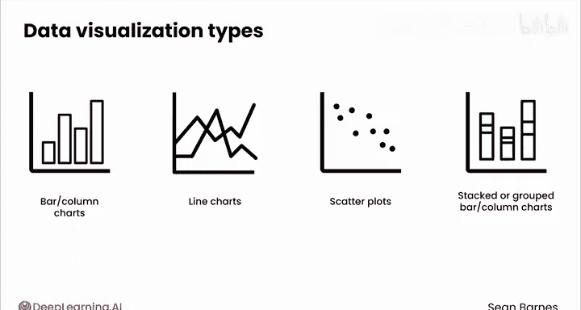
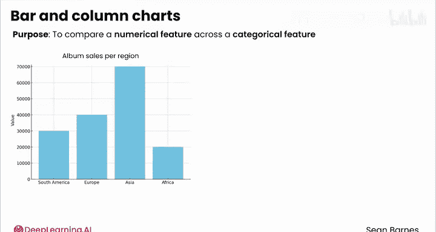
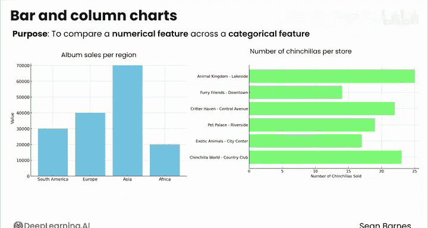
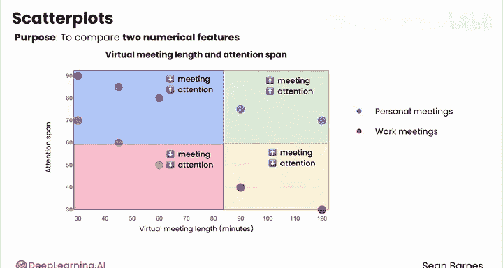
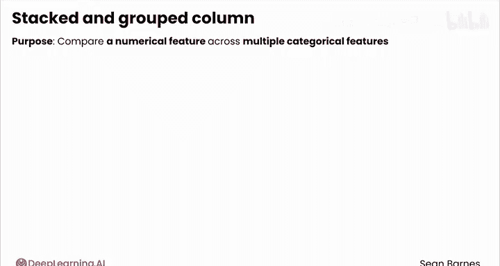
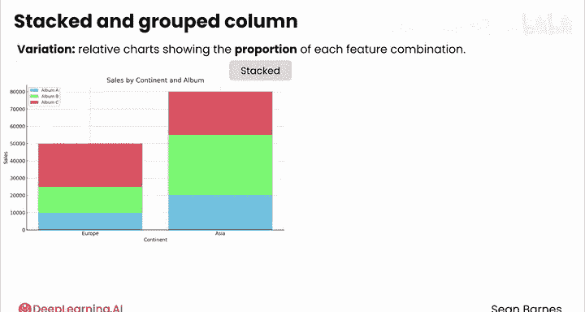
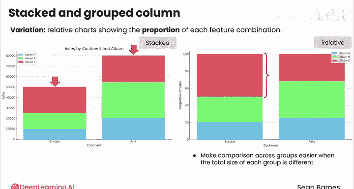
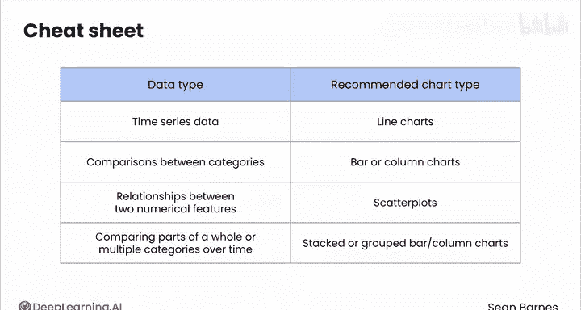
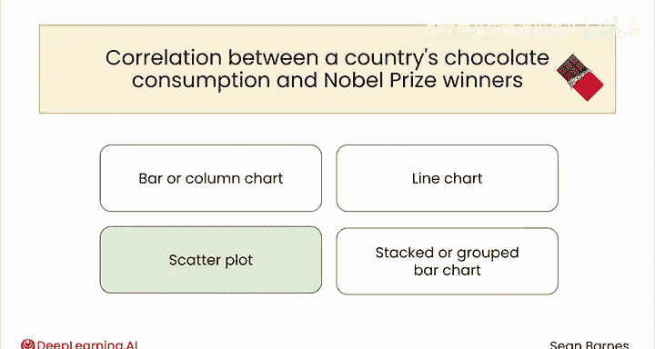

# 044：图表类型选择策略 📊

在本节课中，我们将学习数据可视化的核心原则，即如何为不同的分析目标选择合适的图表类型。正确的图表能清晰传达信息，而错误的图表则可能导致误解。

数据可视化既是一门艺术，也是一门科学。作为一门科学，图表的选择有对错之分。关键在于，必须根据你想要传达的洞察来选择正确的可视化类型。

## 核心图表类型介绍

虽然有数百种可视化类型，但我们将聚焦于四种核心图表：柱状图、折线图、散点图以及堆叠或分组柱状图。仅用这四种类型，你就能有效传达近80%的洞察，无需追求过于复杂的图表。

上一节我们介绍了图表选择的重要性，本节中我们来看看这四种核心图表的具体用途和适用场景。

### 1. 柱状图与条形图

柱状图和条形图的目的是**比较不同类别之间的数值特征**。

以下是其典型应用场景：
*   比较不同地区的专辑销量（X轴：大洲，Y轴：销量）。
*   比较不同异宠商店的龙猫销量（X轴：销量，Y轴：商店位置）。

其核心关系可概括为：**比较 `数值` 在 `类别` 间的差异**。

### 2. 折线图

折线图的目的是**展示数值特征随时间变化的趋势**。

例如，展示月度销量随时间的变化（X轴：月份，Y轴：专辑销量）。图中点与点之间的连线斜率强调了每月变化的速率，让你能清晰看到销量在每段时间内是急剧上升还是下降。

折线图的一个常见变体是面积图，它强调的不仅是趋势，还有数据的体积，尤其是随时间累积的总量。销量速率有升有降，但总量只会不断增加。

### 3. 散点图

散点图是我的个人最爱，它的目的是**比较两个数值特征**，非常适合探索这两个特征之间的关系。

散点图非常灵活。例如，可以绘制虚拟会议长度（X轴）与我的注意力时长（Y轴）的关系，并用蓝色表示个人会议，红色表示工作会议。

一个常见的增强方法是添加象限，以强调高/低组合。例如，为上述图表添加象限后，可以清晰看到“时间长且注意力高”的会议、“时间短且注意力低”的会议等。这有助于突显“大多数会议时间短且注意力高”这一洞察。

其核心关系可概括为：探索 `数值1` 与 `数值2` 之间的**关系**。

### 4. 堆叠与分组柱状图

这是标准柱状图的变体，目的是**跨多个类别特征比较数值特征**。

*   **堆叠柱状图**：看起来像一摞书，展示部分与整体的关系。例如，X轴是大洲，Y轴是销量，用三种不同颜色表示不同的专辑。这张图回答了“每张专辑对每个地区的总销量贡献了多少”的问题。在亚洲，大部分销量来自专辑B，而在欧洲，大部分销量来自专辑C。
*   **分组柱状图**：更适合类别间的直接比较。例如，X轴是宠物店位置，Y轴是销量，可以直观看出哪家店卖的龙猫最多（看起来是奶奶的店）。

一个常见的变体是**相对比例图**，它显示每个特征组合的比例而非原始数值。当各组的总体规模不同时，这种图表使跨组比较变得更加容易。例如，欧洲的总销量远小于亚洲，但使用比例图可以突出显示专辑C在欧洲卖得相对更好。

作为数据分析师，你需要做出选择：有时**数值大小**最重要（你想强调亚洲销量远高于欧洲），有时**比例关系**更重要（你想强调欧洲购买专辑C的比例更高）。

## 图表选择速查表

选择正确的可视化时，请记住这是一门科学，存在对错答案。以下是一个速查指南：

*   **时间序列数据**通常适合用**折线图**。
*   **类别间的比较**可能使用**条形图或柱状图**。
*   **两个数值特征之间的关系**可以使用**散点图**。
*   为了比较**部分与整体**或**随时间变化的多个类别**，可以考虑**堆叠或分组条形图/柱状图**。

## 快速练习

我们来做个快速练习。我会给出一个洞察，请你思考一下应该使用哪种图表。

1.  **洞察**：比较七位不同詹姆斯·邦德演员主演的007电影数量。
    *   **答案**：条形图或柱状图。这里我略微倾向于条形图，以便轻松地将每位演员的名字作为轴标签。

2.  **洞察**：过去50年各国全球咖啡消费量。
    *   **答案**：折线图。因为我们在比较随时间变化的消费量，并且可以用不同颜色的线代表每个国家。

3.  **洞察**：纽约与芝加哥两地订购的五种不同披萨配料的比例。
    *   **答案**：堆叠条形图。因为我们想分析每种配料在两个地点的相对比例。

4.  **洞察**：一个国家的人均巧克力消费量与诺贝尔奖获得者数量之间的相关性。
    *   **答案**：散点图。因为我们想比较两个数值特征。

做得很好！在本课剩余的视频中，你将看到如何在 Google Sheets 中创建这些基础图表类型。我会向你展示所有的技巧和窍门。我们稍后见。

---

本节课中我们一起学习了数据可视化中四种核心图表类型（柱状图、折线图、散点图、堆叠/分组柱状图）的适用场景与选择策略。记住，正确的图表选择是清晰、有效传达数据洞察的关键。